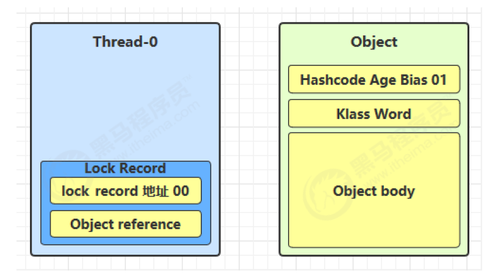

# JAVA并发

## 进程与线程

**进程**

程序由指令和数据组成，但这些指令要运行，数据要读写，就必须将指令加载至 CPU，数据加载至内存。在指令运行过程中还需要用到磁盘、网络等设备。进程就是用来加载指令、管理内存、管理 IO 的当一个程序被运行，从磁盘加载这个程序的代码至内存，这时就开启了一个进程。
进程就可以视为程序的一个实例。

**线程**

一个进程之内可以分为一到多个线程。
一个线程就是一个指令流，将指令流中的一条条指令以一定的顺序交给 CPU 执行
Java 中，线程作为最小调度单位，进程作为资源分配的最小单位。 在 windows 中进程是不活动的，只是作为线程的容器

**区别**

进程基本上相互独立的，而线程存在于进程内，是进程的一个子集进程拥有共享的资源，如内存空间等，供其内部的线程共享
进程间通信较为复杂同一台计算机的进程通信称为 IPC（Inter-process communication）
不同计算机之间的进程通信，需要通过网络，并遵守共同的协议，例如 HTTP线程通信相对简单，因为它们共享进程内的内存，一个例子是多个线程可以访问同一个共享变量
线程更轻量，线程上下文切换成本一般上要比进程上下文切换低

### 并行和并发

线程轮流使用CPU叫做并发(concurrent)
并行是同时调度运行线程。

并发（concurrent）是同一时间应对（dealing with）多件事情的能力
并行（parallel）是同一时间动手做（doing）多件事情的能力

## 线程

### 创建和运行线程

1.直接使用Theread

```java
// 创建线程对象
Thread t = new Thread() {
public void run() {
// 要执行的任务
}
};
// 启动线程
t.start();
```

2.使用Runnable配合Thread

Runnable里放任务
Thread 继承Runnable

```java
Runnable runnable = new Runnable() {
public void run(){
// 要执行的任务
}
};
// 创建线程对象
Thread t = new Thread( runnable );
// 启动线程
t.start();
```

Thread和Runnable的关系
用 Runnable 更容易与线程池等高级 API 配合
用 Runnable 让 任务类脱离了 Thread 继承体系，更灵活

3.FutureTask 配合 Thread

FutureTask 能够接收 Callable 类型的参数，用来处理有返回结果的情况

```java
// 创建任务对象
FutureTask<Integer> task3 = new FutureTask<>(() -> {
log.debug("hello");
return 100;
});
// 参数1 是任务对象; 参数2 是线程名字，推荐
new Thread(task3, "t3").start();
// 主线程阻塞，同步等待 task 执行完毕的结果
Integer result = task3.get();
log.debug("结果是:{}", result);

```

### 多个线程同时运行

交替执行
谁先谁后，由底层控制

### 查看进程线程的方法

**Windows**
任务管理器
cmd 
`tasklist`查看进程 
`taskkill`杀死进程
`tasklist | findstr java` 找到java

**Linux**
`ps -fe `查看所有进程
`ps -fT -p <PID>` 查看某个进程（PID）的所有线程
`kill` 杀死进程
`top` 按大写 H 切换是否显示线程
`top -H -p <PID>` 查看某个进程（PID）的所有线程

**Java**
`jps` 命令查看所有 Java 进程
`jstack <PID>` 查看某个 Java 进程（PID）的所有线程状态
`jconsole `来查看某个 Java 进程中线程的运行情况（图形界面）

### 线程运行原理

### 栈与栈帧

Java Virtual Machine Stacks （Java 虚拟机栈）
JVM 由堆、栈、方法区所组成
每个线程启动后，虚拟机就会为其分配一块栈内存。
每个栈由多个栈帧（Frame）组成，对应着每次方法调用时所占用的内存
每个线程只能有一个活动栈帧，对应着当前正在执行的那个方法

栈帧里有：局部变量表，返回地址，锁记录，操作数栈

不同的线程调用的是不同的独立栈帧

### 线程上下文切换（Thread Context Switch）

类似于操作系统的调度

因为以下一些原因导致 cpu 不再执行当前的线程，转而执行另一个线程的代码

- 线程的 cpu 时间片用完

- 垃圾回收

- 有更高优先级的线程需要运行

- 线程自己调用了 sleep、yield、wait、join、park、synchronized、lock 等方法

当 Context Switch 发生时，需要由操作系统保存当前线程的状态，并恢复另一个线程的状态，Java 中对应的概念就是程序计数器（Program Counter Register），它的作用是记住下一条 jvm 指令的执行地址，是线程私有的

- 状态包括程序计数器、虚拟机栈中每个栈帧的信息，如局部变量、操作数栈、返回地址等
- Context Switch 频繁发生会影响性能

### 常见方法

| 方法名           | static | 功能说明                                                    | 注意                                                         |
| ---------------- | ------ | ----------------------------------------------------------- | ------------------------------------------------------------ |
| start()          |        | 启动一个新线程，在新的线程运行 run 方法中的代码             | start 方法只是让线程进入就绪，里面代码不一定立刻运行（CPU 的时间片还没分给它）。每个线程对象的start方法只能调用一次，如果调用了多次会出现IllegalThreadStateException |
| run()            |        | 新线程启动后会调用的方法                                    | 如果在构造 Thread 对象时传递了 Runnable 参数，则线程启动后会调用 Runnable 中的 run 方法，否则默认不执行任何操作。但可以创建 Thread 的子类对象，来覆盖默认行为 |
| join()           |        | 等待线程运行结束                                            |                                                              |
| join(long n)     |        | 等待线程运行结束,最多等待 n毫秒                             |                                                              |
| getId()          |        | 获取线程长整型的 id                                         | id 唯一                                                      |
| getName()        |        | 获取线程名                                                  |                                                              |
| setName(String)  |        | 修改线程名                                                  |                                                              |
| getPriority()    |        | 获取线程优先级                                              |                                                              |
| setPriority(int) |        | 修改线程优先级                                              | java中规定线程优先级是1~10 的整数，较大的优先级能提高该线程被 CPU 调度的机率 |
| getState()       |        | 获取线程状态                                                | Java 中线程状态是用 6 个 enum 表示，分别为：NEW, RUNNABLE, BLOCKED, WAITING,TIMED_WAITING, TERMINATED |
| isInterrupted()  |        | 判断是否被中断                                              | 不会清除 中断标记                                            |
| isAlive()        |        | 线程是否存活（还没有运行完毕）                              |                                                              |
| interrupt()      |        | 中断线程                                                    | 如果被中断线程正在 sleep，wait，join 会导致被中断的线程抛出 InterruptedException，并清除中断标记；如果中断的正在运行的线程，则会设置 中断标记；park 的线程被中断，也会设置中断标记 |
| interrupted()    | static | 判断当前线程是否被中断                                      | 会清除中断标记                                               |
| currentThread()  | static | 获取当前正在执行的线程                                      |                                                              |
| sleep(long n)    | static | 让当前执行的线程休眠n毫秒，休眠时让出 cpu的时间片给其它线程 |                                                              |
| yield()          | static | 提示线程调度器让出当前线程对CPU的使用                       | 主要是为了测试和调试                                         |

### start 与 run

**run**

```java
public static void main(String[] args) {
Thread t1 = new Thread("t1") {
@Override
public void run() {
log.debug(Thread.currentThread().getName());
FileReader.read(Constants.MP4_FULL_PATH);
}
};
t1.run();
log.debug("do other things ...");
}
```

console

```java
19:39:14 [main] c.TestStart - main
19:39:14 [main] c.FileReader - read [1.mp4] start ...
19:39:18 [main] c.FileReader - read [1.mp4] end ... cost: 4227 ms
19:39:18 [main] c.TestStart - do other things ...
```

程序仍在 main 线程运行，只是main线程调用了run方法


**调用start**

将上述代码的 t1.run() 改为 t1.start() 

console

```java
19:41:30 [main] c.TestStart - do other things ...
19:41:30 [t1] c.TestStart - t1
19:41:30 [t1] c.FileReader - read [1.mp4] start ...
19:41:35 [t1] c.FileReader - read [1.mp4] end ... cost: 4542 ms
```

直接调用 run 是在主线程中执行了 run，没有启动新的线程
使用 start 是启动新的线程，通过新的线程间接执行 run 中的代码

### sleep 与 yield

**sleep**

调用 sleep 会让当前线程从 Running 进入 Timed Waiting 状态（阻塞）
其它线程可以使用 interrupt 方法打断正在睡眠的线程，这时 sleep 方法会抛出 InterruptedException
睡眠结束后的线程未必会立刻得到执行
建议用 TimeUnit 的 sleep 代替 Thread 的 sleep 来获得更好的可读性

sleep会抛出异常，要try catch


**yield**

调用 yield 会让当前线程从 Running 进入 Runnable 就绪状态，然后调度执行其它线程
具体的实现依赖于操作系统的任务调度器


**线程优先级**

线程优先级会提示（hint）调度器优先调度该线程，但它仅仅是一个提示，调度器可以忽略它
如果 cpu 比较忙，那么优先级高的线程会获得更多的时间片，但 cpu 闲时，优先级几乎没作用

```java
Runnable task1 = () -> {
int count = 0;
for (;;) {
System.out.println("---->1 " + count++);
}
};
Runnable task2 = () -> {
int count = 0;
for (;;) {
// Thread.yield();
System.out.println(" ---->2 " + count++);
}
};
Thread t1 = new Thread(task1, "t1");
Thread t2 = new Thread(task2, "t2");
// t1.setPriority(Thread.MIN_PRIORITY);
// t2.setPriority(Thread.MAX_PRIORITY);
t1.start();
t2.start();
```

### 案例

防止CPU占用100%

**sleep**

在没有利用 cpu 来计算时，不要让 while(true) 空转浪费 cpu，这时可以使用 yield 或 sleep 来让出 cpu 的使用权
给其他程序

```java
while(true) {
try {
Thread.sleep(50);
} catch (InterruptedException e) {
e.printStackTrace();
}
}
```

**wait** 

```java
synchronized(锁对象) {
while(条件不满足) {
try {
锁对象.wait();
} catch(InterruptedException e) {
e.printStackTrace();
}
}
// do sth...
}
```

条件变量实现

```java
lock.lock();
try {
while(条件不满足) {
try {
条件变量.await();
} catch (InterruptedException e) {
e.printStackTrace();
}
}
// do sth...
} finally {
lock.unlock();
}
```

### Join

join 类似于操作系统中的wait()，等待某个线程执行完毕。

```java
static int r = 0;
public static void main(String[] args) throws InterruptedException {
test1();
}
private static void test1() throws InterruptedException {
log.debug("开始");
Thread t1 = new Thread(() -> {
log.debug("开始");
sleep(1);
log.debug("结束");
r = 10;
});
t1.start();
log.debug("结果为:{}", r);
log.debug("结束");
}
```

有时效的Join

```java
static int r1 = 0;
static int r2 = 0;
public static void main(String[] args) throws InterruptedException {
test3();
}
public static void test3() throws InterruptedException {
Thread t1 = new Thread(() -> {
sleep(1);
r1 = 10;
});
long start = System.currentTimeMillis();
t1.start();
    // 线程执行结束会导致 join 结束
t1.join(1500);
long end = System.currentTimeMillis();
log.debug("r1: {} r2: {} cost: {}", r1, r2, end - start);
}
```

### interrupt 方法详解

**打断 sleep，wait，join 的线程**

这几个方法都会让线程进入阻塞状态
打断 sleep 的线程, 会清空打断状态，以 sleep 为例

```java
private static void test1() throws InterruptedException {
Thread t1 = new Thread(()->{
sleep(1);
}, "t1");
t1.start();
sleep(0.5);
t1.interrupt();
log.debug(" 打断状态: {}", t1.isInterrupted());
}
```

**打断正常运行的线程**

打断正常运行的线程, 不会清空打断状态

```java
private static void test2() throws InterruptedException {
Thread t2 = new Thread(()->{
while(true) {
Thread current = Thread.currentThread();
boolean interrupted = current.isInterrupted();
if(interrupted) {
log.debug(" 打断状态: {}", interrupted);
break;
}
}
}, "t2");
t2.start();
sleep(0.5);
t2.interrupt();
}
```

**两阶段终止模式（Two Phase Termination）**

在一个线程 T1 中如何“优雅”终止线程 T2？这里的【优雅】指的是给 T2 一个料理后事的机会。

错误思路
使用线程对象的 stop() 方法停止线程
stop 方法会真正杀死线程，如果这时线程锁住了共享资源，那么当它被杀死后就再也没有机会释放锁，
其它线程将永远无法获取锁
使用 System.exit(int) 方法停止线程
目的仅是停止一个线程，但这种做法会让整个程序都停止

**打断park线程**

不会清空打断状态

```java
private static void test3() throws InterruptedException {
Thread t1 = new Thread(() -> {
log.debug("park...");
LockSupport.park();
log.debug("unpark...");
log.debug("打断状态：{}", Thread.currentThread().isInterrupted());
}, "t1");
t1.start();
sleep(0.5);
t1.interrupt();
}
```

如果打断标记已经是true，则park会失效。

**不推荐的方法**

| 方法名    | static | 说明                 |
| --------- | ------ | -------------------- |
| stop()    |        | 停止线程运行         |
| suspend() |        | 挂起（暂停）线程运行 |
| resume()  |        | 恢复线程运行         |

### 主线程和守护线程

默认情况下，Java 进程需要等待所有线程都运行结束，才会结束。有一种特殊的线程叫做守护线程，只要其它非守护线程运行结束了，即使守护线程的代码没有执行完，也会强制结束。

```java
log.debug("开始运行...");
Thread t1 = new Thread(() -> {
log.debug("开始运行...");
sleep(2);
log.debug("运行结束...");
}, "daemon");
// 设置该线程为守护线程
t1.setDaemon(true);
t1.start();
sleep(1);
log.debug("运行结束...");
```

垃圾回收器线程就是一种守护线程
Tomcat 中的 Acceptor 和 Poller 线程都是守护线程，所以 Tomcat 接收到 shutdown 命令后，不会等待它们处理完当前请求

### 线程的五种状态

从操作系统层面来描述

【初始状态】仅是在语言层面创建了线程对象，还未与操作系统线程关联
【可运行状态】（就绪状态）指该线程已经被创建（与操作系统线程关联），可以由 CPU 调度执行
【运行状态】指获取了 CPU 时间片运行中的状态当 CPU 时间片用完，会从【运行状态】转换至【可运行状态】，会导致线程的上下文切换
【阻塞状态】
如果调用了阻塞 API，如 BIO 读写文件，这时该线程实际不会用到 CPU，会导致线程上下文切换，进入【阻塞状态】
等 BIO 操作完毕，会由操作系统唤醒阻塞的线程，转换至【可运行状态】
与【可运行状态】的区别是，对【阻塞状态】的线程来说只要它们一直不唤醒，调度器就一直不会考虑调度它们
【终止状态】表示线程已经执行完毕，生命周期已经结束，不会再转换为其它状态

### 线程的六种状态

从JAVA api层面来描述
根据 Thread.State 枚举，分为六种状态

`NEW` 线程刚被创建，但是还没有调用 start() 方法
`RUNNABLE` 当调用了 start() 方法之后，注意，Java API 层面的 RUNNABLE 状态涵盖了 操作系统 层面的
【可运行状态】、【运行状态】和【阻塞状态】（由于 BIO 导致的线程阻塞，在 Java 里无法区分，仍然认为
是可运行）
`BLOCKED` ，` WAITING` ，` TIMED_WAITING` 都是 Java API 层面对【阻塞状态】的细分，后面会在状态转换一节
详述
`TERMINATED` 当线程代码运行结束

### 小结

线程创建

线程重要 api，如 start，run，sleep，join，interrupt 等

线程状态

**应用方面**
异步调用：主线程执行期间，其它线程异步执行耗时操作
提高效率：并行计算，缩短运算时间
同步等待：join
统筹规划：合理使用线程，得到最优效果

**原理方面**
线程运行流程：栈、栈帧、上下文切换、程序计数器
Thread 两种创建方式 的源码

**模式方面**
终止模式之两阶段终止

## 共享模型管程

两个线程对初始值为 0 的静态变量一个做自增，一个做自减，各做 5000 次，结果是 0 吗？

```java
static int counter = 0;
public static void main(String[] args) throws InterruptedException {
Thread t1 = new Thread(() -> {
for (int i = 0; i < 5000; i++) {
counter++;
}
}, "t1");
Thread t2 = new Thread(() -> {
for (int i = 0; i < 5000; i++) {
counter--;
}
}, "t2");
t1.start();
t2.start();
t1.join();
t2.join();
log.debug("{}",counter);
}
```

**临界区 Critical Section**
一个程序运行多个线程本身是没有问题的
问题出在多个线程访问共享资源
多个线程读共享资源其实也没有问题
在多个线程对共享资源读写操作时发生指令交错，就会出现问题
一段代码块内如果存在对共享资源的多线程读写操作，称这段代码块为临界区
例如，下面代码中的临界区

```java
static int counter = 0;
static void increment()
// 临界区
{
counter++;
}
static void decrement()
// 临界区
{
counter--;
}
```

**竞态条件 Race Condition**
多个线程在临界区内执行，由于代码的执行序列不同而导致结果无法预测，称之为发生了竞态条件

## synchronized

synchronized 对象锁
采用互斥的方式让同一时刻至多只有一个线程能持有【对象锁】，其它线程再想获取这个【对象锁】时就会阻塞住。这样就能保证拥有锁的线程可以安全的执行临界区内的代码，不用担心线程上下文切换

为了避免临界区的竞态条件发生，有多种手段可以达到目的：阻塞式的解决方案：synchronized，Lock
非阻塞式的解决方案：原子变量

**语法**

```java
synchronized(对象) // 线程1， 线程2(blocked)
{
//临界区
}
```

**demo**

```java
static int counter = 0;
static final Object room = new Object();
public static void main(String[] args) throws InterruptedException {
Thread t1 = new Thread(() -> {
for (int i = 0; i < 5000; i++) {
synchronized (room) {
counter++;
}
}
}, "t1");
Thread t2 = new Thread(() -> {
for (int i = 0; i < 5000; i++) {
synchronized (room) {
counter--;
}
}
}, "t2");
t1.start();
t2.start();
t1.join();
t2.join();
log.debug("{}",counter);
}
```

**思考**

synchronized 实际是用对象锁保证了临界区内代码的原子性，临界区内的代码对外是不可分割的，不会被线程切换所打断。
为了加深理解，请思考下面的问题

如果把 synchronized(obj) 放在 for 循环的外面，如何理解？-- 原子性
如果 t1 synchronized(obj1) 而 t2 synchronized(obj2) 会怎样运作？-- 锁对象
如果 t1 synchronized(obj) 而 t2 没有加会怎么样？如何理解？-- 锁对象

### 方法上的 synchronized

```java
class Test{
	public synchronized void test() {
		}
}
//等价于 锁住了this对象
class Test{
	public void test() {
		synchronized(this) {
		}
	}
}
```

锁住static 方法，相当于锁住了类对象。

```java
class Test{
	public synchronized static void test() {
	}
}
//等价于
class Test{
	public static void test() {
		synchronized(Test.class) {
		}
	}
}
```

类对象和this对象不一样。

### 变量的线程安全分析

成员变量和静态变量是否线程安全？
如果它们没有共享，则线程安全
如果它们被共享了，根据它们的状态是否能够改变，又分两种情况
	如果只有读操作，则线程安全
	如果有读写操作，则这段代码是临界区，需要考虑线程安全

局部变量是线程安全的
但局部变量引用的对象则未必
如果该对象没有逃离方法的作用访问，它是线程安全的
如果该对象逃离方法的作用范围，需要考虑线程安全

方法访问修饰符带来的思考，如果把 method2 和 method3 的方法修改为 public 会不会代理线程安全问题？
情况1：有其它线程调用 method2 和 method3
情况2：在 情况1 的基础上，为 ThreadSafe 类添加子类，子类覆盖 method2 或 method3 方法。

**常见线程安全类**

String
Integer
StringBuffer
Random
Vector
Hashtable
java.util.concurrent 包下的类
这里说它们是线程安全的是指，多个线程调用它们同一个实例的某个方法时，是线程安全的。

```java
Hashtable table = new Hashtable();
// 线程1，线程2
if( table.get("key") == null) {
	table.put("key", value);
}
//只能保证单句语句线程安全，组合在一起可能会被重写
```

**不可变类线程安全性**
String、Integer 等都是不可变类，因为其内部的状态不可以改变，因此它们的方法都是线程安全的
String 有 replace，substring 等方法【可以】改变值啊，那么这些方法又是如何保证线程安全的呢？直接赋值新对象。

### Monitor 概念

Monitor 是java对象头(object header)

以 32 位虚拟机为例

普通对象：
Object Header (64 bits) = Mark Word (32 bits) + Klass Word (32 bits)

数组对象
Object Header (96 bits) = Mark Word(32bits) + Klass Word(32bits) + array length(32bits)

Normal  Mark Word (32 bits) =  hashcode:25 | age:4 | biased_lock:0 | 01 
Biased Mark Word (32 bits) = thread:23 | epoch:2 | age:4 | biased_lock:1 | 01

### Monitor 原理

Monitor 被翻译为监视器或管程
每个 Java 对象都可以关联一个 Monitor 对象，如果使用 synchronized 给对象上锁（重量级）之后，该对象头的Mark Word 中就被设置指向 Monitor 对象的指针

Monitor 由WaitSet、EntryList、Owner组成。
Owner：Monitor 只能有一个Owner
EntryList：在Owner线程上锁的时候，又有新的线程来执行，就会进入EntryList BLOCKED
WaitSet：是之前获得过锁，但条件不满足进入 WAITING 状态的线程，后面讲wait-notify 时会分析

### synchronized 原理

#### 轻量级锁

轻量级锁的使用场景：如果一个对象虽然有多线程要加锁，但加锁的时间是错开的（也就是没有竞争），那么可以使用轻量级锁来优化。
轻量级锁对使用者是透明的，即语法仍然是` synchronized`
假设有两个方法同步块，利用同一个对象加锁

```java
static final Object obj = new Object();
public static void method1() {
	synchronized( obj ) {
	// 同步块 A
	method2();
	}
}
public static void method2() {
	synchronized( obj ) {
	// 同步块 B
	}
}
```

执行方法1的时候，栈帧先创建一个锁记录（Lock Record）对象，每个线程都的栈帧都会包含一个锁记录的结，内部可以存储锁定对象的Mark Word。让锁记录中 Object reference 指向锁对象，并尝试用 cas 替换 Object 的 Mark Word，将 Mark Word 的值存入锁记录。

如果替换成功，加锁。
如果不成功，则有两种情况：
如果是其它线程已经持有了该 Object 的轻量级锁，这时表明有竞争，进入锁膨胀过程。
如果是自己执行了 synchronized 锁重入，那么再添加一条 Lock Record 作为重入的计数。
当退出 synchronized 代码块（解锁时）如果有取值为 null 的锁记录，表示有重入，这时重置锁记录，表示重
入计数减一

当退出 synchronized 代码块（解锁时）锁记录的值不为 null，这时使用 cas 将 Mark Word 的值恢复给对象
头，两种情况：
成功，则解锁成功
失败，说明轻量级锁进行了锁膨胀或已经升级为重量级锁，进入重量级锁解锁流程



#### 锁膨胀

如果在尝试加轻量级锁的过程中，CAS 操作无法成功，这时一种情况就是有其它线程为此对象加上了轻量级锁（有竞争），这时需要进行锁膨胀，将轻量级锁变为重量级锁。

```java
static Object obj = new Object();
public static void method1() {
	synchronized( obj ) {
	// 同步块
	}
}
```

锁膨胀，即，已有轻量级锁的情况下，再加轻量级锁：
即为 Object 对象申请 Monitor 锁，让 Object 指向重量级锁地址，然后自己进入 Monitor 的 EntryList BLOCKED
当 Thread-0 退出同步块解锁时，使用 cas 将 Mark Word 的值恢复给对象头，失败。这时会进入重量级解锁
流程，即按照 Monitor 地址找到 Monitor 对象，设置 Owner 为 null，唤醒 EntryList 中 BLOCKED 线程

#### 自旋

重量级锁竞争的时候，还可以使用自旋来进行优化，如果当前线程自旋成功（即这时候持锁线程已经退出了同步
块，释放了锁），这时当前线程就可以避免阻塞。

自旋就是重复几次调用锁，如果几次后还是失败，该阻塞还是得阻塞。

#### 偏向锁