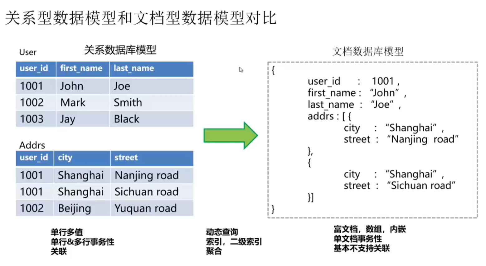

# MongoDB是啥

# MongoDB基础知识

## 基本概念

- 文档型数据库
- 逻辑上按照DB/collection/document组织
- BD:数据库
- collection：类似于关系数据库中的table
- doc：类似于关系数据库中的row

SQL和MongoDB概念区别

| SQL         | MongoDB     | 解释                          |
| ----------- | ----------- | ----------------------------- |
| database    | database    | 数据库                        |
| table       | collection  | 表/集合                       |
| row         | document    | 行/文件                       |
| column      | field       | 列/域                         |
| index       | index       | 索引                          |
| table joins |             | 表连接，mongodb不支持         |
| primary key | primary key | 主键，mongodb自动设置ID为主键 |



## 数据类型

| 数据类型           | 描述                                                       |
| ------------------ | ---------------------------------------------------------- |
| String             | 字符串，mongoDB中UTF-8才是合法的                           |
| Integer            | 整形                                                       |
| Boolean            | 布尔                                                       |
| Double             | 双精度浮点数                                               |
| Min/Max keys       | 将一个值与BSON（二进制的JSON）元素最低值和最高值对比       |
| Array              | 数组                                                       |
| Timestamp          | 时间戳                                                     |
| Object             | 用于内嵌文档                                               |
| Null               | 用于创建空值                                               |
| Symbol             | 符号，基本等同于字符串，但是用于一般采用特殊符号类型的语言 |
| Date               | 日期，UNIX时间格式                                         |
| Object ID          | 对象ID，用于创建文档的ID                                   |
| Binary Data        | 二进制数据，用于存二进制数据                               |
| Code               | 代码类型，用于在文档中存储JavaScript代码                   |
| Regular expression | 正则表达式类型                                             |

**Object ID**
类似于唯一主键，可以很快的去生成和排序，包含12bytes，含义是:
前面四个字节是时间戳，接着是三个机器标识码，接着俩个是进程ID组成的PID，最后三个字节是随机数。

## 数据库基本操作

1. 显示数据库
   `show dbs `
   `show databases `

2. 切换到xxx数据库（第一次使用就是创建xxx数据库）
   `use xxx`

3. 创建集合
   `db.createCollection("t_student")`

4. 显示集合列表
   `show collections`

5. 插入doc数据
   `db.t_student.insert({"name":"asd","age":18})`

6. 显示数据集合
   `db.t_student.find()`

   

   **实例**

   插入文档

   ```
   db.book.insert(
   {
   	title:"my first blog post",
       published:new Date(),
       tags:["NoSQL","MongoDB"],
       type:"Work",
       author:"James",
       viewCount:25,
       commentCount:2
   })
   
   ---console---
   WriteResult({"nInserted":1})
   ```

   查询操作

   ```
   db.book.find({"_id":ObjectID("0123456789ab")})
   db.book.find({author:"James"})
   
   ---console---
   {
   	_id:ObjectID("0123456789ab"),
   	title:"my first blog post",
       published:ISODate("2020-01-6T11:11:11.553Z"),
       tags:[
       	"NoSQL",
       	"MongoDB"
       ],
       type:"Work",
       author:"James",
       viewCount:25.0,
       commentCount:2.0
   }
   ```

   删除文档

   ```
   db.book.remove({"_id":ObjectID("0123456789ab")})
   
   ---console---
   WriteResult({"nRemoved":1})
   ```

   更新文档

   ```
   db.book.update(
   	{"_id":ObjectID("0123456789ab")},
   	{"$set":
   		{
   		"viewCount":3
   		}
   	}
   )
   
   ---console---
   WriteResult({"nMatched:1","nUpdate":0,"nModified":1})
   ```

   删除字段

   ```
   db.book.update(
   	{"_id":ObjectID("0123456789ab")},
   	{"$unset":
   		{
   		"viewCount":""
   		}
   	}
   )
   ```

   

   ## MongoDB应用场景

   **适用场景**

- 灵活多样化的数据存储（半结构化、无结构化）

- 快速开发、迭代

- 高性能易扩展

- 弱一致性

  **不适用的场景**

- 需要大量join表操作
- 复杂的查询
- 强一致性的事务


