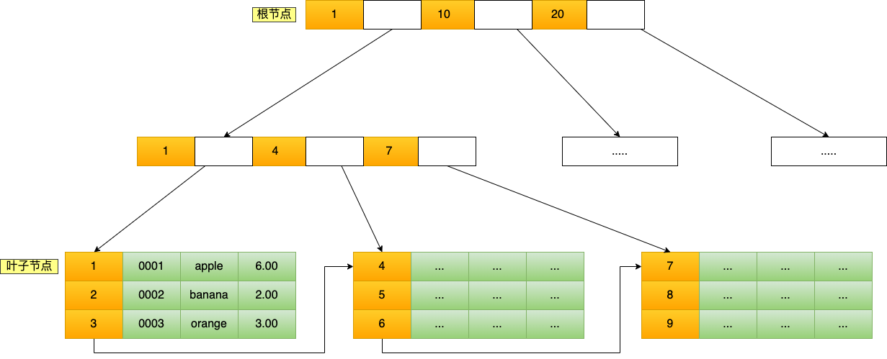
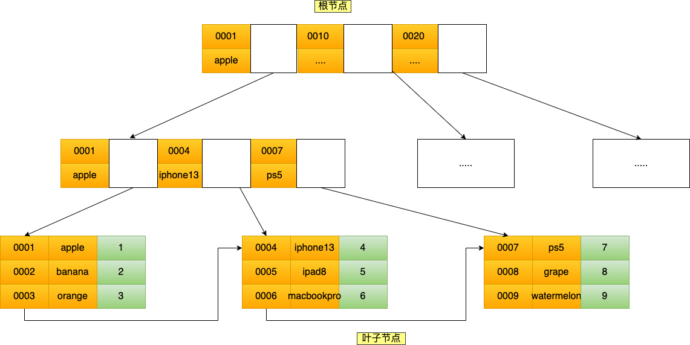
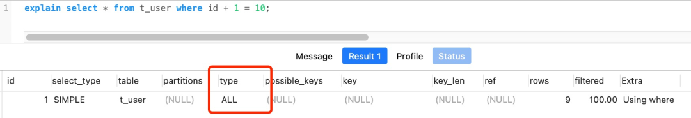

# MySQL

[图解mysql](https://xiaolincoding.com/mysql/)

[mysql源码](https://www.iskm.org/mysql56/index.html)

# 数据查询过程

- 连接器：建立连接，管理连接、校验用户身份；
- 查询缓存：查询语句如果命中查询缓存则直接返回，否则继续往下执行。MySQL 8.0 已删除该模块；
- 解析 SQL，通过解析器对 SQL 查询语句进行词法分析、语法分析，然后构建语法树，方便后续模块读取表名、字段、语句类型；
- 执行 SQL：执行 SQL 共有三个阶段：
  - 预处理阶段：检查表或字段是否存在；将 `select *` 中的 `*` 符号扩展为表上的所有列。
  - 优化阶段：基于查询成本的考虑， 选择查询成本最小的执行计划；
  - 执行阶段：根据执行计划执行 SQL 查询语句，从存储引擎读取记录，返回给客户端；


## 连接

- 与客户端进行 TCP 三次握手建立连接；
- 校验客户端的用户名和密码，如果用户名或密码不对，则会报错；
- 如果用户名和密码都对了，会读取该用户的权限，然后后面的权限逻辑判断都基于此时读取到的权限；


**最大空闲时长**：MySQL 定义了空闲连接的**最大空闲时长**，由 `wait_timeout` 参数控制的，默认值是 8 小时（28880秒），如果空闲连接超过了这个时间，连接器就会自动将它断开。

**连接数限制**：MySQL 服务支持的最大连接数由 max_connections 参数控制，超过这个值系统就会拒绝接下来的连接请求，并报错提示“Too many connections”。

**短连接和长连接**

```c
// 短连接
连接 mysql 服务（TCP 三次握手）
执行sql
断开 mysql 服务（TCP 四次挥手）

// 长连接
连接 mysql 服务（TCP 三次握手）
执行sql
执行sql
执行sql
....
断开 mysql 服务（TCP 四次挥手）
```

使用长连接的好处就是可以减少建立连接和断开连接的过程，所以一般是推荐使用长连接。

但是，使用长连接后可能会占用内存增多，因为 MySQL 在执行查询过程中临时使用内存管理连接对象，这些连接对象资源只有在连接断开时才会释放。如果长连接累计很多，将导致 MySQL 服务占用内存太大，有可能会被系统强制杀掉，这样会发生 MySQL 服务异常重启的现象。


**Q&A**

如何查看mysl 被多少客户端链接了

`show processlist`


怎么解决长连接占用内存的问题？

第一种，**定期断开长连接**。既然断开连接后就会释放连接占用的内存资源，那么我们可以定期断开长连接。

第二种，**客户端主动重置连接**。MySQL 5.7 版本实现了 `mysql_reset_connection()` 函数的接口，注意这是接口函数不是命令，那么当客户端执行了一个很大的操作后，在代码里调用 mysql_reset_connection 函数来重置连接，达到释放内存的效果。这个过程不需要重连和重新做权限验证，但是会将连接恢复到刚刚创建完时的状态。


## 查询缓存

查询语句会先查询 查询缓存(Query Cache )，key-value 结构 key 为 SQL，value 为结果。

如果表有更新操作，查询缓存会被清空。

MySQL 8.0及之后版本已经删除了查询缓存。

对于 MySQL 8.0 之前的版本，如果想关闭查询缓存，我们可以通过将参数 query_cache_type 设置成 `DEMAND`。

查询缓存是server 层的，并不是 Innodb 存储引擎中的 buffer pool

## 解析

解析器会做如下两件事情。

**词法分析**。MySQL 会根据你输入的字符串识别出关键字出来，构建出 SQL 语法树，这样方便后面模块获取 SQL 类型、表名、字段名、 where 条件等等。

**语法分析**。根据词法分析的结果，语法解析器会根据语法规则，判断你输入的这个 SQL 语句是否满足 MySQL 语法。

如果我们输入的 SQL 语句语法不对，就会在解析器这个阶段报错。比如，我下面这条查询语句，把 from 写成了 form，这时 MySQL 解析器就会给报错。

表不存在或者字段不存在，并不是在解析器里做的。解析器只负责构建语法树和检查语法，但是不会去查表或者字段存不存在。

## 执行

三个阶段

- prepare 阶段，预处理阶段；
- optimize 阶段，优化阶段；
- execute 阶段，执行阶段；

###  预处理器

- 检查 SQL 查询语句中的表或者字段是否存在；
- 将 `select *` 中的 `*` 符号，扩展为表上的所有列；

###  优化器

**优化器主要负责将 SQL 查询语句的执行方案确定下来**，比如在表里面有多个索引的时候，优化器会基于查询成本的考虑，来决定选择使用哪个索引。

以在查询语句最前面加个 `explain` 命令，这样就会输出这条 SQL 语句的执行计划，然后执行计划中的 key 就表示执行过程中使用了哪个索引。

索引后面再讲

###  执行器

三种方式执行过程

**主键索引查询**

```sql
select * from product where id = 1;
```

- 执行器第一次查询，会调用 read_first_record 函数指针指向的函数，因为优化器选择的访问类型为 const，这个函数指针被指向为 InnoDB 引擎索引查询的接口，把条件 `id = 1` 交给存储引擎，**让存储引擎定位符合条件的第一条记录**。
- 存储引擎通过主键索引的 B+ 树结构定位到 id = 1的第一条记录，如果记录是不存在的，就会向执行器上报记录找不到的错误，然后查询结束。如果记录是存在的，就会将记录返回给执行器；
- 执行器从存储引擎读到记录后，接着判断记录是否符合查询条件，如果符合则发送给客户端，如果不符合则跳过该记录。
- 执行器查询的过程是一个 while 循环，所以还会再查一次，但是这次因为不是第一次查询了，所以会调用 read_record 函数指针指向的函数，因为优化器选择的访问类型为 const，这个函数指针被指向为一个永远返回 - 1 的函数，所以当调用该函数的时候，执行器就退出循环，也就是结束查询了。


**全表扫描**

```sql
select * from product where name = 'iphone';
```

- 执行器第一次查询，会调用 read_first_record 函数指针指向的函数，因为优化器选择的访问类型为 all，这个函数指针被指向为 InnoDB 引擎全扫描的接口，**让存储引擎读取表中的第一条记录**；
- 执行器会判断读到的这条记录的 name 是不是 iphone，如果不是则跳过；如果是则将记录发给客户端。Server 层每从存储引擎读到一条记录就会发送给客户端。客户端等查询语句查询完成后，才会显示出所有的记录
- 一直重复上述过程，直到存储引擎把表中的所有记录读完，然后向执行器（Server层） 返回了读取完毕的信息；
- 执行器收到存储引擎报告的查询完毕的信息，退出循环，停止查询。


**索引下推 (index condition pushdown)**

MySQL 5.6 推出的查询优化策略

```sql
# idx_age_reward
select * from t_user  where age > 20 and reward = 100000;
```

不使用索引下推执行器与存储引擎的执行流程：

- 定位到最左匹配的第一条记录， age > 20 的第一条记录。
- 获取所有满足最左匹配的数据，拿出主键，然后进行回表，再把完整的记录返回给 Server 层，Server判断reward是否满足条件，否则跳过。
- 重复操作，直到存储引擎把表中的所有符合条件的记录读完。

使用索引下推执行器与存储引擎的执行流程：

- 定位到最左匹配的第一条记录， age > 20 的第一条记录。
- 获取所有满足最左匹配的数据，判断reward是否满足条件，如果不成立则抛弃，如果成立则回表，将记录返回给 Server 层。
- 重复操作，直到存储引擎把表中的所有符合条件的记录读完。


当组合索引满足最左匹配，但是遇到非等值判断时匹配停止。进行索引下推，由存储引擎过滤剩下的组合索引条件，减少回表数据。


# 数据存储格式

文件存放目录

```mysql
mysql> SHOW VARIABLES LIKE 'datadir';
+---------------+-----------------+
| Variable_name | Value           |
+---------------+-----------------+
| datadir       | /var/lib/mysql/ |
+---------------+-----------------+
1 row in set (0.00 sec)
```

```bash
[root@root ~]#ls /var/lib/mysql/my_test
db.opt  
t_order.frm  
t_order.ibd
```

- db.opt，用来存储当前数据库的默认字符集和字符校验规则。
- t_order.frm ，t_order 的**表结构**。
- t_order.ibd，t_order 的**表数据**会保存在这个文件。表数据既可以存在共享表空间文件（文件名：ibdata1）里，也可以存放在独占表空间文件（文件名：表名字.ibd）。这个行为是由参数 innodb_file_per_table 控制的，若设置了参数 innodb_file_per_table 为 1，则会将存储的数据、索引等信息单独存储在一个独占表空间，从 MySQL 5.6.6 版本开始，它的默认值就是 1 了，因此从这个版本之后， MySQL 中每一张表的数据都存放在一个独立的 .ibd 文件。

## 表空间文件的结构

**表空间由段（segment）、区（extent）、页（page）、行（row）组成**，InnoDB存储引擎的逻辑存储结构大致如下图：


**行（row）**

数据库表中的记录都是按行（row）进行存放的，每行记录根据不同的行格式，有不同的存储结构。

**页（page）**

innoDB 的数据是按「页」为单位来读写的。
**默认每个页的大小为 16KB**，最多能保证 16KB 的连续存储空间。
页是 InnoDB 存储引擎磁盘管理的最小单元，意味着数据库每次读写都是以 16KB 为单位的，一次最少从磁盘中读取 16K 的内容到内存中，一次最少把内存中的 16K 内容刷新到磁盘中。

一行的字节大小不能超过数据页的大小，当一行的字节大小超过数据页的大小时，这个行就无法存储在单个数据页中，这被称为行溢出（**row overflow**）。

页的类型有很多，常见的有数据页、undo 日志页、溢出页等等。数据表中的行记录是用「数据页」来管理的。

**区（extent）**

区是一组连续「页」的集合。

每个区的大小通常是多个数据页的大小的倍数，这个倍数可以根据具体的配置进行设置。例如，在InnoDB存储引擎中，默认情况下，一个区的大小为1MB，而一个数据页的大小为16KB。因此，一个区包含64个数据页。

区的主要目的是减少磁盘IO操作的次数。当MySQL需要分配新的存储空间来存储数据时，它会以区为单位进行分配。这样，相对于每次只分配一个数据页，分配一个区可以减少磁盘IO操作的次数，提高性能。

区还有助于提高数据的连续性。由于区是一组连续的数据页，当数据被存储在区中时，它们在磁盘上的物理位置也是连续的。这有助于提高数据的访问效率，减少磁盘寻道的开销。

**段（segment）**

表空间是由各个段（segment）组成的，段是由多个区（extent）组成的。段一般分为数据段、索引段和回滚段等。

- 索引段：存放 B + 树的非叶子节点的区的集合；
- 数据段：存放 B + 树的叶子节点的区的集合；
- 回滚段：存放的是回滚数据的区的集合；

## 行格式

行格式（row_format），就是一条记录的存储结构。

InnoDB 提供了 4 种行格式，分别是 Redundant、Compact、Dynamic和 Compressed 行格式。

- Redundant 是很古老的行格式了， MySQL 5.0 版本之前用的行格式，现在基本没人用了。
- Compact 是一种紧凑的行格式，设计的初衷就是为了让一个数据页中可以存放更多的行记录，从 MySQL 5.1 版本之后，行格式默认设置成 Compact。
- Dynamic 和 Compressed 两个都是紧凑的行格式，它们的行格式都和 Compact 差不多，因为都是基于 Compact 改进一点东西。从 MySQL5.7 版本之后，默认使用 Dynamic 行格式。


**COMPACT 行格式**


```sql
CREATE TABLE `t_user` (
  `id` int(11) NOT NULL,
  `name` VARCHAR(20) DEFAULT NULL,
  `phone` VARCHAR(20) DEFAULT NULL,
  `age` int(11) DEFAULT NULL,
  PRIMARY KEY (`id`) USING BTREE
) ENGINE = InnoDB DEFAULT CHARACTER SET = ascii ROW_FORMAT = COMPACT;
```

一条完整的记录分为「记录的额外信息」和「记录的真实数据」两个部分

### 记录的额外信息

1. **变长字段长度列表**
   变长字段的真实数据占用的字节数
   如果是NULL，则不会保存变长字段的长度
   如果没有变长之短，则不会有变长字段长度列表
2. **NULL值列表**
   记录真实值为NULL的值
   如果存在允许 NULL 值的列，则每个列对应一个二进制位（bit），二进制位按照列的顺序逆序排列。
   如果一个字节存不下NULL值列表，则会扩增到两个字节。
   当所有字段都是NOT NULL，则不会有NULL值列表。
3. **记录头信息**
   这几个比较重要
   **delete_mask** ：标识此条数据是否被删除。从这里可以知道，我们执行 detele 删除记录的时候，并不会真正的删除记录，只是将这个记录的 delete_mask 标记为 1。
   **next_record**：下一条记录的位置。指向的是下一条记录的「记录头信息」和「真实数据」之间的位置，这样的好处是向左读就是记录头信息，向右读就是真实数据，比较方便。
   **record_type**：表示当前记录的类型，0表示普通记录，1表示B+树非叶子节点记录，2表示最小记录，3表示最大记录

额外信息大部分都是**逆序**存放。这样的好处是向左读就是记录头信息，向右读就是真实数据

### 记录的真实数据

记录真实数据部分除了我们定义的字段，还有三个隐藏字段，分别为：row_id、trx_id、roll_pointer

- row_id

如果我们建表的时候指定了主键或者唯一约束列，那么就没有 row_id 隐藏字段了。如果既没有指定主键，又没有唯一约束，那么 InnoDB 就会为记录添加 row_id 隐藏字段。row_id不是必需的，占用 6 个字节。

- trx_id

事务id，表示这个数据是由哪个事务生成的。 trx_id是必需的，占用 6 个字节。

- roll_pointer

这条记录上一个版本的指针。roll_pointer 是必需的，占用 7 个字节。

### 行溢出

默认的数据页大小是16KB，一行的字节大小不能超过数据页的大小，当一行的字节大小超过数据页的大小时，这个行就无法存储在单个数据页中，这被称为行溢出（**row overflow**）。

为了处理行溢出的情况，MySQL提供了一种机制，即将溢出的数据存储在额外的数据页中，并通过指针进行引用。但是，这种行溢出的处理会增加额外的存储和访问成本，并且可能影响查询性能。

为了避免行溢出的情况，MySQL限制了一行的字节大小不能超过数据页的大小。对于InnoDB存储引擎，默认情况下，一行的字节大小不能超过65535个字节（64KB - 1）。

一些大对象如 TEXT、BLOB 可能存储更多的数据，这时一个页可能就存不了一条记录。这个时候就会**发生行溢出，多的数据就会存到另外的「溢出页」中**。

Compact 行格式发生行溢出时，在记录的真实数据处只会保存该列的一部分数据，而把剩余的数据放在「溢出页」中，然后真实数据处用 20 字节存储指向溢出页的地址，从而可以找到剩余数据所在的页。大致如下图所示。

Compressed 和 Dynamic 行格式发生行溢出时，只存储 20 个字节的指针来指向溢出页，而实际的数据都存储在溢出页中。


# 索引

索引的定义就是帮助存储引擎快速获取数据的一种数据结构，索引是数据的目录。

## 索引的分类

- 按「数据结构」分类：**B+tree索引、Hash索引、Full-text索引**。
- 按「物理存储」分类：**聚簇索引（主键索引）、二级索引（辅助索引）**。
- 按「字段特性」分类：**主键索引、唯一索引、普通索引、前缀索引**。
- 按「字段个数」分类：**单列索引、联合索引**。


**1.按数据结构分类**

从数据结构的角度来看，MySQL 常见索引有 B+Tree 索引、HASH 索引、Full-Text 索引。

| 索引类型  | InnoDB                                     | MyISAM | Memory |
| --------- | ------------------------------------------ | ------ | ------ |
| B+Tree    | yes                                        | yes    | yes    |
| HASH      | no(但是在内存结构中有一个自适应的hash索引) | no     | yes    |
| Full-Text | yes                                        | yes    | no     |

InnoDB 是在 MySQL 5.5 之后成为默认的 MySQL 存储引擎，B+Tree 索引类型也是 MySQL 存储引擎采用最多的索引类型。

在创建表时，InnoDB 存储引擎会根据不同的场景选择不同的列作为索引：

- 如果有主键，默认会使用主键作为聚簇索引的索引键（key）；
- 如果没有主键，就选择第一个不包含 NULL 值的唯一列作为聚簇索引的索引键（key）；
- 在上面两个都没有的情况下，InnoDB 将自动生成一个隐式自增 id 列作为聚簇索引的索引键（key）；

除主键索引外，其它索引都属于辅助索引（Secondary Index），也被称为二级索引或非聚簇索引。
**创建的主键索引和二级索引默认使用的是 B+Tree 索引**。




**2.按物理存储分类**

从物理存储的角度来看，索引分为聚簇索引（主键索引）、二级索引（辅助索引）。

- 主键索引的 B+Tree 的叶子节点存放的是实际数据，所有完整的用户记录都存放在主键索引的 B+Tree 的叶子节点里；
- 二级索引的 B+Tree 的叶子节点存放的是主键值，而不是实际数据。

所以，在查询时使用了二级索引，如果查询的数据能在二级索引里查询的到，那么就不需要回表，这个过程就是**覆盖索引**。
如果查询的数据不在二级索引里，就会先检索二级索引，找到对应的叶子节点，获取到主键值后，然后再检索主键索引，就能查询到数据了，这个过程就是**回表**。

**3.按照字段特性分类**

从字段特性的角度来看，索引分为主键索引、唯一索引、普通索引、前缀索引。

**主键索引**就是建立在主键字段上的索引，通常在创建表的时候一起创建，一张表最多只有一个主键索引，索引列的值不允许有空值。

**唯一索引**建立在 UNIQUE 字段上的索引，一张表可以有多个唯一索引，索引列的值必须唯一，但是允许有空值。

**普通索引**就是建立在普通字段上的索引，既不要求字段为主键，也不要求字段为 UNIQUE。

**前缀索引**是指对字符类型字段的前几个字符建立的索引，而不是在整个字段上建立的索引，前缀索引可以建立在字段类型为 char、 varchar、binary、varbinary 的列上。使用前缀索引的目的是为了减少索引占用的存储空间，提升查询效率。


**4.按字段个数分类**

从字段个数的角度来看，索引分为单列索引、联合索引（复合索引）。


通过将多个字段组合成一个索引，该索引就被称为**联合索引**。




## 索引的查询过程


**1.通过主键查询**

B+Tree 会自顶向下逐层进行查找

数据库的索引和数据都是存储在硬盘的，我们可以把读取一个节点当作一次磁盘 I/O 操作。那么上面的整个查询过程一共经历了 3 个节点，也就是进行了 3 次 I/O 操作。

B+Tree 存储千万级的数据只需要 3-4 层高度就可以满足，这意味着从千万级的表查询目标数据最多需要 3-4 次磁盘 I/O，所以**B+Tree 相比于 B 树和二叉树来说，最大的优势在于查询效率很高，因为即使在数据量很大的情况，查询一个数据的磁盘 I/O 依然维持在 3-4次。**


**2.通过二级索引查询**

主键索引的 B+Tree 和二级索引的 B+Tree 区别如下：

- 主键索引的 B+Tree 的叶子节点存放的是实际数据，所有完整的用户记录都存放在主键索引的 B+Tree 的叶子节点里；
- 二级索引的 B+Tree 的叶子节点存放的是主键值，而不是实际数据。

会先检二级索引中的 B+Tree 的索引值，找到对应的叶子节点，然后获取主键值，然后再通过主键索引中的 B+Tree 树查询到对应的叶子节点，然后获取整行数据。**这个过程叫「回表」，也就是说要查两个 B+Tree 才能查到数据**。

当查询的数据是能在二级索引的 B+Tree 的叶子节点里查询到，这时就不用再查主键索引查。**这种在二级索引的 B+Tree 就能查询到结果的过程就叫作「覆盖索引」，也就是只需要查一个 B+Tree 就能找到数据**。

**3.联合索引查询**

联合索引的非叶子节点用两个字段的值作为 B+Tree 的 key 值。当在联合索引查询数据时，先按第一个字段比较，在第一个相同的情况下再按第二个字段比较。

使用联合索引时，存在**最左匹配原则**，也就是按照最左优先的方式进行索引的匹配。在使用联合索引进行查询的时候，如果不遵循「最左匹配原则」，联合索引会失效，这样就无法利用到索引快速查询的特性了。

**利用索引的前提是索引里的 key 是有序的**。


**4.联合索引范围查询**

可能存在部分字段用到联合索引的 B+Tree，部分字段没有用到联合索引的 B+Tree 的情况。

联合索引的最左匹配原则，在遇到范围查询的时候，就会停止匹配，也就是范围查询的字段可以用到联合索引，但是在范围查询字段的后面的字段无法用到联合索引。注意，对于 >=、<=、BETWEEN、like 前缀匹配的范围查询，并不会停止匹配.

**5.联合索引排序**

使用了联合索引，进行排序可能会 filesort // TODO 整理过一个文档，改天找找

利用索引的有序性，筛选完了之后是排序好的，避免filesort 提高效率

**5.索引下推**

可以在联合索引遍历过程中，对联合索引中包含的字段先做判断，直接过滤掉不满足条件的记录，减少回表次数。

当查询语句的执行计划里，出现了 Extra 为 `Using index condition`，那么说明使用了索引下推的优化。


## 查询EXPLAIN

```mysql
EXPLAIN select * from t_user where id +1 = 10;
```



- possible_keys 字段表示可能用到的索引；
- key 字段表示实际用的索引，如果这一项为 NULL，说明没有使用索引；
- key_len 表示索引的长度；
- rows 表示扫描的数据行数。
- type 表示数据扫描类型。


type 字段有，常见扫描类型的**执行效率从低到高的顺序为**：

- All（全表扫描）；
- index（全索引扫描）；
- range（索引范围扫描）只检索给定范围的行，属于范围查找。
- ref（非唯一索引扫描）是使用了非唯一索引或者是唯一索引的非唯一性前缀，返回数据返回可能是多条。
- eq_ref（唯一索引扫描）是使用主键或唯一索引时产生的访问方式。
- const（结果只有一条的主键或唯一索引扫描）是使用了主键或者唯一索引与常量值进行比较。

extra字段，比较重要的有

- Using filesort ：当查询语句中包含 group by 操作，而且无法利用索引完成排序操作的时候， 这时不得不选择相应的排序算法进行，甚至可能会通过文件排序，效率是很低的，所以要避免这种问题的出现。
- Using temporary：使了用临时表保存中间结果，MySQL 在对查询结果排序时使用临时表，常见于排序 order by 和分组查询 group by。效率低，要避免这种问题的出现。
- Using index：所需数据只需在索引即可全部获得，不须要再到表中取数据，也就是使用了覆盖索引，避免了回表操作，效率不错。


## 索引失效

**1. 索引区分度**

```
区分度 = distinct(column) / count(*) 
```

查询优化器发现某个值出现在表的数据行中的百分比（惯用的百分比界线是"30%"）很高的时候，它一般会忽略索引，进行全表扫描

**2.索引被计算**
左或者左右模糊匹配
在查询条件中对索引列做了计算、函数、类型转换操作

**3.没命中索引**
WHERE 子句中，如果在 OR 前的条件列是索引列，而在 OR 后的条件列不是索引列，那么索引会失效。

等等

## 索引面试题

**1.为什么单表不要超过2000w行？**

非叶子节点内指向其他页的数量为 x，索引页数据大小约为15k,索引页一条数据大概为12byte，x=15\*1024/12≈1280 行
叶子节点内能容纳的数据行数为 y，叶子页数据大小约为15k,假设一行数据1k, Y = 15\*1024/1000 ≈15行
B+ 数的层数为 z
Total =x^(z-1) \*y

如果z = 2，Total = （1280 ^1 ）*15 = 19200
如果z = 3，Total = （1280 ^2） *15 = 24576000 （约 2.45kw）

如果叶子节点内一行数据15k，则Y = 1
如果z = 2，Y = 1 ,Total = （1280 ^1 ）*1 = 1280
如果z = 3，Y = 1, Total = （1280 ^2） *1 = 1638400 （约 1百万）

所以，在保持相同的层级（相似查询性能）的情况下，在行数据大小不同的情况下，其实这个最大建议值也是不同的，而且影响查询性能的还有很多其他因素，比如，数据库版本，服务器配置，sql 的编写等等。

当单表数据库到达某个量级的上限时，导致内存无法存储其索引，使得之后的 SQL 查询会产生磁盘 IO，从而导致性能下降，所以增加硬件配置（比如把内存当磁盘使），可能会带来立竿见影的性能提升哈。


# 事务

- **原子性（Atomicity）**：一个事务中的所有操作，要么全部完成，要么全部不完成。
- **一致性（Consistency）**：是指事务操作前和操作后，数据满足完整性约束。
- **隔离性（Isolation）**：多个并发事务相互操作是隔离的。
- **持久性（Durability）**：事务处理结束后，对数据的修改就是永久的，即便系统故障也不会丢失。


 MyISAM 引擎不支持事务

**InnoDB 引擎通过以下技术来保证事务的这四个特性**

- **原子性**(A)是通过 undo log（回滚日志） 来保证的；一个事务中的所有操作，要么全部完成，要么全部不完成。
- **一致性**(C)则是通过持久性+原子性+隔离性来保证；是指事务操作前和操作后，数据满足完整性约束，数据库保持一致性状态。
- **隔离性**(I)是通过 MVCC（多版本并发控制） 或锁机制来保证的；允许多个并发事务同时对其数据进行读写和修改的能力。
- **持久性**(D)是通过 redo log （重做日志）来保证的；事务处理结束后，对数据的修改就是永久的，即便系统故障也不会丢失。


**并行事务会引发的问题**

**脏读（dirty read）**:读到其他事务未提交的数据。

**不可重复读（non-repeatable read）**：前后读取的数据不一致。

**幻读（phantom read）**：前后读取的记录数量不一致。


## **事务的隔离级别**

- **读未提交（Read Uncommitted）**：最低级别的隔离级别，允许一个事务读取另一个事务尚未提交的数据。这种隔离级别可能导致脏读（Dirty Read），即读取到未提交的数据。
- **读提交（Read Committed）**：要求一个事务只能读取已经提交的数据。这种隔离级别可以避免脏读，但可能会导致不可重复读（Non-repeatable Read），即在同一个事务中，多次读取同一数据得到不同的结果。

- **可重复读（Repeatable Read）**：要求在一个事务中多次读取同一数据时，得到的结果保持一致。这种隔离级别可以避免脏读和不可重复读，但可能会导致幻读（Phantom Read），即在同一个事务中，多次查询得到不同的数据行数。**MySQL InnoDB 引擎的默认隔离级别**

- **串行化（Serializable）**：最高级别的隔离级别，要求事务串行执行，完全隔离事务之间的影响。它可以避免脏读、不可重复读和幻读，但会牺牲并发性能。


**事务隔离级别实现方式：**

**读未提交**：直接读取最新的数据就好了

**读提交**：每个语句执行前生成Read View

**可重复读**：启动事务时，生成Read View，整个事务期间都用这个Read View

**串行化**：加读写锁的方式来避免并行访问


## MVCC

Multi-Version Concurrency Control 多版本并发控制


### 实现原理

#### **隐藏字段**

InnoDB下的Compact行结构，有三个隐藏的列，如上文所述

- `row_id` : 主键或者唯一约束列，占用 6 个字节。

- `trx_id` : 事务id，表示这个数据是由哪个事务生成的。占用 6 个字节。

- `roll_pointer` : 回滚指针，指向这条记录的undo log信息。占用 7 个字节。


#### **ReadView**

主要是用来做可见性判断，里面保存了 “当前对本事务不可见的其他活跃事务”

主要有以下字段：

- `m_low_limit_id`：目前出现过的最大的事务 ID+1，即下一个将被分配的事务 ID。大于等于这个 ID 的数据版本均不可见
- `m_up_limit_id`：活跃事务列表 `m_ids` 中最小的事务 ID，如果 `m_ids` 为空，则 `m_up_limit_id` 为 `m_low_limit_id`。小于这个 ID 的数据版本均可见
- `m_ids`：`Read View` 创建时其他未提交的活跃事务 ID 列表。创建 `Read View`时，将当前未提交事务 ID 记录下来，后续即使它们修改了记录行的值，对于当前事务也是不可见的。`m_ids` 不包括当前事务自己和已提交的事务（正在内存中）
- `m_creator_trx_id`：创建该 `Read View` 的事务 ID

**事务可见性**


#### **undo log**

主要作用

- 当事务回滚时用于将数据恢复到修改前的样子
-  `MVCC` ，当读取记录时，若该记录被其他事务占用或当前版本对该事务不可见，则可以通过 `undo log` 读取之前的版本数据，以此实现非锁定读

不同事务或者相同事务的对同一记录行的修改，会使该记录行的 `undo log` 成为一条链表，链首就是最新的记录，链尾就是最早的旧记录。


## 怎么避免幻读

MySQL InnoDB 引擎的默认隔离级别虽然是「可重复读」，但是它很大程度上避免幻读现象（并不是完全解决了），解决的方案有两种：

- 针对**快照读**（普通 select 语句），是**通过 MVCC 方式解决了幻读**，因为可重复读隔离级别下，事务执行过程中看到的数据，一直跟这个事务启动时看到的数据是一致的，即使中途有其他事务插入了一条数据，是查询不出来这条数据的，所以就很好了避免幻读问题。
- 针对**当前读**（select ... for update 等语句），是**通过 next-key lock（记录锁+间隙锁）方式解决了幻读**，因为当执行 select ... for update 语句的时候，会加上 next-key lock，如果有其他事务在 next-key lock 锁范围内插入了一条记录，那么这个插入语句就会被阻塞，无法成功插入，所以就很好了避免幻读问题。


两个发生幻读场景的例子

第一个例子：对于快照读， MVCC 并不能完全避免幻读现象。因为当事务 A 更新了一条事务 B 插入的记录，那么事务 A 前后两次查询的记录条目就不一样了，所以就发生幻读。

第二个例子：对于当前读，如果事务开启后，并没有执行当前读，而是先快照读，然后这期间如果其他事务插入了一条记录，那么事务后续使用当前读进行查询的时候，就会发现两次查询的记录条目就不一样了，所以就发生幻读。


# 锁

## 分类

### 全局锁

```mysql
-- 加全局锁
flush tables with read lock

-- 释放全局锁
unlock tables
```

执行后，**整个数据库就处于只读状态了**，这时其他线程执行以下操作，都会被阻塞：

- 对数据的增删改操作，比如 insert、delete、update等语句；
- 对表结构的更改操作，比如 alter table、drop table 等语句。

当会话断开了，全局锁会被自动释放。

全局锁主要应用于做**全库逻辑备份**，这样在备份数据库期间，不会因为数据或表结构的更新，而出现备份文件的数据与预期的不一样。

> 避免全局锁，去备份数据库的办法
> 数据库引擎支持可重复读的隔离级别，在备份数据库之前先开启事务，会先创建 Read View，然后整个事务执行期间都在用这个 Read View，而且由于 MVCC 的支持，备份期间业务依然可以对数据进行更新操作。


### 表级锁

MySQL 里面表级别的锁有这几种：

- 表锁；
- 元数据锁（MDL）;
- 意向锁；
- AUTO-INC 锁；


#### 表锁

```mysql
-- 表级别的共享锁，也就是读锁；
lock tables t_student read;

-- 表级别的独占锁，也就是写锁；
lock tables t_stuent write;

-- 释放表锁
unlock tables
```

表锁除了会限制别的线程的读写外，也会限制本线程接下来的读写操作。

当会话退出后，也会释放所有表锁。


#### 元数据锁

**元数据锁**metadata lock（MDL）

我们不需要显示的使用 MDL，因为当我们对数据库表进行操作时，会自动给这个表加上 MDL：

- 对一张表进行 CRUD 操作时，加的是 **MDL 读锁**；
- 对一张表做结构变更操作的时候，加的是 **MDL 写锁**；

MDL 是为了保证当用户对表执行 CRUD 操作时，防止其他线程对这个表结构做了变更。

MDL 在事务提交后才会释放，这意味着**事务执行期间，MDL 是一直持有的**。

申请 MDL 锁的操作会形成一个队列，队列中**写锁获取优先级高于读锁**，一旦出现 MDL 写锁等待，会阻塞后续该表的所有 CRUD 操作。


#### 意向锁

- 在使用 InnoDB 引擎的表里对某些记录加上「共享锁」之前，需要先在表级别加上一个「意向共享锁」；
- 在使用 InnoDB 引擎的表里对某些纪录加上「独占锁」之前，需要先在表级别加上一个「意向独占锁」；

也就是，当执行插入、更新、删除操作，需要先对表加上「意向独占锁」，然后对该记录加独占锁。

而普通的 select 是不会加行级锁的，普通的 select 语句是利用 MVCC 实现一致性读，是无锁的。

不过，select 也是可以对记录加共享锁和独占锁的，具体方式如下：

```mysql
-- 先在表上加上意向共享锁，然后对读取的记录加共享锁
select ... lock in share mode;

-- 先表上加上意向独占锁，然后对读取的记录加独占锁
select ... for update;
```

意向共享锁和意向独占锁是表级锁，不会和行级的共享锁和独占锁发生冲突，而且意向锁之间也不会发生冲突，只会和共享表锁（lock tables ... read）和独占表锁（lock tables ... write）发生冲突。


如果没有「意向锁」，那么加「独占表锁」时，就需要遍历表里所有记录，查看是否有记录存在独占锁，这样效率会很慢。

那么有了「意向锁」，由于在对记录加独占锁前，先会加上表级别的意向独占锁，那么在加「独占表锁」时，直接查该表是否有意向独占锁，如果有就意味着表里已经有记录被加了独占锁，这样就不用去遍历表里的记录。

所以，**意向锁的目的是为了快速判断表里是否有记录被加锁**。


#### AUTO-INC 锁

自增主键 `AUTO_INCREMENT` ，在插入数据时，会锁住表级的AUTO-INC 锁，保证自增主键的值是连续递增的。


但是， AUTO-INC 锁再对大量数据进行插入的时候，会影响插入性能，因为另一个事务中的插入会被阻塞。

因此， 在 MySQL 5.1.22 版本开始，InnoDB 存储引擎提供了一种**轻量级的锁**来实现自增。

一样也是在插入数据的时候，会为自增主键加上轻量级锁，**然后给该字段赋值一个自增的值，就把这个轻量级锁释放了，而不需要等待整个插入语句执行完后才释放锁**。


### 行级锁

InnoDB 引擎是支持行级锁的，而 MyISAM 引擎并不支持行级锁。

前面也提到，普通的 select 语句是不会对记录加锁的，因为它属于快照读。如果要在查询时对记录加行锁，可以使用下面这两个方式，这种查询会加锁的语句称为**锁定读**。

```mysql
-- 对读取的记录加共享锁
select ... lock in share mode;

-- 对读取的记录加独占锁
select ... for update;
```

上面这两条语句必须在一个事务中，**因为当事务提交了，锁就会被释放**。


共享锁（S锁）满足读读共享，读写互斥。独占锁（X锁）满足写写互斥、读写互斥。

行级锁的类型主要有三类：

- Record Lock，记录锁，也就是仅仅把一条记录锁上；
- Gap Lock，间隙锁，锁定一个范围，但是不包含记录本身；
- Next-Key Lock：Record Lock + Gap Lock 的组合，锁定一个范围，并且锁定记录本身。


#### Record Lock

Record Lock 称为记录锁，锁住的是一条记录。而且记录锁是有 S 锁和 X 锁之分的：


#### Gap Lock

Gap Lock 称为间隙锁，只存在于可重复读隔离级别，目的是为了解决可重复读隔离级别下幻读的现象。

假设，表中有一个范围 id 为（3，5）间隙锁，那么其他事务就无法插入 id = 4 这条记录了，这样就有效的防止幻读现象的发生。

间隙锁虽然存在 X 型间隙锁和 S 型间隙锁，但是并没有什么区别，**间隙锁之间是兼容的，即两个事务可以同时持有包含共同间隙范围的间隙锁，并不存在互斥关系，因为间隙锁的目的是防止插入幻影记录而提出的**。


#### Next-Key Lock

Next-Key Lock 称为临键锁，是 Record Lock + Gap Lock 的组合，锁定一个范围，并且锁定记录本身。

假设，表中有一个范围 id 为（3，5] 的 next-key lock，那么其他事务即不能插入 id = 4 记录，也不能修改 id = 5 这条记录。

next-key lock 是包含间隙锁+记录锁的，如果一个事务获取了 X 型的 next-key lock，那么另外一个事务在获取相同范围的 X 型的 next-key lock 时，是会被阻塞的。


#### 插入意向锁

一个事务在插入一条记录的时候，需要判断插入位置是否已被其他事务加了间隙锁（next-key lock 也包含间隙锁）。

如果有其他间隙锁的话，插入操作就会发生**阻塞**，直到拥有间隙锁的那个事务提交为止（释放间隙锁的时刻），在此期间会生成一个**插入意向锁**，表明有事务想在某个区间插入新记录，但是现在处于等待状态。

插入意向锁名字虽然有意向锁，但是它并**不是意向锁，它是一种特殊的间隙锁，属于行级别锁**。


### 怎么避免死锁

死锁的四个必要条件：**互斥、占有且等待、不可强占用、循环等待**。只要系统发生死锁，这些条件必然成立，但是只要破坏任意一个条件就死锁就不会成立。

在数据库层面，有两种策略通过「打破循环等待条件」来解除死锁状态：

- **设置事务等待锁的超时时间**。当一个事务的等待时间超过该值后，就对这个事务进行回滚，于是锁就释放了，另一个事务就可以继续执行了。在 InnoDB 中，参数 `innodb_lock_wait_timeout` 是用来设置超时时间的，默认值时 50 秒。
- **开启主动死锁检测**。主动死锁检测在发现死锁后，主动回滚死锁链条中的某一个事务，让其他事务得以继续执行。将参数 `innodb_deadlock_detect` 设置为 on，表示开启这个逻辑，默认就开启。


# 日志

- **undo log（回滚日志）**：是 Innodb 存储引擎层生成的日志，实现了事务中的**原子性**，主要**用于事务回滚和 MVCC**。
- **redo log（重做日志）**：是 Innodb 存储引擎层生成的日志，实现了事务中的**持久性**，主要**用于掉电等故障恢复**；
- **binlog （归档日志）**：是 Server 层生成的日志，主要**用于数据备份和主从复制**；


## undo log

undo log（回滚日志）

**undo log的作用：**

- **实现事务回滚，保障事务的原子性**。事务处理过程中，如果出现了错误或者用户执 行了 ROLLBACK 语句，MySQL 可以利用 undo log 中的历史数据将数据恢复到事务开始之前的状态。
- **实现 MVCC（多版本并发控制）关键因素之一**。MVCC 是通过 ReadView + undo log 实现的。undo log 为每条记录保存多份历史数据，MySQL 在执行快照读（普通 select 语句）的时候，会根据事务的 Read View 里的信息，顺着 undo log 的版本链找到满足其可见性的记录。


**undo log 持久化的流程**：
undo log 和数据页的刷盘策略是一样的，都需要通过 redo log 保证持久化。buffer pool 中有 undo 页，对 undo 页的修改也都会记录到 redo log。redo log 会每秒刷盘，提交事务时也会刷盘，数据页和 undo 页都是靠这个机制保证持久化的。


## redo log

redo log（重做日志）

redo log 是物理日志，记录了某个数据页做了什么修改，比如**对 XXX 表空间中的 YYY 数据页 ZZZ 偏移量的地方做了AAA 更新**，每当执行一个事务就会产生这样的一条或者多条物理日志。


**redo log的作用：**
为了防止断电导致数据丢失的问题，当有一条记录需要更新的时候，InnoDB 引擎就会先更新内存（同时标记为脏页），然后将本次对这个页的修改以 redo log 的形式记录下来，这个时候更新就算完成了。


redo log 和 undo log 的**区别**：
redo log 记录了此次事务「**完成后**」的数据状态，记录的是更新**之后**的值；
undo log 记录了此次事务「**开始前**」的数据状态，记录的是更新**之前**的值；


**redo log的持久化流程**：
在事务提交时，只要先将 redo log 持久化到磁盘即可，可以不需要等到将缓存在 Buffer Pool 里的脏页数据持久化到磁盘。
当系统崩溃时，虽然脏页数据没有持久化，但是 redo log 已经持久化，接着 MySQL 重启后，可以根据 redo log 的内容，将所有数据恢复到最新的状态。


**redo log的持久化时机**：

- MySQL 正常关闭时；
- 当 redo log buffer 中记录的写入量大于 redo log buffer 内存空间的一半时，会触发落盘；
- InnoDB 的后台线程每隔 1 秒，将 redo log buffer 持久化到磁盘。
- 每次事务提交时都将缓存在 redo log buffer 里的 redo log 直接持久化到磁盘


当redo log的文件写满了，他会从头开始覆盖重新写，相当于一个环形。

## bin log

MySQL 在完成一条更新操作后，Server 层还会生成一条 binlog，等之后事务提交的时候，会将该事务执行过程中产生的所有 binlog 统一写 入 binlog 文件。


**binlog 和redo log 的区别**：

1、适用对象不同：

- binlog 是 MySQL 的 Server 层实现的日志，所有存储引擎都可以使用；
- redo log 是 Innodb 存储引擎实现的日志；

2、文件格式不同：

- binlog 有 3 种格式类型，分别是 STATEMENT（默认格式）、ROW、 MIXED，区别如下：
  - STATEMENT：每一条修改数据的 SQL 都会被记录到 binlog 中（相当于记录了逻辑操作，所以针对这种格式， binlog 可以称为逻辑日志），主从复制中 slave 端再根据 SQL 语句重现。但 STATEMENT 有动态函数的问题，比如你用了 uuid 或者 now 这些函数，你在主库上执行的结果并不是你在从库执行的结果，这种随时在变的函数会导致复制的数据不一致；
  - ROW：记录行数据最终被修改成什么样了（这种格式的日志，就不能称为逻辑日志了），不会出现 STATEMENT 下动态函数的问题。但 ROW 的缺点是每行数据的变化结果都会被记录，比如执行批量 update 语句，更新多少行数据就会产生多少条记录，使 binlog 文件过大，而在 STATEMENT 格式下只会记录一个 update 语句而已；
  - MIXED：包含了 STATEMENT 和 ROW 模式，它会根据不同的情况自动使用 ROW 模式和 STATEMENT 模式；
- redo log 是物理日志，记录的是在某个数据页做了什么修改，比如对 XXX 表空间中的 YYY 数据页 ZZZ 偏移量的地方做了AAA 更新；

3、写入方式不同：

- binlog 是追加写，写满一个文件，就创建一个新的文件继续写，不会覆盖以前的日志，保存的是全量的日志。
- redo log 是循环写，日志空间大小是固定，全部写满就从头开始，保存未被刷入磁盘的脏页日志。

4、用途不同：

- binlog 用于备份恢复、主从复制；
- redo log 用于掉电等故障恢复。


**binlog 持久化**
事务执行过程中，先把日志写到 binlog cache（Server 层的 cache），事务提交的时候，再把 binlog cache 写到 binlog 文件中，并且清空binlog cache
一个事务的 binlog 是不能被拆开的，因此无论这个事务有多大（比如有很多条语句），也要保证一次性写入。
每个线程都有自己的binlog cache，但是最终都写到同一个 binlog 文件


### 主从复制

MySQL 的主从复制依赖于 binlog ，也就是记录 MySQL 上的所有变化并以二进制形式保存在磁盘上。复制的过程就是将 binlog 中的数据从主库传输到从库上。
这个过程一般是**异步**的，也就是主库上执行事务操作的线程不会等待复制 binlog 的线程同步完成。


MySQL 集群的主从复制过程梳理成 3 个阶段：

- **写入 Binlog**：主库写 binlog 日志，提交事务，并更新本地存储数据。
- **同步 Binlog**：把 binlog 复制到所有从库上，每个从库把 binlog 写到暂存日志中。
- **回放 Binlog**：回放 binlog，并更新存储引擎中的数据。


主从复制模型

- **同步复制**：MySQL 主库提交事务的线程要等待所有从库的复制成功响应，才返回客户端结果。这种方式在实际项目中，基本上没法用，原因有两个：一是性能很差，因为要复制到所有节点才返回响应；二是可用性也很差，主库和所有从库任何一个数据库出问题，都会影响业务。
- **异步复制**（默认模型）：MySQL 主库提交事务的线程并不会等待 binlog 同步到各从库，就返回客户端结果。这种模式一旦主库宕机，数据就会发生丢失。
- **半同步复制**：MySQL 5.7 版本之后增加的一种复制方式，介于两者之间，事务线程不用等待所有的从库复制成功响应，只要一部分复制成功响应回来就行，比如一主二从的集群，只要数据成功复制到任意一个从库上，主库的事务线程就可以返回给客户端。这种**半同步复制的方式，兼顾了异步复制和同步复制的优点，即使出现主库宕机，至少还有一个从库有最新的数据，不存在数据丢失的风险**。


## Buffer Pool

缓冲池（Buffer Pool）

Buffer Pool的目的：提高数据库的读写性能

Buffer Pool的作用：

- 当读取数据时，如果数据存在于 Buffer Pool 中，客户端就会直接读取 Buffer Pool 中的数据，否则再去磁盘中读取。
- 当修改数据时，如果数据存在于 Buffer Pool 中，那直接修改 Buffer Pool 中数据所在的页，然后将其页设置为脏页（该页的内存数据和磁盘上的数据已经不一致），为了减少磁盘I/O，不会立即将脏页写入磁盘，后续由后台线程选择一个合适的时机将脏页写入到磁盘。


Buffer Pool 缓存了索引页，数据页，Undo 页，插入缓存、自适应哈希索引、锁信息等等。

当我们查询一条记录时，InnoDB 是会把整个页的数据加载到 Buffer Pool 中，将页加载到 Buffer Pool 后，再通过页里的「页目录」去定位到某条具体的记录。


Buffer Pool的持久化流程：
InnoDB 引擎会在适当的时候，由后台线程将缓存在 Buffer Pool 的脏页刷新到磁盘里，这就是 **WAL （Write-Ahead Logging）技术**。
**WAL 技术指的是， MySQL 的写操作并不是立刻写到磁盘上，而是先写日志，然后在合适的时间再写到磁盘上**。


## 两阶段提交

事务提交后，redo log 和 binlog 都要持久化到磁盘，但是这两个是独立的逻辑，可能出现半成功的状态，这样就造成两份日志之间的逻辑不一致。

如果有 redo log 没有binlog，mysql宕机重启后，主库值为正常值，从库值为旧值，数据不一致。
如果有binlog 没有 redo log，mysql宕机重启后，事务无效，从库同步到的为新值，数据不一致。

两阶段提交就是为了解决 MySQL 的两份日志之间的逻辑不一致的问题

**两阶段提交把单个事务的提交拆分成了 2 个阶段，分别是「准备（Prepare）阶段」和「提交（Commit）阶段」**，每个阶段都由协调者（Coordinator）和参与者（Participant）共同完成。


**两阶段提交的过程：**

当客户端执行 commit 语句或者在自动提交的情况下，MySQL 内部开启一个 XA 事务，**分两阶段来完成 XA 事务的提交**


事务的提交过程有两个阶段，就是**将 redo log 的写入拆成了两个步骤：prepare 和 commit，中间再穿插写入binlog**，具体如下：

- **prepare 阶段**：将 XID（内部 XA 事务的 ID） 写入到 redo log，同时将 redo log 对应的事务状态设置为 prepare，然后将 redo log 持久化到磁盘（innodb_flush_log_at_trx_commit = 1 的作用）；
- **commit 阶段**：把 XID 写入到 binlog ，然后将 binlog 持久化到磁盘（sync_binlog = 1 的作用），接着调用引擎的提交事务接口，将 redo log 状态设置为 commit，此时该状态并不需要持久化到磁盘，只需要 write 到文件系统的 page cache 中就够了，因为只要 binlog 写磁盘成功，就算 redo log 的状态还是 prepare 也没有关系，一样会被认为事务已经执行成功；


**两阶段提交的问题：**

两阶段提交虽然保证了两个日志文件的数据一致性，但是性能很差，主要有两个方面的影响：

- **磁盘 I/O 次数高**：对于“双1”配置，每个事务提交都会进行两次 fsync（刷盘），一次是 redo log 刷盘，另一次是 binlog 刷盘。
- **锁竞争激烈**：两阶段提交虽然能够保证「单事务」两个日志的内容一致，但在「多事务」的情况下，却不能保证两者的提交顺序一致，因此，在两阶段提交的流程基础上，还需要加一个锁来保证提交的原子性，从而保证多事务的情况下，两个日志的提交顺序一致。


**组提交：**

MySQL 引入了 binlog 组提交（group commit）机制，当有多个事务提交的时候，会将多个 binlog 刷盘操作合并成一个，从而减少磁盘 I/O 的次数。

引入了组提交机制后，prepare 阶段不变，只针对 commit 阶段，将 commit 阶段拆分为三个过程：

- **flush 阶段**：多个事务按进入的顺序将 binlog 从 cache 写入文件（不刷盘）；
- **sync 阶段**：对 binlog 文件做 fsync 操作（多个事务的 binlog 合并一次刷盘）；
- **commit 阶段**：各个事务按顺序做 InnoDB commit 操作；

上面的**每个阶段都有一个队列**，每个阶段有锁进行保护，因此保证了事务写入的顺序，第一个进入队列的事务会成为 leader，leader领导所在队列的所有事务，全权负责整队的操作，完成后通知队内其他事务操作结束。

对每个阶段引入了队列后，锁就只针对每个队列进行保护，不再锁住提交事务的整个过程，可以看的出来，**锁粒度减小了，这样就使得多个阶段可以并发执行，从而提升效率**。


