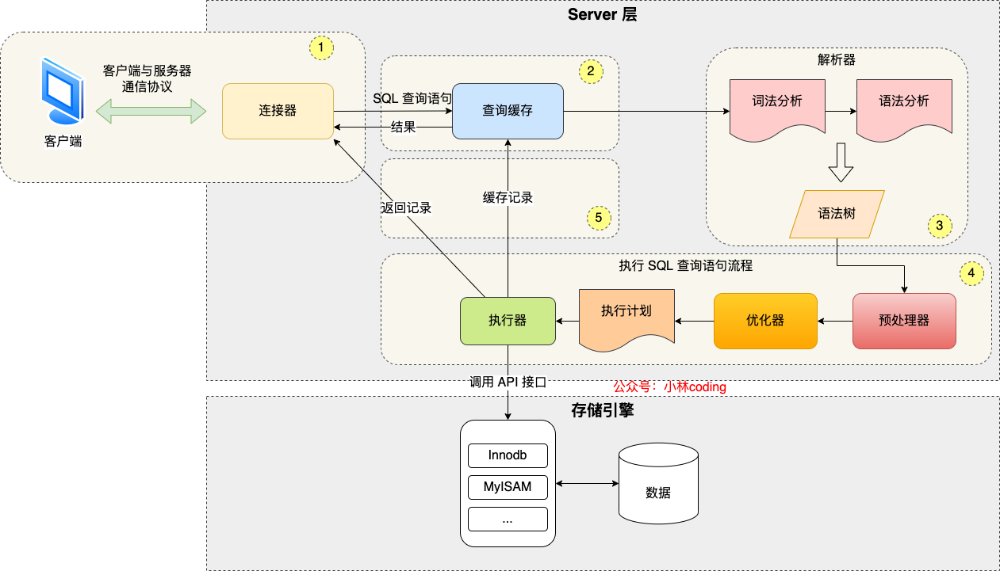
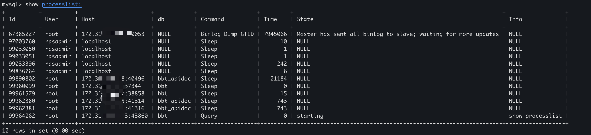
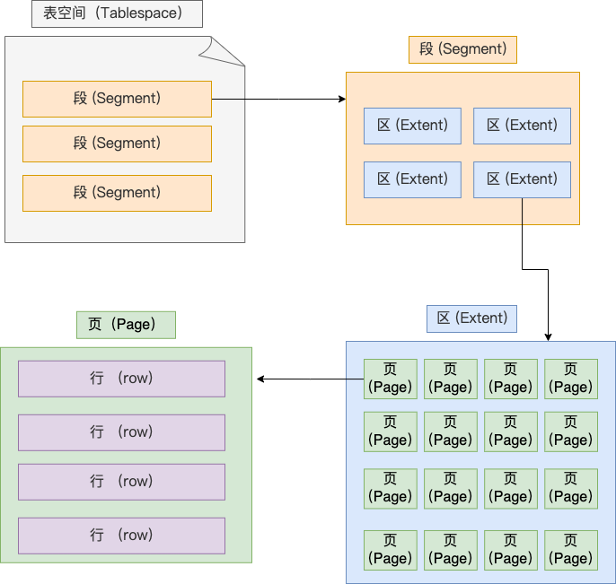
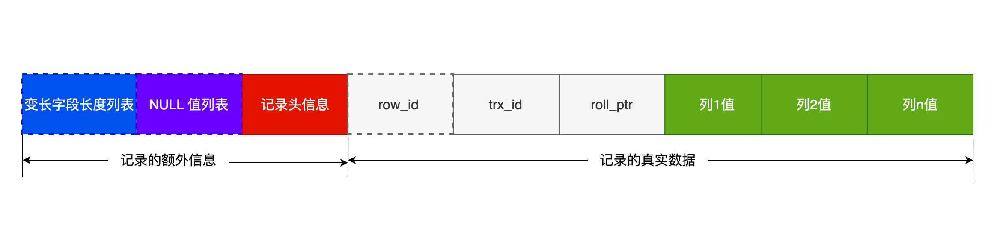

# MySQL

[图解mysql](https://xiaolincoding.com/mysql/)

[mysql源码](https://www.iskm.org/mysql56/index.html)

# 数据查询过程

- 连接器：建立连接，管理连接、校验用户身份；
- 查询缓存：查询语句如果命中查询缓存则直接返回，否则继续往下执行。MySQL 8.0 已删除该模块；
- 解析 SQL，通过解析器对 SQL 查询语句进行词法分析、语法分析，然后构建语法树，方便后续模块读取表名、字段、语句类型；
- 执行 SQL：执行 SQL 共有三个阶段：
  - 预处理阶段：检查表或字段是否存在；将 `select *` 中的 `*` 符号扩展为表上的所有列。
  - 优化阶段：基于查询成本的考虑， 选择查询成本最小的执行计划；
  - 执行阶段：根据执行计划执行 SQL 查询语句，从存储引擎读取记录，返回给客户端；



## 连接

- 与客户端进行 TCP 三次握手建立连接；
- 校验客户端的用户名和密码，如果用户名或密码不对，则会报错；
- 如果用户名和密码都对了，会读取该用户的权限，然后后面的权限逻辑判断都基于此时读取到的权限；


**最大空闲时长**：MySQL 定义了空闲连接的**最大空闲时长**，由 `wait_timeout` 参数控制的，默认值是 8 小时（28880秒），如果空闲连接超过了这个时间，连接器就会自动将它断开。

**连接数限制**：MySQL 服务支持的最大连接数由 max_connections 参数控制，超过这个值系统就会拒绝接下来的连接请求，并报错提示“Too many connections”。

**短连接和长连接**

```c
// 短连接
连接 mysql 服务（TCP 三次握手）
执行sql
断开 mysql 服务（TCP 四次挥手）

// 长连接
连接 mysql 服务（TCP 三次握手）
执行sql
执行sql
执行sql
....
断开 mysql 服务（TCP 四次挥手）
```

使用长连接的好处就是可以减少建立连接和断开连接的过程，所以一般是推荐使用长连接。

但是，使用长连接后可能会占用内存增多，因为 MySQL 在执行查询过程中临时使用内存管理连接对象，这些连接对象资源只有在连接断开时才会释放。如果长连接累计很多，将导致 MySQL 服务占用内存太大，有可能会被系统强制杀掉，这样会发生 MySQL 服务异常重启的现象。


**Q&A**

如何查看mysl 被多少客户端链接了

`show processlist`



怎么解决长连接占用内存的问题？

第一种，**定期断开长连接**。既然断开连接后就会释放连接占用的内存资源，那么我们可以定期断开长连接。

第二种，**客户端主动重置连接**。MySQL 5.7 版本实现了 `mysql_reset_connection()` 函数的接口，注意这是接口函数不是命令，那么当客户端执行了一个很大的操作后，在代码里调用 mysql_reset_connection 函数来重置连接，达到释放内存的效果。这个过程不需要重连和重新做权限验证，但是会将连接恢复到刚刚创建完时的状态。


## 查询缓存(Query Cache)

查询语句会先查询 查询缓存(Query Cache )，key-value 结构 key 为 SQL，value 为结果。

如果表有更新操作，查询缓存会被清空。

MySQL 8.0及之后版本已经删除了查询缓存。

对于 MySQL 8.0 之前的版本，如果想关闭查询缓存，我们可以通过将参数 query_cache_type 设置成 `DEMAND`。

查询缓存是server 层的，并不是 Innodb 存储引擎中的 buffer pool

## 解析

解析器会做如下两件事情。

**词法分析**。MySQL 会根据你输入的字符串识别出关键字出来，构建出 SQL 语法树，这样方便后面模块获取 SQL 类型、表名、字段名、 where 条件等等。

**语法分析**。根据词法分析的结果，语法解析器会根据语法规则，判断你输入的这个 SQL 语句是否满足 MySQL 语法。

如果我们输入的 SQL 语句语法不对，就会在解析器这个阶段报错。比如，我下面这条查询语句，把 from 写成了 form，这时 MySQL 解析器就会给报错。

表不存在或者字段不存在，并不是在解析器里做的。解析器只负责构建语法树和检查语法，但是不会去查表或者字段存不存在。

## 执行

三个阶段

- prepare 阶段，预处理阶段；
- optimize 阶段，优化阶段；
- execute 阶段，执行阶段；

###  预处理器

- 检查 SQL 查询语句中的表或者字段是否存在；
- 将 `select *` 中的 `*` 符号，扩展为表上的所有列；

###  优化器

**优化器主要负责将 SQL 查询语句的执行方案确定下来**，比如在表里面有多个索引的时候，优化器会基于查询成本的考虑，来决定选择使用哪个索引。

以在查询语句最前面加个 `explain` 命令，这样就会输出这条 SQL 语句的执行计划，然后执行计划中的 key 就表示执行过程中使用了哪个索引。

索引后面再讲

###  执行器

三种方式执行过程

**主键索引查询**

```sql
select * from product where id = 1;
```

- 执行器第一次查询，会调用 read_first_record 函数指针指向的函数，因为优化器选择的访问类型为 const，这个函数指针被指向为 InnoDB 引擎索引查询的接口，把条件 `id = 1` 交给存储引擎，**让存储引擎定位符合条件的第一条记录**。
- 存储引擎通过主键索引的 B+ 树结构定位到 id = 1的第一条记录，如果记录是不存在的，就会向执行器上报记录找不到的错误，然后查询结束。如果记录是存在的，就会将记录返回给执行器；
- 执行器从存储引擎读到记录后，接着判断记录是否符合查询条件，如果符合则发送给客户端，如果不符合则跳过该记录。
- 执行器查询的过程是一个 while 循环，所以还会再查一次，但是这次因为不是第一次查询了，所以会调用 read_record 函数指针指向的函数，因为优化器选择的访问类型为 const，这个函数指针被指向为一个永远返回 - 1 的函数，所以当调用该函数的时候，执行器就退出循环，也就是结束查询了。


**全表扫描**

```sql
select * from product where name = 'iphone';
```

- 执行器第一次查询，会调用 read_first_record 函数指针指向的函数，因为优化器选择的访问类型为 all，这个函数指针被指向为 InnoDB 引擎全扫描的接口，**让存储引擎读取表中的第一条记录**；
- 执行器会判断读到的这条记录的 name 是不是 iphone，如果不是则跳过；如果是则将记录发给客户端。Server 层每从存储引擎读到一条记录就会发送给客户端。客户端等查询语句查询完成后，才会显示出所有的记录
- 一直重复上述过程，直到存储引擎把表中的所有记录读完，然后向执行器（Server层） 返回了读取完毕的信息；
- 执行器收到存储引擎报告的查询完毕的信息，退出循环，停止查询。


**索引下推 (index condition pushdown)**

MySQL 5.6 推出的查询优化策略

```sql
# idx_age_reward
select * from t_user  where age > 20 and reward = 100000;
```

不使用索引下推执行器与存储引擎的执行流程：

- 定位到最左匹配的第一条记录， age > 20 的第一条记录。
- 获取所有满足最左匹配的数据，拿出主键，然后进行回表，再把完整的记录返回给 Server 层，Server判断reward是否满足条件，否则跳过。
- 重复操作，直到存储引擎把表中的所有符合条件的记录读完。

使用索引下推执行器与存储引擎的执行流程：

- 定位到最左匹配的第一条记录， age > 20 的第一条记录。
- 获取所有满足最左匹配的数据，判断reward是否满足条件，如果不成立则抛弃，如果成立则回表，将记录返回给 Server 层。
- 重复操作，直到存储引擎把表中的所有符合条件的记录读完。


当组合索引满足最左匹配，但是遇到非等值判断时匹配停止。进行索引下推，由存储引擎过滤剩下的组合索引条件，减少回表数据。


# 数据存储格式

文件存放目录

```mysql
mysql> SHOW VARIABLES LIKE 'datadir';
+---------------+-----------------+
| Variable_name | Value           |
+---------------+-----------------+
| datadir       | /var/lib/mysql/ |
+---------------+-----------------+
1 row in set (0.00 sec)
```

```bash
[root@root ~]#ls /var/lib/mysql/my_test
db.opt  
t_order.frm  
t_order.ibd
```

- db.opt，用来存储当前数据库的默认字符集和字符校验规则。
- t_order.frm ，t_order 的**表结构**。
- t_order.ibd，t_order 的**表数据**会保存在这个文件。表数据既可以存在共享表空间文件（文件名：ibdata1）里，也可以存放在独占表空间文件（文件名：表名字.ibd）。这个行为是由参数 innodb_file_per_table 控制的，若设置了参数 innodb_file_per_table 为 1，则会将存储的数据、索引等信息单独存储在一个独占表空间，从 MySQL 5.6.6 版本开始，它的默认值就是 1 了，因此从这个版本之后， MySQL 中每一张表的数据都存放在一个独立的 .ibd 文件。

## 表空间文件的结构

**表空间由段（segment）、区（extent）、页（page）、行（row）组成**，InnoDB存储引擎的逻辑存储结构大致如下图：




#### 行（row）

数据库表中的记录都是按行（row）进行存放的，每行记录根据不同的行格式，有不同的存储结构。

#### 页（page）

innoDB 的数据是按「页」为单位来读写的。
**默认每个页的大小为 16KB**，最多能保证 16KB 的连续存储空间。
页是 InnoDB 存储引擎磁盘管理的最小单元，意味着数据库每次读写都是以 16KB 为单位的，一次最少从磁盘中读取 16K 的内容到内存中，一次最少把内存中的 16K 内容刷新到磁盘中。

一行的字节大小不能超过数据页的大小，当一行的字节大小超过数据页的大小时，这个行就无法存储在单个数据页中，这被称为行溢出（**row overflow**）。

页的类型有很多，常见的有数据页、undo 日志页、溢出页等等。数据表中的行记录是用「数据页」来管理的。

#### 区（extent）

区是一组连续「页」的集合。

每个区的大小通常是多个数据页的大小的倍数，这个倍数可以根据具体的配置进行设置。例如，在InnoDB存储引擎中，默认情况下，一个区的大小为1MB，而一个数据页的大小为16KB。因此，一个区包含64个数据页。

区的主要目的是减少磁盘IO操作的次数。当MySQL需要分配新的存储空间来存储数据时，它会以区为单位进行分配。这样，相对于每次只分配一个数据页，分配一个区可以减少磁盘IO操作的次数，提高性能。

区还有助于提高数据的连续性。由于区是一组连续的数据页，当数据被存储在区中时，它们在磁盘上的物理位置也是连续的。这有助于提高数据的访问效率，减少磁盘寻道的开销。

#### 段（segment）

表空间是由各个段（segment）组成的，段是由多个区（extent）组成的。段一般分为数据段、索引段和回滚段等。

- 索引段：存放 B + 树的非叶子节点的区的集合；
- 数据段：存放 B + 树的叶子节点的区的集合；
- 回滚段：存放的是回滚数据的区的集合；

## 行格式(row_format)

行格式（row_format），就是一条记录的存储结构。

InnoDB 提供了 4 种行格式，分别是 Redundant、Compact、Dynamic和 Compressed 行格式。

- Redundant 是很古老的行格式了， MySQL 5.0 版本之前用的行格式，现在基本没人用了。
- Compact 是一种紧凑的行格式，设计的初衷就是为了让一个数据页中可以存放更多的行记录，从 MySQL 5.1 版本之后，行格式默认设置成 Compact。
- Dynamic 和 Compressed 两个都是紧凑的行格式，它们的行格式都和 Compact 差不多，因为都是基于 Compact 改进一点东西。从 MySQL5.7 版本之后，默认使用 Dynamic 行格式。


**COMPACT 行格式**



```sql
CREATE TABLE `t_user` (
  `id` int(11) NOT NULL,
  `name` VARCHAR(20) DEFAULT NULL,
  `phone` VARCHAR(20) DEFAULT NULL,
  `age` int(11) DEFAULT NULL,
  PRIMARY KEY (`id`) USING BTREE
) ENGINE = InnoDB DEFAULT CHARACTER SET = ascii ROW_FORMAT = COMPACT;
```

一条完整的记录分为「记录的额外信息」和「记录的真实数据」两个部分

### 记录的额外信息

1. **变长字段长度列表**
   变长字段的真实数据占用的字节数
   如果是NULL，则不会保存变长字段的长度
   如果没有变长之短，则不会有变长字段长度列表
2. **NULL值列表**
   记录真实值为NULL的值
   如果存在允许 NULL 值的列，则每个列对应一个二进制位（bit），二进制位按照列的顺序逆序排列。
   如果一个字节存不下NULL值列表，则会扩增到两个字节。
   当所有字段都是NOT NULL，则不会有NULL值列表。
3. **记录头信息**
   这几个比较重要
   **delete_mask** ：标识此条数据是否被删除。从这里可以知道，我们执行 detele 删除记录的时候，并不会真正的删除记录，只是将这个记录的 delete_mask 标记为 1。
   **next_record**：下一条记录的位置。指向的是下一条记录的「记录头信息」和「真实数据」之间的位置，这样的好处是向左读就是记录头信息，向右读就是真实数据，比较方便。
   **record_type**：表示当前记录的类型，0表示普通记录，1表示B+树非叶子节点记录，2表示最小记录，3表示最大记录

额外信息大部分都是**逆序**存放。这样的好处是向左读就是记录头信息，向右读就是真实数据

### 记录的真实数据

记录真实数据部分除了我们定义的字段，还有三个隐藏字段，分别为：row_id、trx_id、roll_pointer

- row_id

如果我们建表的时候指定了主键或者唯一约束列，那么就没有 row_id 隐藏字段了。如果既没有指定主键，又没有唯一约束，那么 InnoDB 就会为记录添加 row_id 隐藏字段。row_id不是必需的，占用 6 个字节。

- trx_id

事务id，表示这个数据是由哪个事务生成的。 trx_id是必需的，占用 6 个字节。

- roll_pointer

这条记录上一个版本的指针。roll_pointer 是必需的，占用 7 个字节。

### 行溢出(row overflow)

默认的数据页大小是16KB，一行的字节大小不能超过数据页的大小，当一行的字节大小超过数据页的大小时，这个行就无法存储在单个数据页中，这被称为行溢出（**row overflow**）。

为了处理行溢出的情况，MySQL提供了一种机制，即将溢出的数据存储在额外的数据页中，并通过指针进行引用。但是，这种行溢出的处理会增加额外的存储和访问成本，并且可能影响查询性能。

为了避免行溢出的情况，MySQL限制了一行的字节大小不能超过数据页的大小。对于InnoDB存储引擎，默认情况下，一行的字节大小不能超过65535个字节（64KB - 1）。

一些大对象如 TEXT、BLOB 可能存储更多的数据，这时一个页可能就存不了一条记录。这个时候就会**发生行溢出，多的数据就会存到另外的「溢出页」中**。

Compact 行格式发生行溢出时，在记录的真实数据处只会保存该列的一部分数据，而把剩余的数据放在「溢出页」中，然后真实数据处用 20 字节存储指向溢出页的地址，从而可以找到剩余数据所在的页。大致如下图所示。

Compressed 和 Dynamic 行格式发生行溢出时，只存储 20 个字节的指针来指向溢出页，而实际的数据都存储在溢出页中。
