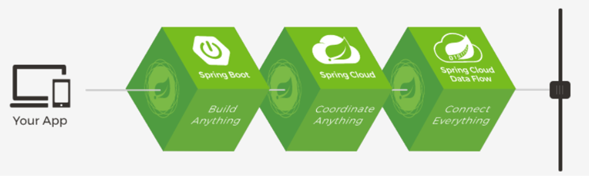

# 基础入门

## Spring与SpringBoot

### Spring能做什么

#### Spring的能力

MicroServices、Reactive、Cloud、webapp、serverless、enentDriven、batch

#### Spring的生态

SpringFramework

https://spring.io/projects/spring-boot

### 为什么用SpringBoot

> Spring Boot makes it easy to create stand-alone, production-grade Spring based Applications that you can "just run".

#### SpringBoot的优点

- Create stand-alone Spring applications

- Embed Tomcat, Jetty or Undertow directly (no need to deploy WAR files)

- Provide opinionated 'starter' dependencies to simplify your build configuration

- Automatically configure Spring and 3rd party libraries whenever possible

- Provide production-ready features such as metrics, health checks, and externalized configuration

- Absolutely no code generation and no requirement for XML configuration

#### SpringBoot的缺点

​	版本迭代快，封装深，内部原理复杂，不易精通

### 时代背景

#### 微服务

[James Lewis and Martin Fowler (2014)](https://martinfowler.com/articles/microservices.html)  提出微服务完整概念。https://martinfowler.com/microservices/

> In short, the **microservice architectural style** is an approach to developing a single application as a **suite of small services**, each **running in its own process** and communicating with **lightweight** mechanisms, often an **HTTP** resource API. These services are **built around business capabilities** and **independently deployable** by fully **automated deployment** machinery. There is a **bare minimum of centralized management** of these services, which may be **written in different programming languages** and use different data storage technologies.-- [James Lewis and Martin Fowler (2014)](https://martinfowler.com/articles/microservices.html)

- 微服务是一种架构风格
- 一个应用拆分为一组小型服务
- 每个服务运行在自己的进程内，也就是可独立部署和升级
- 服务之间使用轻量级HTTP交互
- 服务围绕业务功能拆分
- 可以由全自动部署机制独立部署
- 去中心化，服务自治。服务可以使用不同的语言、不同的存储技术

#### 分布式

**分布式的困难**

- 远程调用
- 服务发现
- 负载均衡
- 服务容错
- 配置管理
- 服务监控
- 链路追踪
- 日志管理
- 任务调度
- ......

**分布式的解决**

- SpringBoot + SpringCloud

  

**云原生**

### 如何学习->官方文档架构

Spring Boot Reference Documentation：https://docs.spring.io/spring-boot/docs/current/reference/html/

查看版本新特性；

https://github.com/spring-projects/spring-boot/wiki#release-notes

## SpringBoot2入门

### 环境要求

Java8及以上

Maven 3.3及以上

配置要求：https://docs.spring.io/spring-boot/docs/current/reference/html/getting-started.html#getting-started-system-requirements

源代码：https://gitee.com/leifengyang/springboot2

**maven设置**

```xml
阿里云的镜像
<mirrors>
      <mirror>
        <id>nexus-aliyun</id>
        <mirrorOf>central</mirrorOf>
        <name>Nexus aliyun</name>
        <url>http://maven.aliyun.com/nexus/content/groups/public</url>
      </mirror>
  </mirrors>
 
使用jdk1.8
  <profiles>
         <profile>
              <id>jdk-1.8</id>
              <activation>
                <activeByDefault>true</activeByDefault>
                <jdk>1.8</jdk>
              </activation>
              <properties>
                <maven.compiler.source>1.8</maven.compiler.source>
                <maven.compiler.target>1.8</maven.compiler.target>
                <maven.compiler.compilerVersion>1.8</maven.compiler.compilerVersion>
              </properties>
         </profile>
  </profiles>
```

### Helloworld

1. #### 创建Maven工程

   记得看idea setting，build->build tools->maven 的设置

2. #### 引入依赖

   在pom.xml文件中引入依赖

   ```xml
   <parent>
           <groupId>org.springframework.boot</groupId>
           <artifactId>spring-boot-starter-parent</artifactId>
           <version>2.3.4.RELEASE</version>
       </parent>
   
   
       <dependencies>
           <dependency>
               <groupId>org.springframework.boot</groupId>
               <artifactId>spring-boot-starter-web</artifactId>
           </dependency>
   
       </dependencies>
   ```

   

3. 创建主程序

   ```java
   /**
    * 主程序类
    * @SpringBootApplication：这是一个SpringBoot应用
    */
   @SpringBootApplication
   public class MainApplication {
   
       public static void main(String[] args) {
           SpringApplication.run(MainApplication.class,args);
       }
   }
   ```

   

4. 编写业务 

   ```java
   @RestController
   public class HelloController {
       @RequestMapping("/hello")
       public String handle01(){
           return "Hello, Spring Boot 2!";
       }
   }
   ```

   

5. 测试
   直接运行main方法

6. 简化配置
   resources 下 application.properties

7. 简化部署

   添加依赖

   ```xml
    <build>
           <plugins>
               <plugin>
                   <groupId>org.springframework.boot</groupId>
                   <artifactId>spring-boot-maven-plugin</artifactId>
               </plugin>
           </plugins>
       </build>
   
   ```

   maven->lifecycle->package

   打包成jar包，服务器可以直接用

## 自动配置原理入门

### SpringBoot特点

#### 1.项目依赖

依赖管理  

```xml
<parent>
        <groupId>org.springframework.boot</groupId>
        <artifactId>spring-boot-starter-parent</artifactId>
        <version>2.3.4.RELEASE</version>
</parent>

 <parent>
    <groupId>org.springframework.boot</groupId>
    <artifactId>spring-boot-dependencies</artifactId>
    <version>2.3.4.RELEASE</version>
  </parent>
<--几乎声明了所有开发中常用的依赖的版本号,自动版本仲裁机制-->
```

导入starter
只要引入starter，这个场景的所有常规需要的依赖我们都自动引入
SpringBoot所有支持的场景
https://docs.spring.io/spring-boot/docs/current/reference/html/using-spring-boot.html#using-boot-starter

```xml
<dependency>
  <groupId>org.springframework.boot</groupId>
  <artifactId>spring-boot-starter</artifactId>
  <version>2.3.4.RELEASE</version>
  <scope>compile</scope>
</dependency>
```

**无需关注版本号，自动版本仲裁**
引入的依赖默认都可以不写版本
引入非版本总裁的JAR，需要写版本号

**可以修改默认版本号**
查看spring-boot-dependencies里面规定当前依赖的版本 用的 key。
或者在当前项目里重写配置

```xml
    <properties>
        <mysql.version>5.1.43</mysql.version>
    </properties>
```

#### 2.自动配置

- 自动配好Tomcat

- - 引入Tomcat依赖。
  - 配置Tomcat

```xml
<dependency>
      <groupId>org.springframework.boot</groupId>
      <artifactId>spring-boot-starter-tomcat</artifactId>
      <version>2.3.4.RELEASE</version>
      <scope>compile</scope>
    </dependency>
```

- 自动配好SpringMVC

- - 引入SpringMVC全套组件
  - 自动配好SpringMVC常用组件（功能）

- 自动配好Web常见功能，如：字符编码问题

- - SpringBoot帮我们配置好了所有web开发的常见场景

- 默认的包结构

- - 主程序所在包及其下面的所有子包里面的组件都会被默认扫描进来
  - 无需以前的包扫描配置
  - 想要改变扫描路径，在application里改变`@SpringBootApplication(scanBasePackages="com.ctf")`

- - - 或者`@ComponentScan` 指定扫描路径

```java
@SpringBootApplication
等同于
@SpringBootConfiguration
@EnableAutoConfiguration
@ComponentScan("com.ctf.boot")
```


- 各种配置拥有默认值

- - 默认配置最终都是映射到某个类上，如：MultipartProperties
  - 配置文件的值最终会绑定每个类上，这个类会在容器中创建对象
  - 要改配置直接在application.yml里改

- 按需加载所有自动配置项

- - 非常多的starter
  - 引入了哪些场景这个场景的自动配置才会开启
  - SpringBoot所有的自动配置功能都在 spring-boot-autoconfigure 包里面
  - 

- ......

### 容器功能

#### 组件添加

##### @Configuration

**Full模式与Lite模式**

实战：配置类组件之间无依赖关系用Lite模式加速容器启动过程，减少判断

配置类组件之间有依赖关系，方法会被调用得到之前单实例组件，用Full模式

```java
config/MyConfig
/**
 * 1、配置类里面使用@Bean标注在方法上给容器注册组件，默认也是单实例的
 * 2、配置类本身也是组件
 * 3、proxyBeanMethods：代理bean的方法
 *      Full(proxyBeanMethods = true)、【保证每个@Bean方法被调用多少次返回的组件都是单实例的】
 *      Lite(proxyBeanMethods = false)【每个@Bean方法被调用多少次返回的组件都是新创建的】
 *      组件依赖必须使用Full模式默认。其他默认是否Lite模式
 *
 *
 *
 */
@Configuration(proxyBeanMethods = false) //告诉SpringBoot这是一个配置类 == 配置文件
public class MyConfig {

    /**
     * Full:外部无论对配置类中的这个组件注册方法调用多少次获取的都是之前注册容器中的单实例对象
     * @return
     */
    @Bean //给容器中添加组件。以方法名作为组件的id。返回类型就是组件类型。返回的值，就是组件在容器中的实例
    public User user01(){
        User zhangsan = new User("zhangsan", 18);
        //user组件依赖了Pet组件
        zhangsan.setPet(tomcatPet());
        return zhangsan;
    }

    @Bean("tom")
    public Pet tomcatPet(){
        return new Pet("tomcat");
    }
}
```

```java
Application
public class MainApplication {

    public static void main(String[] args) {
        //1、返回我们IOC容器
        ConfigurableApplicationContext run = SpringApplication.run(MainApplication.class, args);

        //2、查看容器里面的组件
        String[] names = run.getBeanDefinitionNames();
        for (String name : names) {
            System.out.println(name);
        }

        //3、从容器中获取组件

        Pet tom01 = run.getBean("tom", Pet.class);

        Pet tom02 = run.getBean("tom", Pet.class);

        System.out.println("组件："+(tom01 == tom02));


        //4、com.atguigu.boot.config.MyConfig$$EnhancerBySpringCGLIB$$51f1e1ca@1654a892
        MyConfig bean = run.getBean(MyConfig.class);
        System.out.println(bean);

        //如果@Configuration(proxyBeanMethods = true)代理对象调用方法。SpringBoot总会检查这个组件是否在容器中有。
        //保持组件单实例
        User user = bean.user01();
        User user1 = bean.user01();
        System.out.println(user == user1);


        User user01 = run.getBean("user01", User.class);
        Pet tom = run.getBean("tom", Pet.class);

        System.out.println("用户的宠物："+(user01.getPet() == tom));


    }
}
```

##### @Bean、@Component、@Controller、@Service、@Repository

@Component：组件
@Controller：控制器
@Service：业务逻辑组件
@Repository：数据库层组件

##### @ComponentScan、@Import

@ComponentScan：配置包扫描
@Import：导入

```java
/** 
* 4、@Import({User.class, DBHelper.class})
 *      给容器中自动创建出这个类型的组件、默认组件的名字就是全类名
 *
 *
 *
 */

@Import({User.class, DBHelper.class})
@Configuration(proxyBeanMethods = false) //告诉SpringBoot这是一个配置类 == 配置文件
public class MyConfig {
}
```

##### @Conditional

条件装配：满足Conditional指定的条件，才进行组件注入

```java
//当容器中有名为“tom”的组件，才进行组件注入
@ConditionalOnBean(name = "tom")
public class MyConfig {
    @Bean 
    public User user01(){
        User zhangsan = new User("zhangsan", 18);
        //user组件依赖了Pet组件
        zhangsan.setPet(tomcatPet());
        return zhangsan;
    }

    @Bean("tom")
    public Pe t tomcatPet(){
        return new Pet("tomcat");
    }
}
```

#### 原生(旧的)配置文件引入

##### @ImportResource

```java
//config下
@ImportResource("classpath:beans.xml")
public class MyConfig {
    ...;
}
```

```xml
======================beans.xml=========================
<?xml version="1.0" encoding="UTF-8"?>
<beans xmlns="http://www.springframework.org/schema/beans"
       xmlns:xsi="http://www.w3.org/2001/XMLSchema-instance"
       xmlns:context="http://www.springframework.org/schema/context"
       xsi:schemaLocation="http://www.springframework.org/schema/beans http://www.springframework.org/schema/beans/spring-beans.xsd http://www.springframework.org/schema/context https://www.springframework.org/schema/context/spring-context.xsd">

    <bean id="haha" class="com.atguigu.boot.bean.User">
        <property name="name" value="zhangsan"></property>
        <property name="age" value="18"></property>
    </bean>

    <bean id="hehe" class="com.atguigu.boot.bean.Pet">
        <property name="name" value="tomcat"></property>
    </bean>
</beans>
```

#### 配置绑定

使用Java读取到properties文件中的内容，并且把它封装到JavaBean中，以供随时使用；
旧的Java可能要遍历properties文件；

##### @ConfigurationProperties

加了ConfigurationProperties，一定要加@component ，只有在容器中的组件才会拥有springboot 的功能

```java

@Component
@ConfigurationProperties(prefix = "mycar")
public class Car {
    private String brand;
    private Integer price;
...
}
//car的属性的默认值绑定在properties文件中，前缀是“mycar”
```

##### @EnableConfigurationProperties

写了@ConfigurationProperties，又不能写@component的情况下

写在config里；

```java
@EnableConfigurationProperties(Car.class)
//1.开启CAR配置绑定功能
//2.把CAR这个组件自动注册到容器中
public class MyConfig{
    //..
}
```

### 自动配置原理入门

####  引导加载自动配置类

@SpringBootApplication注解是啥

```java
@SpringBootConfiguration
@EnableAutoConfiguration
@ComponentScan(excludeFilters = { @Filter(type = FilterType.CUSTOM, classes = TypeExcludeFilter.class),
        @Filter(type = FilterType.CUSTOM, classes = AutoConfigurationExcludeFilter.class) })
public @interface SpringBootApplication{}
```

有三个注解

**1.@SpringBootConfiguration**

有一个注解 @Configuration。代表当前是一个配置类

**2.@ComponentScan**
指定扫描哪些

**3.@EnableAutoConfiguration**

```java
@AutoConfigurationPackage
@Import(AutoConfigurationImportSelector.class)
public @interface EnableAutoConfiguration {}
```

1.@AutoConfigurationPackage
自动配置包

```java
@Import(AutoConfigurationPackages.Registrar.classb)  //给容器中导入一个组件
public @interface AutoConfigurationPackage {}

//利用Registrar给容器中导入一系列组件
//将指定的一个包下的所有组件导入进来？MainApplication 所在包下。
```

2.@Import(AutoConfigurationImportSelector.class)

1、利用`getAutoConfigurationEntry(annotationMetadata);`给容器中批量导入一些组件
2、调用`List<String> configurations = getCandidateConfigurations(annotationMetadata, attributes)`获取到所有需要导入到容器中的配置类
3、利用工厂加载 `Map<String, List<String>> loadSpringFactories(@Nullable ClassLoader classLoader);`得到所有的组件
4、从META-INF/spring.factories位置来加载一个文件。
	默认扫描我们当前系统里面所有META-INF/spring.factories位置的文件
    spring-boot-autoconfigure-2.3.4.RELEASE.jar包里面也有META-INF/spring.factories,里面写死了127条启动springboot要导入的组件。

#### 按需开启自动配置项

虽然127个场景的所有自动配置在启动时默认全部加载
但是按照条件装配规则（@Conditional），最终会按需配置。

####  修改默认配置

例如 ，文件上传解析器

```java
@Bean
@ConditionalOnBean(MultipartResolver.class)  //容器中有这个类型组件
       @ConditionalOnMissingBean(name = DispatcherServlet.MULTIPART_RESOLVER_BEAN_NAME) //容器中没有这个名字 multipartResolver 的组件 
        public MultipartResolver multipartResolver(MultipartResolver resolver) {
            //给@Bean标注的方法传入了对象参数，这个参数的值就会从容器中找。
            //SpringMVC multipartResolver。防止有些用户配置的文件上传解析器不符合规范
            // Detect if the user has created a MultipartResolver but named it incorrectly
            return resolver;
        }
```

SpringBoot默认会在底层配好所有的组件。但是如果用户自己配置了以用户的优先
`@ConditionalOnMissingBean`

```java
@Bean
@ConditionalOnMissingBean
public CharacterEncodingFilter characterEncodingFilter() {
    }
```

总结：

- SpringBoot先加载所有的自动配置类  xxxxxAutoConfiguration
- 每个自动配置类按照条件进行生效，默认都会绑定配置文件指定的值。从xxxxProperties里面拿。xxxProperties又和配置文件进行了绑定
- 生效的配置类就会给容器中装配很多组件
- 只要容器中有这些组件，相当于这些功能就有了
- 定制化配置

- - 用户直接自己@Bean替换底层的组件

  - 用户去看这个组件是获取的配置文件什么值就去修改。

    比如，在properties里加入`server.servlet.encoding.charset=GBK`

**xxxxxAutoConfiguration --> 组件  -->** **xxxxProperties里面拿值  --> application.properties**

文档：https://docs.spring.io/spring-boot/docs/current/reference/html/appendix-application-properties.html#common-application-properties

#### 最佳实践步骤

1. 引入场景依赖
   什么什么[启动器](https://docs.spring.io/spring-boot/docs/current/reference/html/using-spring-boot.html#using-boot-starter)
2. 查看自动配置了哪些（选做）
   1. 自己分析，引入场景对应的自动配置
   2. 配置文件中，debug=true，开启自动配置报告，negative(不生效)\positive（生效）
3. 是否要修改
   1. 参照文档修改配置项
      [application properties](https://docs.spring.io/spring-boot/docs/current/reference/html/appendix-application-properties.html#common-application-properties)
      自己分析，xxxxProperties绑定了配置文件的哪些
   2. 自定义加入或替换组件
      @Bean、@Component ...
   3. 自定义器 XXXcustomizer
   4. ...

### 开发小技巧

#### Lombok

简化javaBean的开发

1.引入Lombok

```xml
 <dependency>
            <groupId>org.projectlombok</groupId>
            <artifactId>lombok</artifactId>
        </dependency>
```

2.idea中搜索安装lombak plugin

3.简化JavaBean开发

```java
@NoArgsConstructor //无参构造器
@AllArgsConstructor //全参构造器
@Data //get set
@ToString //toString
@EqualsAndHashCode //重写Equals和HashCode 方法
public class User {

    private String name;
    private Integer age;
    private Pet pet;

    public User(String name,Integer age){
        this.name = name;
        this.age = age;
    }


}
```

4.简化日志开发

```java
@Slf4j
@RestController
public class HelloController {
    @RequestMapping("/hello")
    public String handle01(@RequestParam("name") String name){
        
        log.info("请求进来了....");
        
        return "Hello, Spring Boot 2!"+"你好："+name;
    }
}
```

#### dev-tools

just automatic restart，如果只是改静态页面，挺快，[文档](https://docs.spring.io/spring-boot/docs/current/reference/html/using-spring-boot.html#using-boot-devtools)

1.导入依赖

```xml
        <dependency>
            <groupId>org.springframework.boot</groupId>
            <artifactId>spring-boot-devtools</artifactId>
            <optional>true</optional>
        </dependency>
```

2.改完了之后，只要ctrl+f9(build project)就能更新代码

#### Spring initailizr

项目初始化向导

1.在idea里选spring initailizr，选择需要的开发场景

2.自动依赖引入

3.自动创建项目结构

4.自动编写好主配置类

# 核心功能

## 配置文件

### 文件类型


1. #### properties

   同以前

2. #### yaml

   YAML 是 "YAML Ain't Markup Language"（YAML 不是一种标记语言）的递归缩写。在开发的这种语言时，YAML 的意思其实是："Yet Another Markup Language"（仍是一种标记语言）。 

   非常适合用来做以数据为中心的配置文件

#### 基本语法

   key: value；kv之间有空格

   大小写敏感

   使用缩进表示层级关系

   缩进不允许使用tab，只允许空格

   缩进的空格数不重要，只要相同层级的元素左对齐即可

   '#'表示注释

   字符串无需加引号，如果要加，''与""表示字符串内容 会被 转义/不转义
   单引号的内容不转义，双引号的转义

####    数据类型

   字面量：单个的、不可再分的值。date、boolean、string、number、null

   ```yaml
   k:v
   ```

   对象：键值对的集合。map、hash、set、object 

   ```yaml
   #行内写法：  
   k: {k1:v1,k2:v2,k3:v3}
   #或
   k: 
     k1: v1
     k2: v2
     k3: v3
   ```

   数组：一组按次序排列的值。array、list、queue

   ```yaml
   #行内写法：  
   k: [v1,v2,v3]
   #或者 （一个杠表示一个元素）
   k:
    - v1
    - v2
    - v3
   ```

   示例

   ```yaml
   person:
     userName: zhangsan
     boss: false
     birth: 2019/12/12 20:12:33
     age: 18
     pet: 
       name: tomcat
       weight: 23.4
     interests: [篮球,游泳]
     animal: 
       - jerry
       - mario
     score:
       english: 
         first: 30
         second: 40
         third: 50
       math: [131,140,148]
       chinese: {first: 128,second: 136}
     salarys: [3999,4999.98,5999.99]
     allPets:
       sick:
         - {name: tom}
         - {name: jerry,weight: 47}
       health: [{name: mario,weight: 47}]
   ```

###    打开配置提示

自定义的类和配置文件绑定一般没有提示

导入

```xml
        <dependency>
            <groupId>org.springframework.boot</groupId>
            <artifactId>spring-boot-configuration-processor</artifactId>
            <optional>true</optional>
        </dependency>
```

导入，在打包的时候不打包configuration-processo

```xml
 <build>
        <plugins>
            <plugin>
                <groupId>org.springframework.boot</groupId>
                <artifactId>spring-boot-maven-plugin</artifactId>
                <configuration>
                    <excludes>
                        <exclude>
                            <groupId>org.springframework.boot</groupId>
                            <artifactId>spring-boot-configuration-processor</artifactId>
                        </exclude>
                    </excludes>
                </configuration>
            </plugin>
        </plugins>
    </build>
```

## Web开发

### SpringMVC自动配置概览

Spring Boot provides auto-configuration for Spring MVC that **works well with most applications.**
**(大多场景我们都无需自定义配置)**

The auto-configuration adds the following features on top of Spring’s defaults:

- Inclusion of `ContentNegotiatingViewResolver` and `BeanNameViewResolver` beans.
  内容协商视图解析器和BeanName视图解析器

- Support for serving static resources, including support for WebJars (covered [later in this document](https://docs.spring.io/spring-boot/docs/current/reference/html/spring-boot-features.html#boot-features-spring-mvc-static-content))).
  静态资源（包括webjars）

- Automatic registration of `Converter`, `GenericConverter`, and `Formatter` beans.
  自动注册 `Converter，GenericConverter，Formatter `(转换器、格式化器)

- Support for `HttpMessageConverters` (covered [later in this document](https://docs.spring.io/spring-boot/docs/current/reference/html/spring-boot-features.html#boot-features-spring-mvc-message-converters)).
  支持 `HttpMessageConverters` （后来我们配合内容协商理解原理）

- Automatic registration of `MessageCodesResolver` (covered [later in this document](https://docs.spring.io/spring-boot/docs/current/reference/html/spring-boot-features.html#boot-features-spring-message-codes)).
  自动注册 `MessageCodesResolver` （国际化用）

- Static `index.html` support.
  静态index.html 页支持

- Custom `Favicon` support (covered [later in this document](https://docs.spring.io/spring-boot/docs/current/reference/html/spring-boot-features.html#boot-features-spring-mvc-favicon)).
  自定义 `Favicon`  

- Automatic use of a `ConfigurableWebBindingInitializer` bean (covered [later in this document](https://docs.spring.io/spring-boot/docs/current/reference/html/spring-boot-features.html#boot-features-spring-mvc-web-binding-initializer)).
  自动使用 `ConfigurableWebBindingInitializer` ，（DataBinder负责将请求数据绑定到JavaBean上）

> If you want to keep those Spring Boot MVC customizations and make more [MVC customizations](https://docs.spring.io/spring/docs/5.2.9.RELEASE/spring-framework-reference/web.html#mvc) (interceptors, formatters, view controllers, and other features), you can add your own `@Configuration` class of type `WebMvcConfigurer` but **without** `@EnableWebMvc`.
> **不用@EnableWebMvc注解。使用** **`@Configuration`** **+** **`WebMvcConfigurer`** **自定义规则**


> If you want to provide custom instances of `RequestMappingHandlerMapping`, `RequestMappingHandlerAdapter`, or `ExceptionHandlerExceptionResolver`, and still keep the Spring Boot MVC customizations, you can declare a bean of type `WebMvcRegistrations` and use it to provide custom instances of those components.
> **声明** **`WebMvcRegistrations`** **改变默认底层组件**


> If you want to take complete control of Spring MVC, you can add your own `@Configuration` annotated with `@EnableWebMvc`, or alternatively add your own `@Configuration`-annotated `DelegatingWebMvcConfiguration` as described in the Javadoc of `@EnableWebMvc`.
> **使用** **`@EnableWebMvc+@Configuration+DelegatingWebMvcConfiguration 全面接管SpringMVC`**

### 简单功能分析

#### 静态资源访问

只要静态资源放在类路径下： `/static` (or `/public` or `/resources` or `/META-INF/resources `) 就能直接访问 

访问 ： 当前项目根路径/ + 静态资源名 


原理： 静态映射/**。

请求进来，先去找Controller看能不能处理。不能处理的所有请求又都交给静态资源处理器。静态资源也找不到则响应404页面


##### 默认的静态资源路径

默认无前缀

```yaml
spring:
  #改变静态资源访问前缀
  mvc:
    static-path-pattern: /res/**
  #改变静态资源默认位置
  resources:
    static-locations: [classpath:/haha/]
```

当前项目 + static-path-pattern + 静态资源名 = 静态资源文件夹下找

##### webjar

自动映射 /[webjars](http://localhost:8080/webjars/jquery/3.5.1/jquery.js)/**

https://www.webjars.org/

```xml
<dependency>
            <groupId>org.webjars</groupId>
            <artifactId>jquery</artifactId>
            <version>3.5.1</version>
</dependency>
```

访问地址：[http://localhost:8080/webjars/**jquery/3.5.1/jquery.js**](http://localhost:8080/webjars/jquery/3.5.1/jquery.js)  
后面地址要按照依赖里面的包路径

#### 欢迎页支持

静态资源路径下  index.html
可以配置静态资源路径
但是不可以配置静态资源的访问前缀。否则导致 index.html不能被默认访问

```yaml
spring:
#  mvc:
#    static-path-pattern: /res/**   这个会导致welcome page功能失效

  resources:
    static-locations: [classpath:/haha/]
```

- controller能处理/index

#### 自定义Favicon

favicon.ico 放在静态资源目录下即可。

#### 静态资源配置原理

- SpringBoot启动默认加载 一堆 xxxAutoConfiguration 类（自动配置类）
- SpringMVC功能的自动配置类 WebMvcAutoConfiguration，生效

```java
@Configuration(proxyBeanMethods = false)
@ConditionalOnWebApplication(type = Type.SERVLET)
@ConditionalOnClass({ Servlet.class, DispatcherServlet.class, WebMvcConfigurer.class })
@ConditionalOnMissingBean(WebMvcConfigurationSupport.class)
@AutoConfigureOrder(Ordered.HIGHEST_PRECEDENCE + 10)
@AutoConfigureAfter({ DispatcherServletAutoConfiguration.class, TaskExecutionAutoConfiguration.class,
        ValidationAutoConfiguration.class })
public class WebMvcAutoConfiguration {}
```

- 给容器中配了什么。

```java
    @Configuration(proxyBeanMethods = false)
    @Import(EnableWebMvcConfiguration.class)
    @EnableConfigurationProperties({ WebMvcProperties.class, ResourceProperties.class })
    @Order(0)
    public static class WebMvcAutoConfigurationAdapter implements WebMvcConfigurer {}
```

- 配置文件的相关属性和xxx进行了绑定。WebMvcProperties==**spring.mvc**、ResourceProperties==**spring.resources**

##### 配置类只有一个有参构造器

有参构造器所有参数的值都会从容器中确定

ResourceProperties resourceProperties;获取和spring.resources绑定的所有的值的对象

WebMvcProperties mvcProperties 获取和spring.mvc绑定的所有的值的对象

ListableBeanFactory beanFactory Spring的beanFactory 容器工厂

HttpMessageConverters 找到所有的HttpMessageConverters

ResourceHandlerRegistrationCustomizer 找到 资源处理器的自定义器。

DispatcherServletPath  

ServletRegistrationBean   给应用注册Servlet、Filter....

```java
	public WebMvcAutoConfigurationAdapter(ResourceProperties resourceProperties, WebMvcProperties mvcProperties,
				ListableBeanFactory beanFactory, ObjectProvider<HttpMessageConverters> messageConvertersProvider,
				ObjectProvider<ResourceHandlerRegistrationCustomizer> resourceHandlerRegistrationCustomizerProvider,
				ObjectProvider<DispatcherServletPath> dispatcherServletPath,
				ObjectProvider<ServletRegistrationBean<?>> servletRegistrations) {
			this.resourceProperties = resourceProperties;
			this.mvcProperties = mvcProperties;
			this.beanFactory = beanFactory;
			this.messageConvertersProvider = messageConvertersProvider;
			this.resourceHandlerRegistrationCustomizer = resourceHandlerRegistrationCustomizerProvider.getIfAvailable();
			this.dispatcherServletPath = dispatcherServletPath;
			this.servletRegistrations = servletRegistrations;
		}
```

##### 资源处理的默认规则

WebMvcAutoConfiguration.java

```JAVA
@Override
		public void addResourceHandlers(ResourceHandlerRegistry registry) {
			if (!this.resourceProperties.isAddMappings()) {
				logger.debug("Default resource handling disabled");
				return;
			}
			Duration cachePeriod = this.resourceProperties.getCache().getPeriod();
			CacheControl cacheControl = this.resourceProperties.getCache().getCachecontrol().toHttpCacheControl();
			//webjars的规则
            if (!registry.hasMappingForPattern("/webjars/**")) {
				customizeResourceHandlerRegistration(registry.addResourceHandler("/webjars/**")
						.addResourceLocations("classpath:/META-INF/resources/webjars/")
						.setCachePeriod(getSeconds(cachePeriod)).setCacheControl(cacheControl));
			}
            
            //
			String staticPathPattern = this.mvcProperties.getStaticPathPattern();
			if (!registry.hasMappingForPattern(staticPathPattern)) {
				customizeResourceHandlerRegistration(registry.addResourceHandler(staticPathPattern)
						.addResourceLocations(getResourceLocations(this.resourceProperties.getStaticLocations()))
						.setCachePeriod(getSeconds(cachePeriod)).setCacheControl(cacheControl));
			}
		}
```

可以配置`add-mappings`

```YAML
spring:
  resources:
    #禁用所有静态资源规则  	
    add-mappings: false   

```

静态资源的默认四个位置ResourceProperties.java

```JAVA
@ConfigurationProperties(prefix = "spring.resources", ignoreUnknownFields = false)
public class ResourceProperties {

	private static final String[] CLASSPATH_RESOURCE_LOCATIONS = { "classpath:/META-INF/resources/",
			"classpath:/resources/", "classpath:/static/", "classpath:/public/" };

	/**
	 * Locations of static resources. Defaults to classpath:[/META-INF/resources/,
	 * /resources/, /static/, /public/].
	 */
	private String[] staticLocations = CLASSPATH_RESOURCE_LOCATIONS;
```

##### 欢迎页的配置规则

HandlerMapping：处理器映射。保存了每一个Handler能处理哪些请求。比如下面的WelcomePageHan dlerMapping

```JAVA
		@Bean
		public WelcomePageHandlerMapping welcomePageHandlerMapping(ApplicationContext applicationContext,
				FormattingConversionService mvcConversionService, ResourceUrlProvider mvcResourceUrlProvider) {
			WelcomePageHandlerMapping welcomePageHandlerMapping = new WelcomePageHandlerMapping(
					new TemplateAvailabilityProviders(applicationContext), applicationContext, getWelcomePage(),
					this.mvcProperties.getStaticPathPattern());
			welcomePageHandlerMapping.setInterceptors(getInterceptors(mvcConversionService, mvcResourceUrlProvider));
			welcomePageHandlerMapping.setCorsConfigurations(getCorsConfigurations());
			return welcomePageHandlerMapping;
		}

	WelcomePageHandlerMapping(TemplateAvailabilityProviders templateAvailabilityProviders,
			ApplicationContext applicationContext, Optional<Resource> welcomePage, String staticPathPattern) {
		if (welcomePage.isPresent() && "/**".equals(staticPathPattern)) {
            //要用欢迎页功能，必须是/**
			logger.info("Adding welcome page: " + welcomePage.get());
			setRootViewName("forward:index.html");
		}
		else if (welcomeTemplateExists(templateAvailabilityProviders, applicationContext)) {
            // 调用Controller  /index
			logger.info("Adding welcome page template: index");
			setRootViewName("index");
		}
	}
```

##### favicon

/favicon.ico

### 请求参数处理

#### 请求映射

在所有web开发开始最先要做的就是请求映射

##### rest使用与原理

@xxxMapping()；

- Rest风格支持（*使用**HTTP**请求方式动词来表示对资源的操作*）

- - *以前：**/getUser*  *获取用户*   */deleteUser* *删除用户*   */editUser*  *修改用户*    */saveUser* *保存用户*
  - *现在： /user*   *GET-**获取用户*   *DELETE-**删除用户*   *PUT-**修改用户*    *POST-**保存用户*
  - 核心Filter；HiddenHttpMethodFilter

- - ​	用法： 表单method=post，隐藏域 _method=put

  - ​	SpringBoot中手动开启

- - 扩展：如何把_method 这个名字换成我们自己喜欢的。

两个相等
@RequestMapping(value = "/user",method = RequestMethod.GET)
@GetMapping("/user")

```java
//controller
	//@RequestMapping(value = "/user",method = RequestMethod.GET)
	@GetMapping("/user")
    public String getUser(){
        return "GET-张三";
    }

    //@RequestMapping(value = "/user",method = RequestMethod.POST)
    @PostMapping("/user")
	public String saveUser(){
        return "POST-张三";
    }


    //@RequestMapping(value = "/user",method = RequestMethod.PUT)
    @PutMapping("/user")
	public String putUser(){
        return "PUT-张三";
    }

    //@RequestMapping(value = "/user",method = RequestMethod.DELETE)
    @DeleteMapping("/user")
	public String deleteUser(){
        return "DELETE-张三";
    }


```

WebMvcAutoConfiguration.java

```JAVA
	//自定义filter
    @Bean
    public HiddenHttpMethodFilter hiddenHttpMethodFilter(){
        HiddenHttpMethodFilter methodFilter = new HiddenHttpMethodFilter();
        methodFilter.setMethodParam("_m");
        return methodFilter;
    }

	@Bean
	@ConditionalOnMissingBean(HiddenHttpMethodFilter.class)
	@ConditionalOnProperty(prefix = "spring.mvc.hiddenmethod.filter", name = "enabled", matchIfMissing = false)
	public OrderedHiddenHttpMethodFilter hiddenHttpMethodFilter() {
		return new OrderedHiddenHttpMethodFilter();
	}

```


Rest原理
（表单提交要使用REST的时候）

- 表单提交会带上**_method=PUT**

  ```html
  <form action="/user" method = "post">
      <input name="_method" type = "hidden" value = "delete"/>
      <input value="REST-DELETE 提交" type="submit"/>
  </form>	
  ```

  

- **请求过来被**HiddenHttpMethodFilter拦截

- - 请求是否正常，并且是POST

- - - 获取到**_method**的值。
    - 兼容以下请求：：**PUT**,**DELETE**,**PATCH**
    - 原生request（post），包装模式requestWrapper重写了getMethod方法，返回的是传入的值。
    - 过滤器链放行的时候用wrapper。以后的方法调用getMethod是调用requesWrapper的。

**Rest使用客户端工具，**

- 如PostMan直接发送Put、delete等方式请求，无需Filter。

```yml
spring:
  mvc:
    hiddenmethod:
      filter:
        enabled: true   #开启页面表单的Rest功能
```

