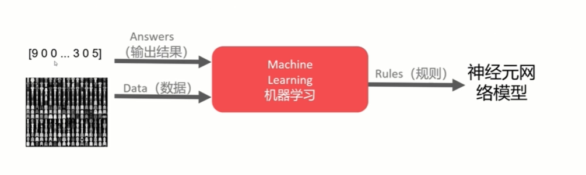
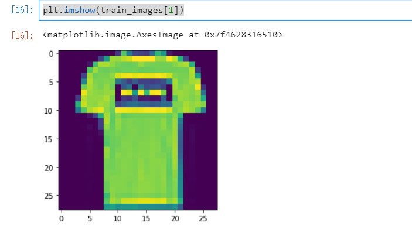
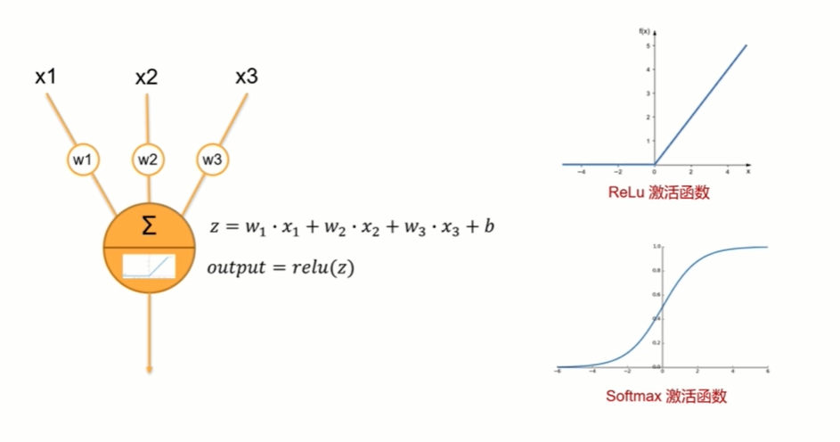
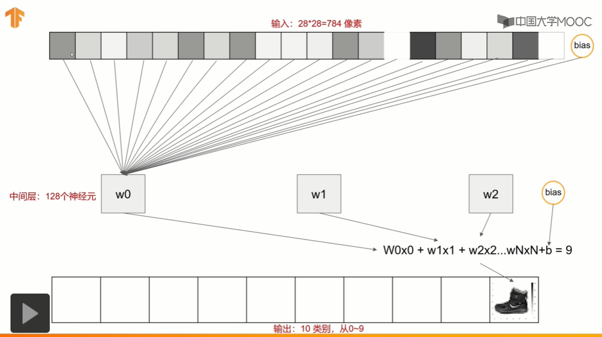

# TensorFlow简介

## 什么是神经网络

**神经网络**是一种数学模型，是存在于计算机的神经系统，由大量的神经元相连接并进行计算，在外界信息的基础上，改变内部的结构，常用来对输入和输出间复杂的关系进行建模。

神经网络由大量的节点和之间的联系构成，负责传递信息和加工信息，神经元也可以通过训练而被强化。

这个图就是一个神经网络系统，它由很多层构成。输入层就是负责接收信息，比如说一只猫的图片。输出层就是计算机对这个输入信息的认知，它是不是猫。隐藏层就是对输入信息的加工处理。


**神经网络是如何被训练的**，首先它需要很多数据。比如他要判断一张图片是不是猫。就要输入上千万张的带有标签的猫猫狗狗的图片，然后再训练上千万次。

神经网络训练的结果有对的也有错的，如果是错误的结果，将被当做非常宝贵的经验，那么是**如何从经验中学习的呢？**就是对比正确答案和错误答案之间的区别，然后把这个区别反向的传递回去，对每个相应的神经元进行一点点的改变。那么下一次在训练的时候就可以用已经改进一点点的神经元去得到稍微准确一点的结果。

**神经网络是如何训练的呢？**每个神经元都有属于它的激活函数，用这些函数给计算机一个刺激行为。


## 神经网络 梯度下降

梯度的本意是一个向量（矢量），表示某一函数在该点处的方向导数沿着该方向取得最大值，即函数在该点处沿着该方向（此梯度的方向）变化最快，变化率最大（为该梯度的模）。

### Optimization 

[](https://morvanzhou.github.io/static/results/ML-intro/gd2.png)

学习机器学习的同学们常会遇到这样的图像, 我了个天, 看上去好复杂, 哈哈, 不过还挺好看的. 这些和我们说的梯度下降又有什么关系呢? 原来这些图片展示出来了一个家族的历史, 这个家族的名字就是-”optimization” (优化问题). 优化能力是人类历史上的重大突破, 他解决了很多实际生活中的问题. 从而渐渐演化成了一个庞大的家族.

比如说牛顿法 (Newton’s method), 最小二乘法(Least Squares method), 梯度下降法 (Gradient Descent) 等等. 而我们的神经网络就是属于梯度下降法这个分支中的一个. 提到梯度下降, 我们不得不说说大学里面学习过的求导求微分. 因为这就是传说中”梯度下降”里面的”梯度” (gradient)啦. 听到求导微分可别后怕, 因为这个短视频只是让你有一个直观上的理解, 并不会涉及太过复杂的东西.

### 梯度下降 

[](https://morvanzhou.github.io/static/results/ML-intro/gd3.png)

初学神经网络的时候, 我们通常会遇到这样一个方程, 叫做误差方程 (Cost Function). 用来计算预测出来的和我们实际中的值有多大差别. 在预测数值的问题中, 我们常用平方差 (Mean Squared Error) 来代替. 我们简化一下这个方程, W是我们神经网络中的参数, x, y 都是我们的数据, 因为 xy 都是实实在在的数据点, 在这个假设情况中, 是多少都无所谓, 然后我们再厚颜无耻地像这样继续简化一下, (注意, 这个过程在在数学中并不正确, 不过我们只是为了看效果), 所以现在误差值曲线就成了这样. 假设我们初始化的 W 在这个位置. 而这个位置的斜率是这条线, 这也就是梯度下降中的梯度啦. 我们从图中可以看出, Cost 误差最小的时候正是这条 cost 曲线最低的地方, 不过在蓝点的 W 却不知道这件事情, 他目前所知道的就是梯度线为自己在这个位置指出的一个下降方向, 我们就要朝着这个蓝色梯度的方向下降一点点. 在做一条切线, 发现我还能下降, 那我就朝着梯度的方向继续下降, 这时, 再展示出现在的梯度, 因为梯度线已经躺平了, 我们已经指不出哪边是下降的方向了, 所以这时我们就找到了 W 参数的最理想值. 简而言之, 就是找到梯度线躺平的点. 可是神经网络的梯度下降可没这么简单.

[](https://morvanzhou.github.io/static/results/ML-intro/gd4.png)

神经网络中的 W 可不止一个, 如果只有一个 W, 我们就能画出之前那样的误差曲线, 如果有两个 W 也简单, 我们可以用一个3D 图来展示, 可是超过3个 W, 我们可就没办法很好的可视化出来啦. 这可不是最要命的. 在通常的神经网络中, 误差曲线可没这么优雅.

### 全局 and 局部最优 

[](https://morvanzhou.github.io/static/results/ML-intro/gd5.png)

在简化版的误差曲线中, 我们只要找到梯度线躺平的地方, 就能能迅速找到误差最小时的 W. 可是很多情况是这样的, 误差曲线并不只有一个沟, 而且梯度躺平的点也不止一个. 不同的 W 初始化的位置, 将会带来不同的下降区域. 不同的下降区域, 又会带来不同的 W 解. 在这个图像当中, W 的全局最优解(Global minima)在这个位置, 而其它的 解都是局部最优(Local minima). 全局最优固然是最好, 但是很多时候, 你手中的都是一个局部最优解, 这也是无可避免的. 不过你可以不必担心, 因为虽然不是全局最优, 但是神经网络也能让你的局部最优足够优秀, 以至于即使拿着一个局部最优也能出色的完成手中的任务.

## 神经网络在干嘛？

### 拟合曲线 

机器学习 其实就是让电脑不断的尝试模拟已知的数据. 他能知道自己拟合的数据离真实的数据差距有多远, 然后不断地改进自己拟合的参数,提高拟合的相似度.

本例中蓝色离散点是我们的数据点, 红线是通过神经网络算法拟合出来的曲线,

[](https://morvanzhou.github.io/static/results/tensorflow/1_3_1.png)

它是对我们数据点的一个近似表达. 可以看出, 在开始阶段, 红线的表达能力不强, 误差很大. 不过通过不断的学习, 预测误差将会被降低. 所以学习到后来. 红线也能近似表达出数据的样子.

[](https://morvanzhou.github.io/static/results/tensorflow/1_3_2.png)

### 拟合参数 

如果红色曲线的表达式为：`y = a*x + b` 其中`x`代表`inputs`, `y`代表`outputs`, `a`和`b`是神经网络训练的参数. 模型训练好了以后,`a`和`b`的值将会被确定, 比如 `a=0.5`, `b=2`,当我们再输入`x=3`时, 我们的模型就会输出 `0.5*3 + 2` 的结果. 模型通过学习数据, 得到能表达数据的参数, 然后对我们另外给的数据所作出预测.


# Tensorflow 基础框架

## 处理结构

计算图纸 

Tensorflow 首先要定义神经网络的结构, 然后再把数据放入结构当中去运算和 training.

[](https://www.tensorflow.org/images/tensors_flowing.gif)

因为TensorFlow是采用数据流图（data　flow　graphs）来计算, 所以首先我们得创建一个数据流流图, 然后再将我们的数据（数据以张量(tensor)的形式存在）放在数据流图中计算. 节点（Nodes）在图中表示数学操作,图中的线（edges）则表示在节点间相互联系的多维数据数组, 即张量（tensor). 训练模型时tensor会不断的从数据流图中的一个节点flow到另一节点, 这就是TensorFlow名字的由来.

## 例子1

tensorflow version 1代码如下

```python
import tensorflow as tf
import numpy as np

# create data
x_data = np.random.rand(100).astype(np.float32)
y_data = x_data*0.1 + 0.3

#搭建模型
Weights = tf.Variable(tf.random_uniform([1], -1.0, 1.0))
biases = tf.Variable(tf.zeros([1]))
y = Weights*x_data + biases

#计算误差
loss = tf.reduce_mean(tf.square(y-y_data))

#传播误差
#反向传递误差的工作就教给optimizer了, 我们使用的误差传递方法是梯度下降法: Gradient Descent 让后我们使用 optimizer 来进行参数的更新.
optimizer = tf.train.GradientDescentOptimizer(0.5)
train = optimizer.minimize(loss)


#训练
#到目前为止, 我们只是建立了神经网络的结构, 还没有使用这个结构. 在使用这个结构之前, 我们必须先初始化所有之前定义的Variable, 所以这一步是很重要的!
# init = tf.initialize_all_variables() # tf 马上就要废弃这种写法
init = tf.global_variables_initializer()  # 替换成这样就好

#接着,我们再创建会话 Session. 我们用 Session 来执行 init 初始化步骤. 并且, 用 Session 来 run 每一次 training 的数据. 逐步提升神经网络的预测准确性.
sess = tf.Session()
sess.run(init)          # Very important

for step in range(201):
    sess.run(train)
    if step % 20 == 0:
        print(step, sess.run(Weights), sess.run(biases))
```

tensorflow version 2代码如下

```python
import tensorflow as tf
import numpy as np

#creat data
x_data = np.random.rand(100).astype(np.float32)
y_data = x_data*01.+0.3

### creat tensorflow structure start ###
Weights = tf.Variable(tf.random.uniform((1,),-1.0,1.0))
biases = tf.Variable(tf.zeros([1]))

y = Weights*x_data+biases

loss= lambda: tf.keras.losses.MSE(y_data,Weights * x_data +biases)
optimizer = tf.keras.optimizers.SGD(learning_rate=0.5)
### creat tensorflow structure end ###


for step in range(201):
    optimizer.minimize(loss, var_list=[Weights, biases])

    if step %20==0:
        #print(step,sess.run(Weights),sess.run(biases))
        print("{} step, weights = {}, biases = {}".format(step, Weights.read_value(), biases.read_value()))  # read_value函数可用numpy替换
```


## Session 会话控制

这一次我们会讲到 Tensorflow 中的 `Session`, `Session` 是 Tensorflow 为了控制,和输出文件的执行的语句. 运行 `session.run()` 可以获得你要得知的运算结果, 或者是你所要运算的部分.

首先，我们这次需要加载 Tensorflow ，然后建立两个 `matrix` ,输出两个 `matrix` 矩阵相乘的结果。

```python
import tensorflow as tf

# create two matrixes

matrix1 = tf.constant([[3,3]])
matrix2 = tf.constant([[2],
                       [2]])
product = tf.matmul(matrix1,matrix2)
```

因为 `product` 不是直接计算的步骤, 所以我们会要使用 `Session` 来激活 `product` 并得到计算结果. 有两种形式使用会话控制 `Session` 。

```python
# method 1
sess = tf.Session()
result = sess.run(product)
print(result)
sess.close()
# [[12]]

# method 2
with tf.Session() as sess:
    result2 = sess.run(product)
    print(result2)
# [[12]]
```

tensorflow version 2已经不需要用session控制了

```python
import tensorflow as tf

matrix1=tf.constant([[3,3]])
matrix2=tf.constant([[2],[2]])
product=tf.matmul(matrix1,matrix2)
tf.print(product)
```


## Variable 变量

在 Tensorflow 中，定义了某字符串是变量，它才是变量，这一点是与 Python 所不同的。

定义语法： `state = tf.Variable()`

```python
import tensorflow as tf

state = tf.Variable(0, name='counter')

# 定义常量 one
one = tf.constant(1)

# 定义加法步骤 (注: 此步并没有直接计算)
new_value = tf.add(state, one)

# 将 State 更新成 new_value
update = tf.assign(state, new_value)
```

如果你在 Tensorflow 中设定了变量，那么初始化变量是最重要的！！所以定义了变量以后, 一定要定义 `init = tf.initialize_all_variables()` .

到这里变量还是没有被激活，需要再在 `sess` 里, `sess.run(init)` , 激活 `init` 这一步.

```python
# 如果定义 Variable, 就一定要 initialize
init = tf.global_variables_initializer()  # 替换成这样就好
 
# 使用 Session
with tf.Session() as sess:
    sess.run(init)
    for _ in range(3):
        sess.run(update)
        print(sess.run(state))
```

注意：直接 `print(state)` 不起作用！！

一定要把 `sess` 的指针指向 `state` 再进行 `print` 才能得到想要的结果！

附上v2代码

```python
import tensorflow as tf

state=tf.Variable(0,name='counter')
one=tf.constant(1)
new_value=tf.add(state,one)

for _ in range(3):
	#The variable value can be changed using one of the assign methods.
	state.assign_add(new_value)
	tf.print(state,new_value)
```


## Placeholder 传入值

placeholder 是 Tensorflow 中的占位符，暂时储存变量.

Tensorflow 如果想要从外部传入data, 那就需要用到 `tf.placeholder()`, 然后以这种形式传输数据 `sess.run(***, feed_dict={input: **})`.

示例：

```python
import tensorflow as tf

#在 Tensorflow 中需要定义 placeholder 的 type ，一般为 float32 形式
input1 = tf.placeholder(tf.float32)
input2 = tf.placeholder(tf.float32)

# mul = multiply 是将input1和input2 做乘法运算，并输出为 output 
ouput = tf.multiply(input1, input2)
```


接下来, 传值的工作交给了 `sess.run()` , 需要传入的值放在了`feed_dict={}` 并一一对应每一个 `input`. `placeholder` 与 `feed_dict={}` 是绑定在一起出现的。


```python
with tf.Session() as sess:
    print(sess.run(ouput, feed_dict={input1: [7.], input2: [2.]}))
# [ 14.]
```


v2貌似已经换掉了placeholder ，看到我再添加。


###  Activation Function激励函数

这里的 AF 就是指的激励函数. 激励函数拿出自己最擅长的”掰弯利器”, 套在了原函数上 用力一扭, 原来的 Wx 结果就被扭弯了.

其实这个 AF, 掰弯利器, 也不是什么触不可及的东西. 它其实就是另外一个非线性函数. 比如说relu, sigmoid, tanh. 将这些掰弯利器嵌套在原有的结果之上, 强行把原有的线性结果给扭曲了. 使得输出结果 y 也有了非线性的特征. 举个例子, 比如我使用了 relu 这个掰弯利器, 如果此时 Wx 的结果是1, y 还将是1, 不过 Wx 为-1的时候, y 不再是-1, 而会是0.

你甚至可以创造自己的激励函数来处理自己的问题, 不过要确保的是这些激励函数必须是可以微分的, 因为在 backpropagation 误差反向传递的时候, 只有这些可微分的激励函数才能把误差传递回去.

想要恰当使用这些激励函数, 还是有窍门的. 比如当你的神经网络层只有两三层, 不是很多的时候, 对于隐藏层, 使用任意的激励函数, 随便掰弯是可以的, 不会有特别大的影响. 不过, 当你使用特别多层的神经网络, 在掰弯的时候, 玩玩不得随意选择利器. 因为这会涉及到梯度爆炸, 梯度消失的问题. 因为时间的关系, 我们可能会在以后来具体谈谈这个问题.

最后我们说说, 在具体的例子中, 我们默认首选的激励函数是哪些. 在少量层结构中, 我们可以尝试很多种不同的激励函数. 在卷积神经网络 Convolutional neural networks 的卷积层中, 推荐的激励函数是 relu. 在循环神经网络中 recurrent neural networks, 推荐的是 tanh 或者是 relu (这个具体怎么选, 我会在以后 循环神经网络的介绍中在详细讲解).


## 创建第一个神经网络

### 例子3 添加层 def add_layer()


# 计算机视觉介绍

## Anaconda使用

```python
%config IPCompleter.greedy=True  #按tag可以自动补全代码
```

## 加载Fashion MNIST数据集

70000张图片
10个类别
28*28像素
训练神经元网络


```python
import tensorflow as tf
from tensorflow import keras
import matplotlib.pyplot as plt

#导入数据集
fasion_mnist = keras.datasets.fashion_mnist
#划分数据集
(train_images,train_labels),(test_images,test_labels) = fasion_mnist.load_data()

#看数据集大小
print(train_images.shape)

#展示图片
plt.imshow(train_images[1])

```



## 构建神经元网络模型





全连接的网络结构

```python
model = keras.Sequential()
model.add(keras.layers.Flatten(input_shape=(28,28)))
model.add(keras.layers.Dense(128,activation=tf.nn.relu))
model.add(keras.layers.Dense(10,activation=tf.nn.softmax))

model.summary()

#以下为console
Model: "sequential_1"
_________________________________________________________________
Layer (type)                 Output Shape              Param #   
=================================================================
flatten_1 (Flatten)          (None, 784)  个像素             0         
_________________________________________________________________
dense (Dense)                (None, 128)               100480    （784个像素+1权重）*128个神经元
_________________________________________________________________
dense_1 (Dense)              (None, 10)                1290      （128个神经元+1权重）*10个类别
=================================================================
Total params: 101,770
Trainable params: 101,770
Non-trainable params: 0
_________________________________________________________________
```

