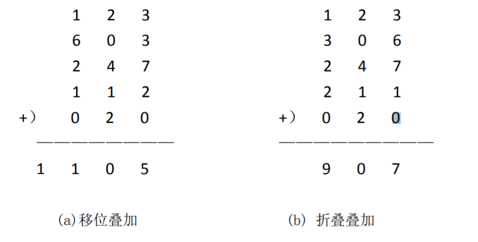
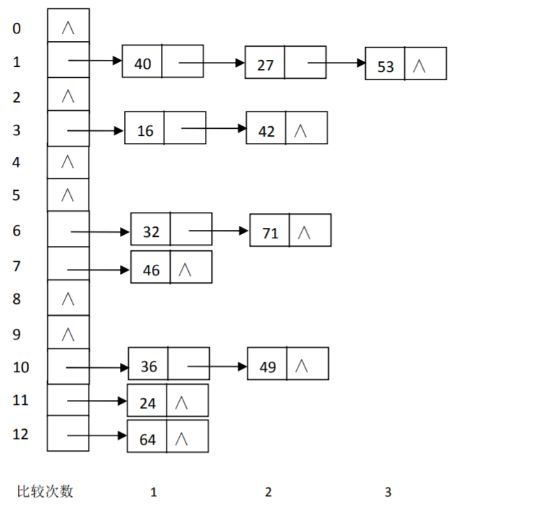
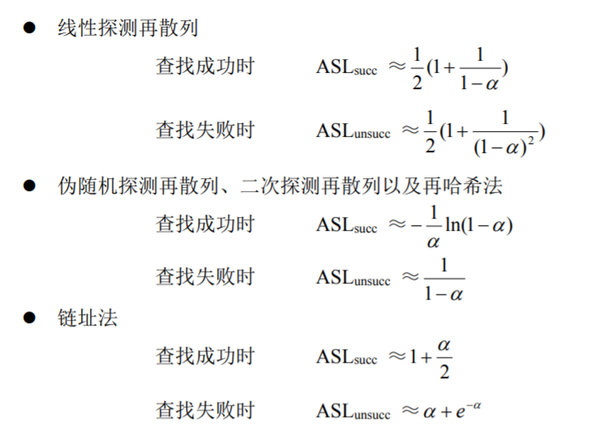
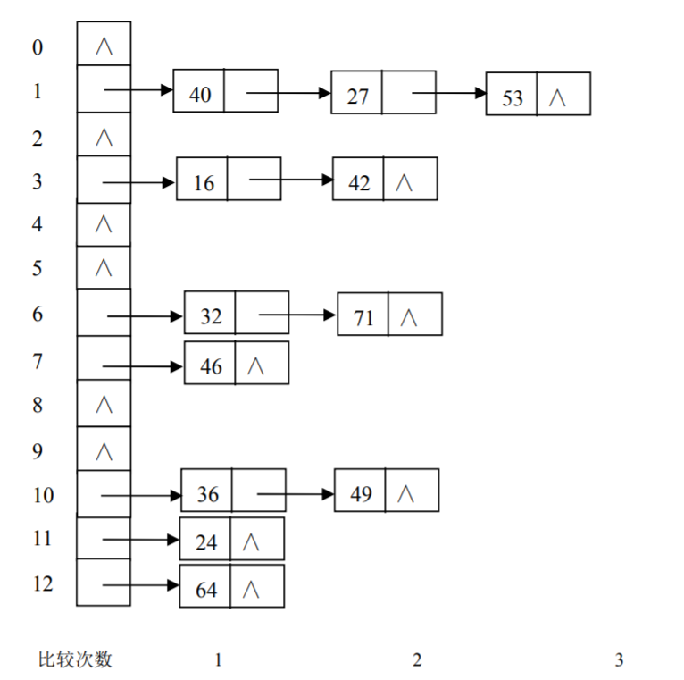
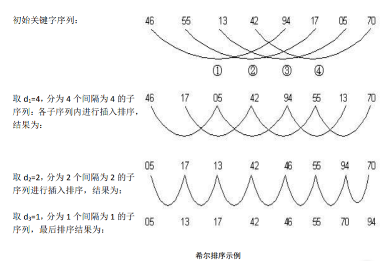
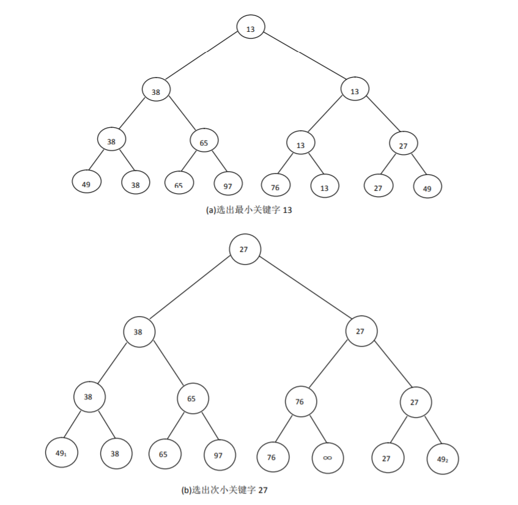
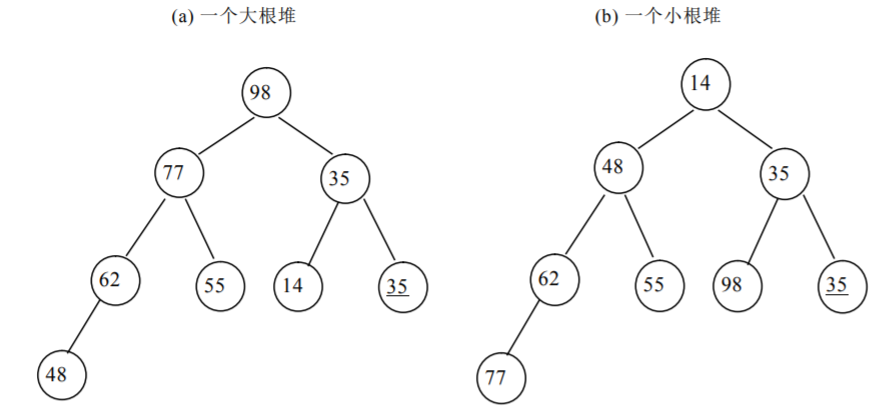

# 线性表

## 顺序表

### 1.概念

定义：具有相同数据类型的n(n≥0)个数据元素组成的有限
序列。是最简单、最常用的数据结构。

• 线性表的顺序表示就是用一组地址连续的存储单
元依次存储线性表的数据元素。
• 线性表的这种机内表示称做线性表的顺序存储结
构或顺序映像。
• 通常，称这种存储结构的线性表为顺序表。

### 2.定义

```c
//静态描述
typedef struct node
{
	DataType data[maxsize];
	int length;
}sqlist;
sqlist L;

//动态描述
typedef struct node
{
	DataType *elem;
	int length;
}sqlist;
sqlist L;
L.elem=(DataType*)malloc(maxsize*sizeof(DataType))
    
```

### 3.操作

1)初始化

```c
void Init_SqList(SqList *L)
{
	L->data=(DataType *)malloc(MAXSIZE*sizeof(DataType)));
	//注动态初始化才需要上一步
	L-＞length=0;
}
```

2)插入

在线性表的第i-1个元素和第i个元素之前插入一个新的元素，先移动，后插入。

步骤：
(1)将ai ~ an顺序向后移动,为新元素让出位置
(2)将x置入空出的第i个位置

```c
void InsertList(SeqList *L,DataType x,int i)
{
	//在顺序线性表L中第i个位置插入新的元素X
	int j;
	if(i<1||i>L->length+1) //此时i为元素位置
	Error("position error");　　//非法位置，退出
	if(L->length>=ListSize)
	Error("overflow");　　　　//表空间溢出
	for(j=L->length-1;j>=i;j--)
	L->data[j+1]=L->data[j]; //从最后一个结点开始往后移
	L->data[i-1]=x;　　　　　 //插入x，此时i为下标
	L->length++; //表长加１
}
```


3)删除

步骤： 

(1)删除ai
(2)将ai+1 ~ an， 顺序向前移动

```c
void DeleteList(Seqlist *L,int i)
{
	int j;
	if(i<1||i>L->length)
	Error("position error");
	for(j=i;j<=L->length-1;j++)
	L->data[j-1]=L->data[j]; //注意区分此时i是作为下标
	L->length--;
}
```


4)查找

```c
//按值查找
int location_sqlist(sqlist *L,datatype x)
{
	//在顺序线性表L中查找值与x相等的元素
	//若找到，则返回其在L中的位序,否则返回-1
	int i;
	i=0; // i是下标
	while(i<=L->length&&L->data[i]!=x)
	i++;
	if(i<=L->length) return(i+1) ;
	else return –1;
}
//时间复杂度为：T(n)=O(n)
```


5)顺序表的合并

```c
Void merge(sqlist A,sqlist B,sqlist *c)
{
	int i,j,k;//分别表示A,B,C的下标
	int i=0;j=0;k=0;
	while (i<=A.length-1 && j<=B.length-1)
	//将A与B当前小的放到C中
	if(A.data[i]<B.data[j])
	C->data[k++]=A.data[i++];
	else
	C->data[k++]=B.data[j++];
	while(i<=A.length-1)
	C->data[k++]=A.data[i++];
	while(j<=B.length-1)
	C->data[k++]=B.data[j++];
}
```


### 


## 链表

### 单链表

**1.概念**

结点:数据元素及直接后继的存储位置组成一个数据元素的存储结构称为一个结点。
结点包括两个域：
数据域：存储元素本身的信息
指针域：存储直接后继的位置，指针域中存储的信息称作指针或链

单链表：由于链表的每个结点中只包含一个指针域，故又称线性链表或单链表
头指针：头指针指示链表中第一个结点的存储位置。

由于最后一个数据元素没有直接后继，则线性链表中最后一个结点的指针为“空”(NULL)

链式存储结构特点:	存储空间可以不连续。不要求逻辑上相邻的元素在物理位置上也相邻。数据元素间逻辑关系由指针域确定。

头指针(Head pointer)：头指针指示链表中第一个结点的存储位置
头结点：为了操作方便，在第一个结点之前附设的一个结点
首元结点：链表中存储信息的第一个结点

**2.定义**

```c
typedef struct node{
	DataType data;
	struct node *next;
}listnode,*LinkList;

LinkList H; //定义头指针为H，表示整个链表
listnode *p; // p为指向结点的指针变量，工作指针
```


**3.操作**

1)求单链表长度

```c
int Length_LinkList(LinkList L)
{
	listnode *p;
	p=L->next;
	int j=0; //计数器
	while(p) //p!=NULL
	{
		p=p->next;
		j++;
	}
	return j;
}
```


2)单链表查找

```c
//按序号查找(查找第i个元素)
Listnode * GetP (LinkList L, int i)
{ 	int j; //计数器
	Listnode *p=L ;
	j=0;
	while (p!=NULL && j<i){ 
        p=p->next;
		j++;
	}
	if (i==j) return p;
	else return NULL;
}

//按值查找
listnode * Locate_LinkList(LinkList L,DataType e)
{
	listnode *p=L->next;
	while(p !=NULL && p->data!=e)
		p=p->next;
	return p;
}
//按值查找操作的时间复杂度为O(n)。

```


3)单链表插入

假设s为指向结点x的指针，则插入步骤为：
修改s指针域,使其指向p结点的后继结点:s->next=p->next
修改p指针域, 使其指向新结点s: p->next＝s

```c
void ListInsert_L(LinkList &L, DataType x，int i)
{ //在带头结点的单链线性表L中第i个位置之前插入元素x
	ListNode *p; p=L; int j=0;
	while(p!=NULL && j<i-1) //寻找第i-1 个结点
	{ 
        p= p->next; j=j+1;}
		if (j==i-1){ //若存在
			s=(linklist *) malloc (sizeof (struct node ));
			s->data=x; //③
			s->next=p->next; //④
			p->next=s; //⑤
		}
		else error (“不存在第i-1个位置”);
}
```


4)单链表删除

先找到p的前驱结点q
删除p结点，修改q结点指针域 q->next＝p->next


```c
//删除第i个结点
void DeleteList(LinkList L, int i)
{
    ListNode *p，*q;
    while(p->next!=NULL&&j<i-1){ //查找i-1的结点
    	p=p->next;j++;
    }
    if (p->next==NULL || j>i-1) return error;//位置不合理
    q=p->next; //②
    p->next=q->next; //③将ai从链上摘下
    free(q); //④ 释放结点ai
}
```


5)建立单链表

头插法建立单链表的算法虽然简单，但生成的链表中结点的次序和
输入数据的顺序不一致。若希望两者次序致，可采用尾插法。该方法
是将新结点插入到当前链表的表尾上，为此必须增加一个尾指针r,使其
始终指向当前链表的尾结点。如下图所示：

```c
//(头插法建立单链表)
LinkList CreatListF(LinkList &L){
    //从表尾到表头逆向建立单链表L,每次均在头结点之后插入元素
    ListNode *s;int x;
    L=(LinkList)malloc(sizeof(ListNode )); //创建头结点
    L->next=NULL; //初始为空链表
    scanf("%d", &x); //输入结点的值
    while(x!= 9999){ //输入 9999表示结束
        s=(ListNode *) malloc(sizeof(ListNode )); //创建新结点
        s->data=x;
        s->next=L->next;
        L->next=s; //将新结点插入表中，L为头指针
        scanf("%d", &x);
	} //while 结束
	return L;
}


//（尾插法建立单链表)
LinkList CreatListR(LinkList &L){
    // 从表头到表尾正向建立单链表L,每次均在表尾插入元素
    int x; // 设元素类型为整型
    L=(LinkList)malloc(sizeof(ListNode));
    ListNode *s, *r = L; // r为表尾指针
    scanf ("%d"，&x); //输入结点的值
    while(x!=9999){ //输入 9999表示结束
        s=(ListNode *)malloc(sizeof(ListNode );
        s->data=x; r->next=s;
        r=s; //r指向新的表尾结点
        scanf("%d", &x);
    }
    r->next = NULL; //尾结点指针置空
    return L;
}
```


6)单链表逆置

```c
Void nizhi(Linklist &L)
{
    ListNode *p, *s;
    P=L->next; L->next=NULL; //变成两个链表
    While(p!=NILL){
        s=p;
        p=p->next;
        s->next=L->next; //头插法
        L->next = s; //头插法
    }
}
```


7)单链表合并

```c
//将两个有序链表并为一个有序链表
void Linklist_Merge(LinkList &La, LinkList &Lb, LinkList &Lc) {
//已知单链线性表La和Lb的元素按值非递减排列。
//归并La和Lb得到新的单链线性表Lc,Lc的元素也按值非递减排列。
    ListNode *pa, *pb, *crear,*s;
    // crear指向LC的尾巴
    pa = La->next; pb = Lb-> next; crear = Lc; 
    while (pa!=NULL && pb!=NULL) {
    	if (pa->data <= pb->data) {
       		s=pa; pa=pa->next;
        	s->next = crear->next; crear->next = s;
            crear = crear->next; 
        }else{
            s=pb; pb=pb->next;
    		s->next = crear->next;
            crear->next = s;
            crear = crear->next;
        }
    }
    if(pa!=NULL)crear->next = pa;
    else crear->next = pb;
} // MergeList_L
```

### 循环链表

**1.概念**

循环链表是线性表的另一种链式存储结构,它的特点是将线性链表的最后一个结点指针指向链表的第一个结点。

优点:从任意位置开始可以访问链中任意结点。

判空：L->next==L

判空：L->next==L

判尾：P->next==L; P==L ;

2.定义

3.操作

### 双向链表

**1.概念**

在双向链表中,每个结点有两个指针域，一个指向后继
结点，另一个指向直接前驱结点。

判空：

```c
L->next==Null  &&  L->prior==Null
```


**2.定义**

```c
typedef struct DuLNode {
    DataType data;
    struct DuLNode *prior;
    struct DuLNode *next;
}DuLNode, *DuLinkList;

//定义头指针： DuLinkList L;
//定义工作指针： DuLNode *p;
```

双向链表具有对称性：
p->prior->next=p=p->next->prior

**3.操作**

1)插入

```C
//在P后面插入：
s->next = p->next;
s->prior = p;
p->next->prior = s;
p->next = s;

//在P前面插入：
s->next = p;
s->prior = p->prior;
p->prior->next = s;
p->prior = s;

//插入P：
p->next = q->next;
p->prior = q;
q->next->prior = p;
q->next = p;
```

2)删除

```c
//删除P后边的结点
q = p->next;
q->next->prior = p;
p->next = q->next;
free(q);

//删除P前边的结点
q = p->prior;
q->prior->next = p;
p->prior = q->prior;
free(q);

//删除P
p->prior->next = p->next;
p->next->prior = p->prior;
free(p);
```


### 链表与顺序表的比较

顺序表:
• 需要预分配一定长度的存储空间。太大易造成存储空间的浪费，太小又将造成频繁地进行存储空间的再分配。
• 顺序表是一种随机存取的结构，对顺序表中任一元素进行存取的时间相同。
• 顺序表对插入、删除操作需要移动近一半的数据元素。

链表:
• 存储分配灵活，链表中的结点可在程序执行过程中动态生成。
• 链表是一种顺序存取的结构，对链表中的每个结点都必须从头指针所指结点起顺链扫描。
• 链表对插入、删除操作不需要移动数据元素。

# 栈

栈是限定仅在表尾进行插入和删除操作的线性表。

修改栈的原则：先进后出(FILO, First In Last Out)或后进先出(LIFO)

## 顺序栈

### 1.概念

顺序存储结构：利用一组地址连续的存储单元依次存放自栈底到栈顶的数据元素。

顺序栈：顺序存储结构的栈称为顺序栈。

### 2.定义

```c
//1.顺序栈的静态定义
#define MAXSIZE 1024
typedef struct
{
	ElemType data[MAXSIZE];
	int top;
}SqStack;
```

```C
//2.顺序栈的动态定义
typedef struct{
	SElemType *base;
	SElemType *top;
	int stacksize;
}SqStack;
```

### 3.静态栈的基本操作

```c
当栈空：sq.top==0
入栈：sq.data[sq.top]=x; sq.top++;
出栈：sq.top--; x=sq.data[sq.top];
栈满：sq.top==Maxsize
上溢：当栈满时再做进栈运算时产生空间溢出称为上溢。出
错状态应当避免
下溢：当栈空时再做退栈运算也将产生溢出称为下溢。是正
常现象，可用作程序控制转移件
```

```c
当栈空：sq.top==-1
入栈：sq.top++;sq.data[sq.top]=x;
出栈：x=sq.data[sq.top];sq.top--;
栈满：sq.top==Maxsize-1
上溢：当栈满时再做进栈运算时产生空间溢出称为上溢。出
错状态应当避免。
下溢：当栈空时再做退栈运算也将产生溢出称为下溢。是正
常现象，可用作程序控制转移件。
```

### 4.动态栈的基本操作

```c
栈空： sq.top == sq.base
栈满： sq.top-sq.base>=sq.stacksize
读栈顶元素： e = *(sq.top- 1)
入栈：*sq.top++ = e;
出栈: e = *--sq.top;
```

1)初始化

```c
Status InitStack (SqStack &S) {
	//构造一个空栈S
	S.base = (SElemType) *malloc(STACK_INIT_SIZE*sizeof(SElemType));
	if (!S.base) exit (OVERFLOW); // 存储分配失败
	S.top = S.base;
	S.stacksize = STACK_INIT_SIZE;
	return OK;
}// InitStack
```

2)读栈顶元素

```c
Status GetTop(SqStack S, SELemType &e) {
	// 若栈不空，则用e返回S的栈顶元素并返回0K;否则返回ERROR
	if(S.top == s.base) return ERROR;
	e = *(S.top- 1);
	return OK;
}// GetTop
```

3)进栈

```c
Status Push (SqStack &S, SElemType e){
	//插入元素e为新的栈顶元素
	if(S.top - S.base >= S.stacksize) {//栈满,追加存储空间
		S.base = (SElemType *) realloc (S.base,
		(S.stacksize + STACKINCREMENT)*sizeof(SElemType));
		if (!S.base) exit (OVERFLOW); //存储分配失败
		S.top = S.base + S.stacksize;
		S.stacksize += STACKINCREMENT;
	}
	*s.top++ =e;
	return 0K;
}// Push
```

4)退栈

```c
Status Pop (SqStack &S, SElenmType &e) {
	//若栈不空,则删除S的栈顶元素,用e返回其值，并返回
	//0K;否则返回ERROR
	if(S.top == S.base) return EROR;
	e = * --S.top;
	return 0K;
}// Pop
```


## 链栈

### 1.概念

链式存储结构：用于收集计算机存储器中所有空闲存储空间,来保存自栈底到栈顶的数据元素。

链栈：链式存储结构栈称为链栈。

### 2.定义

```c
typedef struct node
{
	StackElementType data;
	struct node *next;
}LinkStackNode;
typedef LinkStackNode *LinkStack;
```

### 3.操作

1)进栈

```c
int Push(LinkStack top, StackElementType x)
/* 将数据元素 x 压入栈 top 中 */
{
	LinkStackNode * temp;
	temp=(LinkStackNode * )malloc(sizeof(LinkStackNode));
	if(temp==NULL) return(FALSE); /* 申请空间失败 */
	temp->data=x;
	temp->next=top->next;
	top->next=temp; /* 修改当前栈顶指针 */
	return(TRUE);
}

```

2)出栈

```c
int Pop(LinkStack top, StackElementType *x)
/* 将栈 top 的栈顶元素弹出，放到 x 所指的存储空间中 */
{ 
	LinkStackNode * temp;
	temp=top->next;
	if(temp==NULL)return(FALSE); /*栈为空*/
	top->next=temp->next;
	*x=temp->data;
	free(temp); /* 释放存储空间 */
	return(TRUE);
}

```

## 栈的应用

**1.括号匹配的检验**

```c
int pipei()
{ 
    sqstack s; char c; s.top=0; scanf(“%c”,&c);
	while(c!=’#’){
        switch(c){
            case ‘(‘ : push(s,c); scanf(“%c”,&c);break;
			case ‘{‘ : push(s,c); scanf(“%c”,&c);break;
			case ‘<‘ : push(s,c); scanf(“%c”,&c);break;
			case ‘)‘ : if(s.top==0) return -1; else if(*(s.top-1)==”(”) pop(s);
			scanf(“%c”,&c);break; else return -1;
			case ‘}‘ : if(s.top==0) return -1; else if(*(s.top-1)==”{”) pop(s);
			scanf(“%c”,&c);break; else return -1;
			case ‘>‘ : if(s.top==0) return -1; else if(*(s.top-1)==”<”) pop(s);
			scanf(“%c”,&c);break; else return -1;
           	}
    }
	if(s.top!=0) return -1;
	else return 0;
}
```

**2.表达式求值**

为实现算法，使用两个工作栈。一个称做OPTR,用以寄存运算符；另一个称做OPND,用以寄存操作数或运算结果。算法的基本思想是:
(1) 首先置操作数栈为空栈，表达式起始符“#”为运算符栈的栈底元素；
(2) 依次读入表达式中每个字符，若是操作数则进OPND栈，若是运算符则和OPTR栈的栈顶运算符比较优先权，然后作相应操作,直至整个表达式求值完毕(即OPTR栈的栈顶元素和当前读入的字符均为“#”)。

```c
OperandType EvaluateExpression(){
	//算术表达式求值的算符优先算法。设OPTR和OPND分别为运算符栈和运算数栈
	//OP为运算符集合OPS 为运算符集合
	InitStack (OPTR);
    Push (OPTR,'#' );
	InitStack (OPND) ;
    C= getchar();
	while (c!='#' II GetTop(OPTR)!='#') {
		if (! In(C, 0P)) {
            Push((OPND, C); C = getchar(); 
        }else{//不是运算符则进栈
			switch (Precede( GetTop(0PTR)，c)) {
				case '<': //栈顶元素优先权低
					Push(OPTR, c); c = getchar(); break;
				case '=': // 脱括号并接收下一字符
					Pop(OPTR, x); c = getchar();break;
				case'>' : //退栈并将运算结果入栈
					Pop(OPTR, theta);
					Pop(OPND, b); Pop(OPND, a);
					Push(OPND, Operate(a, theta, b)) ;break;
				}
            }
	}
	return GetTop( OPND) ;
} // EvaluateExpression
```

# 队列

## 1.概念

队列是只允许在一端删除，另一端插入的线性表，允许删除的一端叫队头(front),

允许插入的一端叫队尾(rear)。

特点：先进先出(FIFO)

## 2.顺序队列

1.语言描述

```c
#define MAXSIZE 1024 //最大队列长度
typedef struct
{
datatype data[MAXSIZE]; /*队员的存储空间*/
int rear,front; /*队头队尾指针*/
}SqQueue;
```

2.具体操作

```c
置空队: sq.front= sq.rear=0
入队: sq.data[sq.rear]=x; sq.rear++;
出队: x=sq.data[sq.front] sq.front++;
读队头、队尾: sq.data[sq.front] sq.data[sq.rear-1]
队中元素个数:m=sq.rear-sq.front
队满:m==MAXSIZE
队空:m==0
```

3.顺序队列的假溢出

如图(无图)所示的状态，不能再继续插入新的队尾元素，否则会因为数组越界导致程序代码被破坏。而此时又不宜如顺序栈那样，进行存储空间再分配来扩大数组的空间，因为队列的实际可用空间并未占满，这种情况叫做顺序队列的假溢出。

解决方案：

​	① 队首固定，每次出队剩余元素向下移动——浪费时间。
​	② 循环队列。

## 3.循环队列

**1)定义**

```c
队空 sq.front==sq.rear
队满 sq.front==sq.rear
或者:
	另外设一个标志存储队中元素个数num==0代表队空，num==MAXSIZE代表队满
	少用一个元素空间：
	队空：front==rear
	队满：(rear+1)%M==front
```

**2)基本操作**

```c
typedef struct
{
	datatype data[M] ;
	int front ;
    int rear ;
	int count ; //记录队中元素个数
} cirqueue ;

```

```c
//0)初始化
	q->front=q->rear = 0;
//1)判队空
	q.count == 0;

//2) 判队满
	q.count == M;

//3) 读队头元素
datatype get_queue (cirqueue q)
{
	if(q.count == 0 ){
        printf ( “queue null “ ) ;
        exit (0) ;
    }
	return ( q.data [q.front]);
}

//4) 入队
void enqueue(cirqueue * q, datatype x ){
    // 判队满
    if (q->count = = M) { printf(“over flow “) ; exit(0);}
    
	q->data[q->rear ] = x ;
	q->rear = (q->rear+1)% M ; //插入元素 x
	q->count ++ ; //修改表长
}

//5) 出队
datatype dequeue(cirqueue * q , datatype x ){
    //判队空
    if(q->count == 0 ) {printf (“queue null”) ; exit(0); }
    
	x=q->data[q ->font];
	q->front = (q->front + 1)%M ; //删除队头元素
	q->count-- ; //修改表长
	return (x) ;
}
```


## 4.链队列

**1)定义**

```c
typedef struct Node
{
     QueueElementType data; /*数据域*/
     struct Node *next; /*指针域*/
}LinkQueueNode;

typedef struct
{
	 LinkQueueNode * front;
	 LinkQueueNode * rear;
}LinkQueue;
```

**2)初始化**

```c
int InitQueue(LinkQueue * Q)
{ /* 将 Q 初始化为一个空的链队列 */
	 Q->front=(LinkQueueNode *)malloc(sizeof(LinkQueueNode));
	 if(Q->front!=NULL){
		Q->rear=Q->front;
		Q->front->next=NULL;
		return(TRUE);
	}else return(FALSE); /* 溢出！*/
}
```

**3)入队**

```c
链队列入队操作算法
int EnterQueue(LinkQueue *Q, QueueElementType x)
{ /* 将数据元素 x 插入到队列 Q 中 */
	LinkQueueNode * NewNode;
	NewNode=(LinkQueueNode * )malloc(sizeof(LinkQueueNode));
	if(NewNode!=NULL){
		NewNode->data=x;
		NewNode->next=NULL;
		Q->rear->next=NewNode;
		Q->rear=NewNode;
		return(TRUE);
	}else return(FALSE); /* 溢出！*/
}

```

**4)出队**

```c
int DeleteQueue(LinkQueue * Q, QueueElementType *x)
{ /* 将队列 Q 的队头元素出队，并存放到 x 所指的存储空间中 */
	LinkQueueNode * p;
	if(Q->front==Q->rear)return(FALSE);
	p=Q->front->next;
	Q->front->next=p->next; /* 队头元素 p 出队 */
    /* 如果队中只有一个元素 p，则 p 出队后成为空队*/
	if(Q->rear==p) Q->rear=Q->front;
	*x=p->data;
	free(p); /* 释放存储空间 */
	return(TRUE);
}
```

# 数组

**1.定义**

数组作为一种数据结构其特点是结构中的元素本身可以是具有某种结构的数据，但属于同一数据类型，比如：一维数组可以看作一个线性表，二维数组可以看作“数据元素是一维数组”的一维数组，三维数组可以看作“数据元素是二维数组”的一维数组，依此类推。

n 维数组可以看成是这样一个线性表,其中每个数据元素均是一个 n -1 维数组。

**2.特点**

数组是一个具有固定格式和数量的数据有序集，每一个数据元素有唯一的一组下标来标识，因此，在数组上不能做插入、删除数据元素的操作。通常在各种高级语言中数组一旦被定义，每一维的大小及上下界都不能改变。

**3.储存方式**

数组采用顺序存储结构,其主要操作是随机存取,即数据元素的定位,给定元素的下标, 得到该元素在计算机中的存放位置。

给定数组下标求其数组元素在一维空间的位置
数组元素地址=基址+(序号-1)*size

1)行优先
定义：将数组元素按行向量排列，第i+1个行向量紧接在第i个行向量后面。
如：
a11 a12 … a1n , a21 a22 … a2n , … , am1 am2 … amn;
储存位置计算:
假设每个数据元素占L个存储单元，则按行序优先存储的数组A中任一元素aij的存储位置为：

```c
LOC(aij)=LOC(a11)+[(i-1)*n+j-1 ]*L
LOC(aij)=LOC(a00)+[i*n+j]*L
//LOC(a11)、LOC(a00)是开始结点的存放地址，即基地址;
```

2)列优先
定义：将数组元素按列向量排列，第i+1个列向量紧接在第i个行向量后面。
如：
a11 a21 … am1 , a12 a22 … am2  ,  …   ,a1n a2n …  amn；
存储位置计算:
假设每个数据元素占L个存储单元，则按列序优先存储的数组A中任一元素aij的存储位置为：

```c
LOC(aij)=LOC(a11)+[(j-1)*m+i-1 ]*L;
LOC(aij)=LOC(a00)+[j*m+i]*L;
//其中，LOC(a11)、LOC(a00)是开始结点的存放地址，即基地址。
```

3)三维数组Amnp按行优先存储

```c
LOC(aijk)=LOC(a000)+[i*n*p+j*p+k]*L
```

4)四维数组A[b1][b2][b3][b4]按行优先存储

```c
LOC(aijkm)=LOC(a0000)+[i*b2*b3*b4+j*b3*b4+k*b4+m]*L
```

# 矩阵的压缩存储

有些阶数很高的矩阵中，有许多值相同的元素或者零元素，为了节省存储空间，可以对这类矩阵进行压缩存储。
所谓压缩存储是指：为多个值相同的元只分配一个存储空间；对零元不分配空间。假若值相同的元素或者零元素在矩阵中的分布有一定规律，则我们称此类矩阵为特殊矩阵；反之，称为稀疏矩阵。

## 1.对称矩阵

若n阶矩阵A中的元满足下述性质：

```c
aij==aji   1≤i,j≤n
```

则称为n阶对称矩阵。


对于对称矩阵 我们可以为每一对对称元分配一个存储空间，则可将n2个元压缩存储到n(n+1)/2个元的空间中。不失一般性，我们可以行序为主序存储其下三角(包括对角线)中的元。

例子：

```c
1 2 3 4 5
2 1 6 7 8
3 6 1 9 0
4 7 9 1 1
5 8 0 1 1
```

对下三角部分以行为主序列顺序存储到一个向量中去，在下三角中共存有n*(n+1)/2个元素

## 2.三角矩阵

三角矩阵大体分为三类:下三角矩阵、上三角矩阵、对称矩阵。对于一个 n 阶矩阵 A 来 说:若当 i j 时,有 aij =c(典型情 况 c=0 ),则称此矩阵为上三角矩阵;若矩阵中的所有元素均满足 aij =aji,则称此矩阵为对称矩 阵。

1)下三角矩阵

```c
共存储了n*(n+1)/2+1个元素，设存入向量：SA[n*(n+1)/2+1]中，这种的存储方式可节约n*(n-1)/2-1个存储单元，sak 与aji 的对应关系为：
if(i>=j) k=i*(i-1)/2+j-1;
if(i<j) k=n*(n+1)/2;
地址:
LOC[i,j]=LOC[1,1]+(i(i-1)/2+j-1)*size;
```

2)上三角矩阵

地址：

```c
LOC[i,j]=LOC[1,1]+(j(j-1)/2+i-1)*size;
```


## 3.对角矩阵(带状矩阵)

```python
a11 	a12 	0 			……………	0
a21 	a22 	a23	 	0 	…………	0
0 		a32 	a33 	a34  0 … 	0
	……………………………
0		 0	 … an-1,n-2 an-1,n-1 an-1,n
0		 0 	 … 		…	an,n-1 	an,n.
```

共存储： 3n-2个元素
sak 与aji 的对应关系为：

```c
k=3(i-1)-1+j-i+1=2i+j-3
```

## 4.稀疏矩阵

1.定义

假设在mn的矩阵中，有t个元素不为零。令δ=t/mn，称δ为矩阵的稀疏因子。通常认为δ≤0.05时称为稀疏矩阵。

2.稀疏矩阵的压缩存储思想

按照压缩存储的概念，为了节省存储单元，可以只存储稀疏矩阵的非零元素。因此在存储非零元素的同时，还必须存储非零元素所在的行号、列号，才能迅速确定一个非零元素是矩阵中的哪一个元素。其中每一个非零元素所在的行号、列号和值组成一个三元组(i，j，aij)，并由此三元组惟一确定。
稀疏矩阵进行压缩存储通常有两类方法：
• 顺序存储
• 链式存储

3.稀疏矩阵的三元组顺序表存储

假设以顺序存储结构来表示三元组表，则可得稀疏矩阵的
一种压缩存储方式，我们称之为三元组顺序表。

例：


```c
typedef struct{
	int i,j; //该非零元素的行下标和列下标
	ElemType e; //非零元素值
}Triple; //三元组类型

typedef struct{
	Triple data[MAXSIZE+1] //非零元三元组表，data[0]未用
	int mu, nu, tu; //矩阵的行数、列数和非零元素的个数
}TSMatrix; //三元组表的顺序存储类型
```

4.稀疏矩阵的十字链表存储

在十字链表中,矩阵的每一个非零元素用一个结点表示,该结点除了( row,col,value)以外, 还要有以下两个链域: 
right:用于链接同一行中的下一个非零元素。
down:用于链接同一列中的下一个非零元素。

在十字链表中,同一行的非零元素通过 right 域链接成一个单链表。同一列的非零元素通 过 down 域链接成一个单链表。这样,矩阵中任一非零元素 M[ i][ j]所对应的结点既处在第 i 行的行链表上,又处在第 j 列的列链表上,这好像是处在一个十字交叉路口上,所以称其为十字 链表。同时再附设一个存放所有行链表的头指针的一维数组和一个存放所有列链表的头指针 的一维数组。


```c
typedef struct OLNode{
    int row, col; /*非零元素的行和列下标*/
	ElementType value;
struct OLNode * right,*down; /*非零元素所在行表、列表的后继链域*/
}OLNode; *OLink;

typedef struct{
    OLink * row_head, *col_head; /*行、列链表的头指针向量*/
	int m, n, len; /*稀疏矩阵的行数、列数、非零元素的个数*/
}CrossList;
```


**转置运算**

转置运算是一种最简单的矩阵运算。对于一个m*n的矩阵M，它的转置矩阵T是一个n*m的矩阵，且

`T(i,j)=M(j,i)，1≤i≤n，1≤j≤m`

显然，一个稀疏矩阵的转置矩阵仍然是稀疏矩阵。

```c
//稀疏矩阵转置经典算法
void TransMatrix(ElementType source[m][n], ElementType dest[n][m]){
/*source 和 dest 分别为被转置的矩阵和转置以后的矩阵(用二维数组表示)*/
	int i, j;
	for(i=0;i<m;i++)
		for (j=0;j< n;j++)
			dest[j][i]=source[i] [j] ;
 }
```

三元组

```c
//三元组表实现稀疏矩阵的转置
void TransposeTSMatrix(TSMatrix A, TSMatrix * B){ 
    /*把矩阵 A 转置到 B 所指向的矩阵中去。矩阵用三元组表表示*/
    int i , j, k ;
    B->m= A.n ;
    B->n= A.m ;
    B->len= A.len ;
 	if(B->len>0){
		j=1; /*j 为辅助计数器，记录转置后的三元组在三元组表 B 中的下标值*/
		for(k=1; k<=A.n; k++) /*扫描三元组表 A 共 A.n 次，每次寻找列值为 k 的三元组进行转置*/
			for(i=1; i<=A.len; i++)
				if(A.data[i].col==k){
					B->data[j].row=A.data[i].col;
					B->data[j].col=A.data[i].row;
					B->data[j].e=A.data[i].e;
					j++; }/*计数器 j 加 1，指向本行下一个转置后元素的位置下标*/
		}/* if(B->len>0)的结束*/
}/* end of TransposeTSMatrix */
```

```c
//稀疏矩阵“一次定位快速转置”算法
void FastTransposeTSMatrix (TSMatrix A, TSMatrix * B){ 
    /*基于矩阵的三元组表示，采用“一次定位快速转置”法，将矩阵 A 转置为矩阵 B*/
    int col , t , p，q;
	int num[MAXSIZE], position[MAXSIZE] ;
	B->len= A.len ;
    B->n= A.m ;
    B->m= A.n ;
	if(B->len){
		for(col=1;col<=A.n;col++)num[col]=0;
        
        /*采用数组下标计数法计算每一列的非零元素的个数*/
		for(t=1;t<=A.len;t++)num[A.data[t].col]++; 
		position[1]=1;
        
        /*求 col 列中第一个非零元素在 B.data[ ]中的正确位置*/
		for(col=2;col<=A.n;col++)position[col]=position[col-1]+num[col-1];
	    for(p=1;p<=A.len;p++){/*将被转置矩阵的三元组表 A 从头至尾扫描一次，实现矩阵转置*/
			col=A.data[p].col; q=position[col];
			B->data[q].row=A.data[p].col;
			B->data[q]..col=A.data[p].row;
			B->data[q].e=A.data[p].e;
            /*position[col]加1，指向下一个列号为col的非零元素在三元组表B中的存放位置*/
			position[col]++; 
		}
	}
}
```

# 广义表

1.定义

广义表是n(n≥0)个数据元素a1，a2，…，ai，…，an的有序序列，一般记作：
LS＝(a1，a2，…，ai，…，an)
其中：
• LS是广义表的名称，n是它的长度。
• 每个ai(1≤i≤n)是LS的成员，它可以是单个元素，也可以是一个广义表，分别称为广义表LS的原子和子表。习惯上，用大写字母表示广义表的名称，用小写字母表示原子。
• 当广义表LS非空时，称第一个元素a1为LS的表头(head)，称其余元素组成的表(a2，…，ai，…，an)为LS的表尾(tail)。

```
D=() 空表；其长度为零。
A=(a，(b，c)) 表长度为 2 的广义表，其中第一个元素是单个数据 a，第二个元素是一个子表(b，c)。
B=(A，A，D) 长度为 3 的广义表，其前两个元素为表 A，第三个元素为空表 D。
C=(a，C) 长度为 2 递归定义的广义表，C 相当于无穷表 C=(a，(a，度为 2 递归定义的广义表，C 相当于无穷表 C=(a，(a，(a，(…))))。
head( A)= a;表 A 的表头是: a
tail( A)=(( b,c));表 A 的表尾是(( b,c))。
广义表的表尾一定是一个表。
```

2.储存结构

由于广义表 GL=( d1 ,d2 ,d3 ,…, dn)中的数据元素既可以是单个元素,也可以是 子表,因此对于广义表来说,难以用顺序存储结构来表示它,通常用链式存储结构 来表示。

1)广义表的头尾链表存储结构 

```c
typedef enum {ATOM, LIST} ElemTag; /* ATOM＝0，表示原子；LIST＝1，表示子表*/
typedef struct GLNode{
    ElemTag tag; /*标志位 tag 用来区别原子结点和表结点*/
	union{
        AtomType atom; /*原子结点的值域 atom*/
		struct {
            struct GLNode * hp, *tp;
        } htp; /*表结点的指针域 htp，包括表头指针域 hp 和表尾指针域 tp*/
	} atom_htp; /* atom_htp 是原子结点的值域 atom 和表结点的指针域 htp 的联合体域*/
} GLNode，*GList;
```

A=(a,(b,c))例子：


2)广义表的同层结点链存储结构 

```c
typedef enum {ATOM,LIST} ElemTag; /* ATOM＝0，表示原子；LIST＝1，表示子表*/
typedef struct GLNode{
	ElemTag tag;
	union{
		AtomType atom;
		struct GLNode * hp; /*表头指针域*/
		} atom_hp; /* atom_hp 是原子结点的值域 atom 和表结点的表头指针域 hp 的联合体域*/
	struct GLNode * tp; /*同层下一个结点的指针域*/
} GLNode，*GList;
```


3.运算

广义表有两个重要的基本操作，即取头操作(GetHead())和取尾操作(GetTail())：
• 取表头GetHead(LS)：取出的表头为非空广义表的第一个元素，它可以是一个原子，也可以是一个子表。
• 取表尾GetTail(LS)：取出的表尾为除去表头之外，由其余元素构成的表。即表尾一定是一个广义表。

# 树

1.定义

树(tree)是n(n ≥ 0)个结点的有限集合T，T为空时称为空树，否则满足如下条件:
(1) 有且仅有一个称为根(root)的结点;
(2) 其余结点可分为m(m>=0)个互不相交的有限集合T1, T2, …, Tm, 且其中每一个集合本身又是一棵树,称之为根的子树(subtree)。

2.基本术语

1、结点：包含一个数据元素及若干指向其子树的分支。
2、边：连接两个结点的线段。
3、度：一个结点拥有的子树数称为该结点的度。
4、树的度：指该树中结点的最大度数。
5、叶子(终端结点)：度为零的结点称为叶子。
6、分支结点(非终端结点)：度不为零的结点。
7、内部结点：根结点(开始结点)之外的分支结点称为内部结点。
8、孩子和双亲：结点的子树的根称为该结点的孩子，相应的，该结点称为孩子的双亲。
9、兄弟：同一个双亲的孩子之间互称兄弟。
10、堂兄弟：双亲在同一层的结点互为堂兄弟。
11、祖先：一个结点的祖先是从根结点到该结点路径上所经过的所有结点。
12、子孙：一个结点的子孙则是以该结点为根的子树中所有的结点(不包括该结点)13、结点的层次：从根开始定义起，根为第一层，根的孩子为第二层。若某结点在第l层，则其子树的根就在第l+1层。
14、树的深度(高度)：树中结点的最大层次称为树的深度。
15、有序树：树中每个结点的各子树看成从左到右有次序即不能互换称为有序树。
16、无序树：树中每个结点的各子树看成从左到右无次序称为无序树。
17、森林：m(m>=0)棵互不相交的树的集合。对树中每个结点而言,其子树的集合即为森林。
18、树和森林的转换
树————>森林:删去树的根。
森林———>树：加上一个结点的根。

3.基本操作： 

```
① InitTree(Tree)： 将 Tree 初始化为一棵空树。
② DestoryTree(Tree)： 销毁树 Tree。
③ CreateTree(Tree)： 创建树 Tree。
④ TreeEmpty(Tree)： 若 Tree 为空，则返回 TRUE，否则返回 FALSE。
⑤ Root(Tree)： 返回树 Tree 的根。
⑥ Parent(Tree，x)： 树 Tree 存在，x 是 Tree 中的某个结点。若 x 为非根结点，则返回它的双亲，否则返回“空”。
⑦ FirstChild(Tree，x)： 树 Tree 存在，x 是 Tree 中的某个结点。若 x 为非叶子结点，则返回它的第一个孩子结点，否则返回“空”。
⑧ NextSibling(Tree，x)： 树 Tree 存在，x 是 Tree 中的某个结点。若 x 不是其双亲的最后一个孩子结点，则返回 x 后面的下一个兄弟结点，否则返回“空”。
⑨ InsertChild(Tree，p，Child)： 树 Tree 存在，p 指向 Tree 中某个结点，非空树 Āhild与 Tree 不相交。将 Child 插入 Tree 中，做 p 所指向结点的子树。
⑩ DeleteChild(Tree，p，i)： 树 Tree 存在，p 指向 Tree 中某个结点，1≤i≤d，d为 p 所指向结点的度。删除 Tree 中 p 所指向结点的第 i 棵子树。
11 TraverseTree(Tree，Visit())： 树 Tree 存在，Visit()是对结点进行访问的函数。按照某种次序对树 Tree 的每个结点调用 Visit()函数访问一次且最多一次。若 Visit()失败，则操作失败。
```

4.存储结构

1)双亲表示法：
这种方法用一组连续的空间来存储树中的结点，在保存每个结点的同时附设一个指示器来指 示其双亲结点在表中的位置。
节点结构 :	Data|Parent 

2)孩子表示法：
这种方法通常是把每个结点的孩子结点排列起来，构成一个单链表，称为孩子链表。n 个结 点共有 n 个孩子链表(叶子结点的孩子链表为空表)，而 n 个结点的数据和 n 个孩子链表的 头指针又组成一个顺序表。

3)孩子兄弟表示法：(二叉链表表示法)
这种表示法又称为树的二叉表示法，或者二叉链表表示法，即以二叉链表作为树的存储结构。 链表中每个结点设有两个链域，分别指向该结点的第一个孩子结点和下一个兄弟(右兄弟) 结点。 
节点结构 :	FirstChild|Data|Nextsibling 

```c
//1)双亲表示法
#define MAX 100
typedef struct TNode{
	DataType data;
	int parent;
} TNode;

//2)孩子表示法
 /* 孩子链表结点的定义 */
typedef struct ChildNode{
	int Child; 					/* 该孩子结点在线性表中的位置 */
	struct ChildNode * next;	/*指向下一个孩子结点的指针 */
}ChildNode;
/* 顺序表结点的结构定义 */
typedef struct{
	DataType data; 				/* 结点的信息 */
	ChildNode * FirstChild ;	/* 指向孩子链表的头指针 */
} DataNode;
/* 树的定义 */
typedef struct{ 
	DataNode nodes[MAX]; 		/* 顺序表 */
	int root; 					/* 该树的根结点在线性表中的位置 */
	int num; 					/* 该树的结点个数 */
}ChildTree;

//3)孩子兄弟表示法
typedef struct CSNode{
    DataType data; 				/*结点信息*/
	Struct CSNode *FirstChild; 	/*第一个孩子*/
	Struct CSNode *Nextsibling; /*下一个兄弟*/
} CSNode, *CSTree;
```

5.相互转换

1.树转换为二叉树
⑴ 树中所有相邻兄弟之间加一条连线。 
⑵ 对树中的每个结点，只保留其与第一个孩子结点之间的连线， 删去其与其他孩子结点之间的连线。 
⑶ 以树的根结点为轴心，将整棵树顺时针旋转一定的角度，使之结构层次分明。 树做这样的转换所构成的二叉树是惟一的。

2.二叉树还原为树或森林 
(1)若某结点是其双亲的左孩子，则把该结点的右孩子、右孩子的右孩子、……都与 该结点的双亲结点用线连起来。 
(2)删掉原二叉树中所有双亲结点与右孩子结点的连线。 
(3)整理由前两步所得到的树或森林，使之结构层次分明。


3.森林转换为二叉树
(1)将森林中的每棵树转换成相应的二叉树。
(2) 第一棵二叉树不动，从第二棵二叉树开始，依次把后一棵二叉树的根结点作为前 一棵二叉树根结点的右孩子，当所有二叉树连在一起后，所得到的二叉树就是由 森林转换得到的二叉树。


6.树与森林的遍历

1．树的遍历
树的遍历方法主要有以下两种：

(1)先根遍历：
若树非空，则遍历方法为：
① 访问根结点。
② 从左到右，依次先根遍历根结点的每一棵子树。
(2)后根遍历：
若树非空，则遍历方法为： 
①从左到右，依次后根遍历根结点的每一棵子树。 
②访问根结点。

```c
//方法一
void RootFirst(CSTree root){
	if (root!=NULL){
        Visit(root ->data); /* 访问根结点 */
		p= root-> FirstChild;
		while (p!=NULL){
            RootFirst( p ); /* 访问以 p 为根的子树 */
			p = p -> Nextsibling;
		}
	}
}
//方法二
void RootFirst(CSTree root){
	if (root!=NULL){
		Visit (root ->data); /*访问根结点*/
		RootFirst (root->FirstChild); /*先根遍历首子树*/
		RootFirst (root->Nextsibling); /*先根遍历兄弟树*/
	}
}
```

2.森林的遍历

森林的遍历方法主要有以下三种： 
(1)先序遍历 若森林非空，则遍历方法为：
①访问森林中第一棵树的根结点。
②先序遍历第一棵树的根结点的子树森林。
③先序遍历除去第一棵树之后剩余的树构成的森林。 例如，右图中森林的先序遍历序列为 ABCDEFGHIJ。 
(2)中序遍历 若森林非空，则遍历方法为：
①中序遍历森林中第一棵树的根结点的子树森林。 
②访问第一棵树的根结点。
③中序遍历除去第一棵树之后剩余的树构成的森林。 例如，右图中森林的中序遍历序列为 BCDAFEHJIG。 
(3)后序遍历 若森林非空，则遍历方法为： 
①后序遍历森林中第一棵树的根结点的子树森林。
② 后序遍历除去第一棵树之后剩余的树构成的森林。 
③访问第一棵树的根结点。 例如，右图中森林的后序遍历序列为 DCBFJIHGEA。


## 二叉树

### 1.定义

把满足以下两个条件的树型结构叫做二叉树(Binary Tree)： 
(1) 每个结点的度都不大于 2； 
(2) 每个结点的孩子结点次序不能任意颠倒。

 由此定义可看出，一个二叉树中的每个结点只能含有 0、1 或 2 个孩子，而且每个孩子 有左右之分。位于左边的孩子叫做左孩子，位于右边的孩子叫做右孩子。

基本形态：
(a)空二叉树 
(b)只有根结点的二叉树
(c)只有左子树的二叉树 
(d)左右子树均非空的二叉树
(e)只有右子树的二叉树

### 2.性质

1.二叉树的第i层上至多有2^(i-1)(i >=1)个结点。
2.深度为k的二叉树中至多2^(k-1)个结点。
3.对任何一棵二叉树T，如果其终端结点数为n0，度为2的结点数为n2，则n0＝n2＋1。

满二叉树：
定义：如果一个二叉树深度为K，结点数为2k-1，则称为满二叉树
特点：每一层上的结点数都是最大结点数。

完全二叉树：
定义: 指深度为k的，有n个结点的，且每一个结点都与深度为k的满二叉树中编号从1至n的结点一一对应。
特点: 
1)叶子结点只可能在层次最大的两层上出现；
2)对任一结点，若其右分支下的子孙的最大层次为L，则其左分支下的子孙的最大层次必为L或L+1。
即：完全二叉树可以不满，但是少的结点只能从满二叉树的最下层、最右边少起。
(个人认为，就是满二叉树的完整前半部分)

4.具有n个结点的完全二叉树的深度k为└log2n┘+1。

5：如果对一棵有n个结点的完全二叉树(其深度为└log2(n)┘+1)的结点按层序编号(从第一层到第└log2(n)┘+1层，每层从左到右)，则对任意结点i(0≤i≤n),有：
1) 如果i=1，则结点i是二叉树的根，无双亲； 若i>1，则它的双亲结点的编号为└i/2┘。
2) 若2i>n，则结点i无左孩子(结点i为叶子结点)；否则其左孩子编号为2i 。
3)若2i+1>n，则结点i无右孩子；否则其右孩子编号为2i+1。

### 3.存储结构

1.顺序存储结构: 

用一组连续的存储单元存放二叉树中的结点


优点：适用于满二叉树和完全二叉树，按结点从上至下，从左到右顺序存放，结点序号唯一反映出结点间逻辑关系，又可用数组下标值确定结点位置。

缺点：对一般二叉树，需增加许多空结点将一棵二叉树改造成完全二叉树，浪费大量存储空间。(否则数组元素下标间不能反映各结点间逻辑关系)

2.链式存储结构
二叉链表：每个结点由数据域、左指针域和右指针域组成。

```c
typedef struct node{
	Datatype data;
	struct node *Lchild,*Rchild;
}BiTNode;
typedef BiTNode * BinTree ;
//注意：BiTNode是结点类型，BinTree是指向BiTNode的指针类型
```

三叉链表：增加一个指向其双亲结点的指针域。

### 4.遍历二叉树

1.遍历：是指沿着某条搜索路线，依次对树中每个结点均做一次且做一次访问。
2.目的：非线性结构线性化。
二叉树是非线性结构，经过一次完整遍历，可将各结点的非线性排列变为某种意义的线性序列。

3.方式：

一棵二叉树的组成:
根结点 D(访问根结点)
左子树 L(遍历左子树)
右子树 R(遍历右子树)

(1)先序遍历 (NLR/DLR)
(2)中序遍历 (LDR/LNR)
(3)后序遍历(LRD/LRN)

```c
//先序遍历的递归算法:
void NLR(BinTree T){
    if(T!=null){
		printf(“%c”,T->data);
		NLR(T->Lchild);
		NLR(T->Rchild);
	}
}
//中序遍历的递归算法:
void LNR(BinTree T){
    if(T!=null){
		LNR(T->Lchild);
		printf(“%c”,T->data);
		LNR(T->Rchild);
	}
}
//后序遍历的递归算法:
void LRN (BinTree T){
    if(T!=null){
        LRN (T->Lchild);
		LRN (T->Rchild);
		printf(“%c”,T->data);
	}
}
```

4.应用

```c
//1)建立二叉链表
void CreateBiTree(BiTree &T) {
	//按先序次序输入二叉树中结点的值(一个字符)，空格字符表示空树，
	//构造二又链表表示的二叉树T
    char ch;
	scanf(&ch);
	if(ch ==’’) T = NULL;
	else{
		if(!(T = (BiTNode *)malloc(sizeof(BiTNode)))) exit(OVERFLOW);
		T->data = ch; //生成根结点
		CreateBiTree(T -> lchild); //构造左子树
		CreateBiTree(T -> rchild) //构造右子树
	}
	return OK;
}// CreateBiTree

//2)求二叉树的结点个数
int count(BiTree T){
	int lcount,rcount;
	if (T==NULL) return 0;
	else{
	lcount = count(T -> lchild);
	rcount = count(T -> rchild);
	return lcount + rcount +1;
	}
}

//3)求二叉树叶子结点的个数
int countleaf(BiTree T){
	int lcount,rcount;
	if (T==NULL) return 0;
	else{
		lcount = countleaf(T -> lchild);
		rcount = countleaf(T -> rchild);
		if(T->lchild==NULL && T->rchild==NULL) return lcount + rcount +1;
		else return lcount + rcount;
	}
}

//4)求二叉树度为1的结点的个数(上面那个改)
int countdeg1(BiTree T){
	int lcount,rcount;
	if (T==NULL) return 0;
	else{
		lcount = countdeg1(T -> lchild);
		rcount = countdeg1(T -> rchild);
		if((T->lchild != NULL && T->rchild == NULL)||(T->lchild ==
		NULL && T->rchild != NULL)) return lcount + rcount +1;
		else return (lcount + rcount);
}}

//5)计算二叉树的深度
int BiTDepth(BiTree T){
	int ldep,rdep;
	if (T==NULL) return 0;
	else{
		ldep=BiTDepth(T->lchild)+1;
		rdep=BiTDepth(T->rchild)+1;
		return ldep>rdep?ldep:rdep;
	}
}

//6) 复制二叉树
Status CopyBiTree(BiTree &T, BiTree &T1){
	BiTree p;
	if(T){
		p=new BiTNode;
		if(!p) return ERROR;
		p->data=T->data;
		T1=p;
		CopyBiTree(T->lchild,T1->lchild);
		CopyBiTree(T->rchild,T1->rchild);
    }
	else T1=T;
	return OK;
}

//7)按竖向树状打印的二叉树
void PrintTree(BiTree bt, int nLayer) {
	if(bt = =NULL) return;
	PrintTree(bt ->RChild, nLayer+1);
	for(int i=0; i<nLayer; i++)
	printf(“ ”);
 	printf(“%c\n”, bt ->data); /*按逆中序输出结点，用层深决定的左、右位置*/
    PrintTree(bt ->LChild , nLayer+1);
}
```

基于栈的递归消除

```c
//中序遍历二叉树的非递归算法(c) (调用栈操作的函数)
void InOrder(BiTree root){
	InitStack (&S);
	p=root;
	while(p!=NULL || !IsEmpty(S)){
		if(p!=NULL){ /* 根指针进栈，遍历左子树 */
	 		Push(&S,p);
			p=p->LChild;
		}else{ 
            /*根指针退栈，访问根结点，遍历右子树*/
			Pop(&S,&p);
            Visit(p->data);
			p=p->RChild;
		}
	}
} 
//时间复杂度O(n) 循环次数为 n+(n+1)=2n+1,
//空间复杂度O(k) 所需栈的空间最多等于二叉树深度 K 乘以每个结点所需空间数
```

### 5.线索二叉树

1.基本概念

线索：指向结点前驱和后继的指针,叫做线索。
线索链表： 以这种结点结构构成的二叉链表作为二叉树的存储结构,叫做线索链表。
线索二叉树(Threaded Binary Tree)：加上线索的二叉树称之为线索二叉树。
线索化：对二叉树以某种次序遍历使其变为线索二叉树的过程叫做线索化。
				通俗一点，没有左孩子的给他加前驱，没右孩子的给他加后继(先左再右遍历)

线索二叉树结点结构 LChild|Ltag|Data|Rtag|RChild

Ltag=0 LChild 域指示结点的左孩子
Ltag=1 LChild 域指示结点的遍历前驱
Rtag=0 RChild 域指示结点的右孩子 
Rtag=1 RChild 域指示结点的遍历后继

2.线索化

```c
/*对 root 所指的二叉树进行中序线索化，其中 pre 始终指向刚访问过的结点，其初值为NULL */
void Inthread(BiTree root){
    if (root!=NULL){
        /* 线索化左子树 */
        Inthread(root->LChild); 
        
        /* 置前驱线索 */
        if (root->LChild==NULL){
 			root->Ltag=1;
            root->LChild=pre; 
		}
        
        /* 置后继线索 */
		if (pre!=NULL&& pre->RChild==NULL) {
            pre-> RChild=root;
            pre->Rtag=1;
        }
        /*当前访问结点为下一个访问结点的前驱*/
		pre=root;
        Inthread(root->RChild); /*线索化右子树*/
	}
}
```

3.查找前驱后继节点

```c
/* 在中序线索二叉树中查找 p 的中序前驱, 并用 pre 指针返回结果 */
BiTNode *InPre(BiTNode * p){
	if(p->Ltag==1) pre= p->LChild; /*直接利用线索*/
	else{ /* 在 p 的左子树中查找“最右下端”结点 */
		for(q= p->LChild;q->Rtag==0;q=q->RChild);
			pre=q;
		}
	return(pre);
}

/*在中序线索二叉树中查找 p 的中序后继结点，并用 Next 指针返回结果*/
BiTNode *InNext(BiTNode * p){ 
    if (p->Rtag==1) Next= p-> RChild; /*直接利用线索*/
	else{ /*在 p 的右子树中查找“最左下端”结点*/
		if(p->RChild!=NULL){
			for(q= p->RChild; q->Ltag==0 ;q=q->LChild );
			Next=q;
		}else Next = NULL;
	}
	return(Next)
}
//遍历中序二叉线索树
void TInOrder(BiTree Bt){
	BITNode *p;
	P=InFirst(Bt);
	While(p){
		Visit(p);
		p = InNext(p);
	}
}
```

## 哈夫曼树

1.定义
1、路径：从树中一个结点到另一个结点之间的分支构成两个结点之间的路径。
2、路径长度：路径的上分支的数目。
3、结点的路径长度：从根到该结点的路径长度。
4、树的路径长度：从树根到每一个结点的路径长度之和。
5、结点的权：在一些应用中，赋予树中结点的一个有某种意义实数。
6、结点的带权路径长度：从根结点到各个叶结点的路径长度与相应结点权值的乘积。
7、树的带权路径长度：所有叶结点的带权路径长度之和。
8、最优二叉树/赫夫曼树： 假设有n个权值(w1,w2…wn)，试构造一棵有n个叶子结点的二叉树，每个叶子结点带权为wi ，则其中带权路径长度WPL最小的二叉树称作最优二叉树或赫夫曼树。

2.存储结构
对于有 n 个叶子结点的赫夫曼树，结点总数为 2n-1 个，为实现方便，将叶子结点集 中存储在前面部分 1~n 个位置，而后面的 n－1 个位置中存储其余非叶子结点。
静态三叉链表中：weight|parent|LChild|RChild

```c
//用静态三叉链表实现的哈夫曼树类型定义如下：
#define N 20 /* 叶子结点的最大值。*/
#define M 2*N-1 /* 所有结点的最大值。*/
typedef struct{
	int weight ; /* 结点的权值*/
    int parent ; /* 双亲的下标*/
	int LChild ; /* 左孩子结点的下标*/
	int RChild ; /* 右孩子结点的下标*/
} HTNode, HuffmanTree[M+1]; 
/* HuffmanTree 是一个结构数组类型，0 号单元不用。 */
```

3.算法实现

```c
/*构造哈夫曼树 ht[M+1]， w[ ]存放 n 个权值。*/
void CrtHuffmanTree(HuffmanTree ht, int w[ ], int n){ 
	for(i=1;i<=n;i++) ht[i] ={ w[i],0,0,0}; /* 1 ~ n 号单元存放叶子结点，初始化*/
	m=2*n-1;
	for(i=n+1;i<=m;i++) ht[i] ={0,0,0,0}; /* n+1 ~ m 号单元存放非叶结点，初始化 */
	/*创建非叶结点，建哈夫曼树*/
	for(i=n+1; i<=m; i++){ 
//在 ht[1] ~ ht[i-1] 的范围内选择两个 parent 为 0 且weight 最小的结点，其序号分别赋值给 s1、s2 返回 
		select(ht, i-1, s1, s2); 
		ht [i].weight= ht [s1].weight+ ht [s2].weight;
		ht [s1].parent=i;
        ht [s2].parent=i;
		ht [i].LChild=s1;
        ht [i].RChild=s2;
	} /*哈夫曼树建立完毕*/
}
```


### 哈夫曼编码

1.概念

1.前缀码：
如果在一个编码系统中，任一个编码都不是其他任何编码的前缀(最左子串)，则称该编码系统中的编码是前缀码。
2.哈夫曼编码：对一棵具有 n 个叶子的哈夫曼树，若对树中的每个左分支赋予 0， 右分支赋予 1(也可规定左 1 右 0)，则从根到每个叶子的通路上，各分支的赋值分别构成一 个二进制串，该二进制串就称为哈夫曼编码。

2.算法实现

```c
typedef char * HuffmanCode[N+1]; /* 存储哈夫曼编码串的头指针数组 */
/*从叶子结点到根，逆向求每个叶子结点对应的哈夫曼编码*/
void CrtHuffmanCode(HuffmanTree ht, HuffmanCode hc, int n){
	char *cd;
	cd=(char * )malloc(n* sizeof(char ));	/*分配求当前编码的工作空间*/
	cd[n-1]＝’\0’;							/*从右向左逐位存放编码，首先存放编码结束符*/
    
    /*求 n 个叶子结点对应的哈夫曼编码*/
	for(i=1;i<=n;i++){ 
		start=n-1; 							/*初始化编码起始指针*/
		c=i;
        p=ht[i].parent; 				/* 从叶子结点开始向上倒推 */
		while(p!=0){ 
            //start;
			if(ht[p].LChild==c) cd[start]=’0’; /*左分支标 0*/
			else cd[start]=’1’; 			/*右分支标 1*/
			c=p; p=ht[p].parent; 			/* 向上倒推 */
		}
		hc [i]=(char *)malloc((n-start)*sizeof(char)); /*为第 i 个编码分配空间*/
		strcpy(hc[i], &cd[start]);					 /*把编码复制到 hc[i]中*/
	}
	free(cd);
}
```

# 图

## 1.定义

1、**图**：
多对多的网状结构，图G由两个集合V(G)和E(G)组成，记作：G=(V,E)。
**V(G)**是顶点的非空有限集合。
**E(G)**是边的有穷集合，E(G)可以是空集，如是空集则图G只有顶点没有边，而边是顶点偶对。
2、**无向图**：图G中的每条边都是没有方向的，通常用( )来表示。
3、**有向图**：图G中每条边都是有方向的，通常用< >来表示。
4、**弧**：有向边也称为弧。
5、**弧尾**：边的始点称为弧尾，或者初始点。
6、**弧头**：边的终点称为弧头，或者叫终端点。
7、**n**表示顶点数，**e**表示边数
无向图中边的数目为：0≤e≤n(n-1)/2(另一半重复的原因)，
有向图中边的数目为：0≤e≤n(n-1)
8、**无向完全图**：恰好有n(n-1)/2条边的无向图称为无向完全图。
9、**有向完全图**：恰好有n(n-1)条边的有向图称为有向完全图。
注意：完全图具有最多的边数。任意一对顶点间均有边相连。
10、**图的边和顶点的关系**
若(vi,vj)是一条无向边，则称顶点vi和vj互为**邻接点(Adjacent)**，或称vi和vj相邻接；
并称(vi,vj)依附或**关联(Incident)**于顶点vi和vj，或称(vi，vj)与顶点vi和vj相关联。
若<vi，vj>是一条有向边，则称顶点vi邻接到vj，顶点vj邻接于顶点vi；
并称边<vi,vj>关联于vi和vj或称<vi，vj>与顶点vi和vj相关联。
11、**无向图中的度**：顶点的度指依附于某顶点v的边数，通常记为D(v)。
12、**入度**：顶点v的入度是指以顶点v为终点的弧的数目。记为：ID(v)
13、**出度**：顶点v的出度是指以顶点v为始点的弧的数目。记为：OD(v)
14、**边、顶点、度之间的关系**(适应于有向图及无向图)
D(vi)与顶点的个数以及边的数目满足关系：
E(G)=(D1+D2+….+Dn)/2
15、**子图**
在图G=(V,E)，G’=(V’,E’)，若V’∈ V,E’∈ E，且E’中的边所关联的节点都在 V‘中，则G’是G的子图。
(通俗来讲就是G包含G')
16、**路径**(有向图路径、无向图路径)
顶点 v 到 v‘的路径是一个顶点序列
**路径长度**：路径上边的数目。
17、**回路**：Vp=Vq的路径，即起点和终点相同，也称环。
18、**简单路径**：该路径上除Vp和Vq可相同外，其余顶点均不相同。
19、连通、连通图、连通分量
**连通**：无向图中，若vi到vj有一条路径，则称vi,vj连通。
**连通图**：无向图中若对于任意两个不同的顶点vi和vj都连通，称G为连通图。例：无向图G3和无向图G4都是连通图
**连通分量**：无向图中G的最大连通子图称为G的连通分量。
20、强连通、强连通图、强连通分量
**强连通**：有向图中,vi –vj及vj—vi都有路径，则vi,vj强连通。
**强连通图**：有向图中若对于作意两个不同的顶点vi和vj都存在从vi到vj及vj到vi的路径，则称G是强连通图。
**强连通分量**：有向图的极大强连通子图称为G的强连通分量。
任何强连通图的强连通分量只有一个，即是其自身。
非强连通的有向图有多个强连通分量。
21、**生成树**
一个连通图的生成树是一个极小连通子图。如果在一棵生成树上添加一条边，必定构成一个环。一棵有N个顶点的生成树有且仅有N-1条边。如果一个图有N个顶点和小于N-1条边，则是非连通图；如果多于N-1条边，则一定有环。有N-1条边的图不一定是生成树。

## 2.存储结构

1.邻接矩阵表示法

1)基本思想
用一维数组存储图的顶点，用矩阵(二维数组)表示图中各顶点之间的邻接关系。


2)邻接矩阵表示法的 C 语言描述如下

```c
#define MAX_VERTEX_NUM 20 	/*最多顶点个数*/
#define INFINITY 32768 		/*表示极大值，即∞*/
/* 图的种类：DG 表示有向图, DN 表示有向网, UDG 表示无向图, UDN 表示无向网*/
typedef enum{DG, DN, UDG, UDN} GraphKind;
typedef char VertexData; 		/*假设顶点数据为字符型*/
typedef struct ArcNode{
    AdjType adj; /* 对于无权图，用 1 或 0 表示是否相邻；对带权图，则为权值类型 */
	OtherInfo info;
} ArcNode;
typedef struct{
	VertexData vertex[MAX_VERTEX_NUM]; /*顶点向量*/
	ArcNode arcs [MAX_VERTEX_NUM][MAX_VERTEX_NUM]; /*邻接矩阵*/
	int vexnum, arcnum; 		/*图的顶点数和弧数*/
	GraphKind kind; 			/*图的种类标志*/
}AdjMatrix; 					/*(Adjacency Matrix Graph)邻接矩阵*/

/*求顶点位置函数*/
int LocateVertex(AdjMatrix * G, VertexData v){ 
	int j=Error,k;
    for(k=0;k<G->vexnum;k++)
 		if(G->vertex[k]==v){
            j=k;
            break;
        }
 		return(j);
}

int CreateDN(AdjMatrix *G){ /*创建一个有向网*/
	int i,j,k,weight; VertexData v1,v2;
	scanf("%d,%d",&G->arcnum,&G->vexnum); /*输入图的顶点数和弧数*/
	for(i=0;i<G->vexnum;i++) /*初始化邻接矩阵*/
		for(j=0;j<G->vexnum;j++)
			G->arcs[i][j].adj=INFINITY;
	for(i=0;i<G->vexnum;i++)scanf("%c",&G->vertex[i]); /* 输入图的顶点*/
	for(k=0;k<G->arcnum;k++){
        scanf("%c,%c,%d",&v1,&v2,&weight);/*输入一条弧的两个顶点及权值*/
 		i=LocateVex_M(G,v1);
 		j=LocateVex_M(G,v2);
 		G->arcs[i][j].adj=weight; /*建立弧*/
    }
 	return(Ok);
}
```

2.邻接表表示法
1)基本思想
只存储图中有关联的边的信息，对图中n个顶点均建立有关联的边链表
每个顶点信息与其边链表的头指针构成**表头结点表**

2)结构构成
一个N个顶点的图的邻接表由**表头结点表**和**边表**两部分构成
表头结点表构成数据域(vexdata)|链域(firstarc)
边标构成临界点域(adjvex)|链域(nextarc)|数据域(info)

3)邻接表存储结构的形式化说明如下：

```c
#define MAX_VERTEX_NUM 20 /*最多顶点个数*/
typedef enum{DG, DN, UDG, UDN} GraphKind; /*图的种类*/
typedef struct ArcNode{
	int adjvex; /*该弧指向顶点的位置*/
	struct ArcNode *nextarc; /*指向下一条弧的指针*/
 	OtherInfo info; /*与该弧相关的信息*/
} ArcNode;
typedef struct VertexNode{
 	VertexData data; /*顶点数据*/
 	ArcNode *firstarc; /*指向该顶点第一条弧的指针*/
} VertexNode;
typedef struct{
 	VertexNode vertex[MAX_VERTEX_NUM];
 	int vexnum,arcnum; /*图的顶点数和弧数*/
 	GraphKind kind; /*图的种类标志*/
}AdjList; /*基于邻接表的图(Adjacency List Graph)*/
```


3.十字链表
1)定义
十字链表(Orthogonal List)是有向图的另一种链式存储结构。可以把它看成是 将有向图的邻接表和逆邻接表结合起来形成的一种链表。有向图中的每一条弧对应十字链表中的一个弧结点，同时有向图中的每个顶点在十字链表中对应有一个结点，叫做顶点结点。
2)结构构成
十字链表由顶点结点和弧结点构成
顶点节点 data|| 链域firstin
弧结点 弧尾结点(tailvex) | 弧头结点(headvex) | 头的下一条弧(hlink) |尾的下一条弧 (tlink)


4.邻接多重表

邻接多重表(Adjacency Multi_list)是无向图的另外一种存储结构，邻接多重表是指将图中关于一条边的信息用一个结点来表示，

## 3.图的遍历

与树的遍历相似，若从图中某顶点出发访遍图中每个顶点，且每个顶点仅访问一次，此过程称为图的遍历(Traversing Graph)。

1.深度优先遍历(DFS)
1)基本思想：给定一个连通子图，从图中某个结点v1出发，首先访问出发点v1，然后选择一个v1的未被访问过的邻接点v2，以v2为新的出发点继续进行深度优先遍历，当遇到一个所有邻接于它的顶点都被访问过时，则回到已访问顶点中最后一个拥有未被访问的相邻顶点，再进行深度优先，直至所有的顶点都被访问。直到子图中所有结点都被访问过(递归定义)。若此时图中仍有未访问的结点，则另找一个连通子图，重复上述操作，直到图中所有的结点都被访问过。
特点：尽可能先对纵深方向进行搜索。

2)算法实现

```c
//主函数
void DFSTraverseAL(ALGraph *G){
    /*深度优先遍历以邻接表存储的图G*/
	int i;
	for (i=0;i<G->n;i++)visited[i]=FALSE;
	for (i=0;i<G->n;i++)
        if (!visited[i]) DFS(G,i);
}
/*以Vi为出发点对邻接表存储的图G进行DFS搜索*/
void DFS(ALGraph *G,int i){ 
	EdgeNode *p;
	//visit(v0);
    printf("visit vertex:V%c\n",G->adjlist[i].vertex); /*访问顶点Vi*/
	visited[i]=1;
	p=G->adjlist[i].firstedge;
	while(p){
        if (visited[p->adjvex]==0){
            DFS(G,p->adjvex);
        }
	p=p->next;//下一个邻接点
	}
}

//用邻接矩阵方式实现深度优先搜索，图g为邻接矩阵类型 AdjMatrix
void DepthFirstSearch(AdjMatrix g, int v0){
	visit(v0); 
    visited[v0]=True;
	for ( vj=0;vj<n;vj++)
 		if (!visited[vj] && g.arcs[v0][vj].adj==1)
			DepthFirstSearch(g, vj);
}/* DepthFirstSearch */

//用邻接表方式实现深度优先搜索，图g为邻接表类型 AdjList
void DepthFirstSearch(AdjList g, int v0){
    visit(v0) ;
    visited[v0]=True;
	p=g.vertex[v0].firstarc;
	while( p!=NULL ){
        if (! visited[p->adjvex])
			DepthFirstSearch(g, p->adjvex);
		p=p->nextarc;
 	}
}/*DepthFirstSearch*/
```

2.广度优先遍历
广度优先遍历(Breadth_First Search)是指按照广度方向搜索，它类似于树的层次遍历，是树的按层次遍历的推广。
1)基本思想
(1)从图中某个顶点 v0出发，首先访问 v0。
(2)依次访问 v0的各个未被访问的邻接点。
(3)分别从这些邻接点(端结点)出发，依次访问它们的各个未被访问的邻接点(新的端结点)。访问时应保证：如果 Vi和 Vk为当前端结点，且 Vi在 Vk之前被访问，则 Vi的所有未被访问的邻接点应在 Vk的所有未被访问的邻接点之前访问。重复(3)，直到所有端结点均没有未被访问的邻接点为止。若此时还有顶点未被访问，则选一个未被访问的顶点作为起始点，重复上述过程，直至所有顶点均被访问过为止。

2)算法实现

```c
/*广度优先搜索图 g 中 v0 所在的连通子图*/
void BreadthFirstSearch(Graph g, int v0){
	visit(v0);
    visited[v0]=True;
	InitQueue(&Q); /*初始化空队*/
	EnterQueue(&Q, v0); /* v0 进队*/
	while ( ! Empty(Q)){
        DeleteQueue(&Q, &v); /*队头元素出队*/
		w=FirstAdjVertex (g, v); /*求 v 的第一个邻接点*/
		while (w!=-1 ){
            if (!visited[w]){
                visit(w);
                visited[w]=True;;
				EnterQueue(&Q, w);
			}
			w=NextAdjVertex (g, v, w); /*求 v 相对于 w 的下一个邻接点*/
	 	}
	}
}
```

## 4.图的连通性

1.无向图的连通分量
可以利用图的遍历过程来判断一个图是否连通。如果在遍历的过程中，不止一次调用搜索过程，则说明该图就是一个非连通图。几次调用搜索过程，表明该图就有几个连通分量。

2.图中两个顶点之间的简单路径
在图的应用问题中，常常需要找从顶点 u 到另一个顶点 v 的简单路径，即路径中的顶点均不相同。u 到 v 可能存在多条简单路径，由于遍历过程将走遍图中的所有顶点，故可以在深度(或广度)优先搜索算法基础上加以适当的条件，就能得到求解此问题的算法，因此可以将此问题看成是有条件的图遍历过程。

```c
//深度优先找出从顶点 u 到 v 的简单路径

int *pre;
/*在连通图 G 中找一条从第 u 个顶点到 v 个顶点的简单路径*/
void one_path(Graph *G, int u, int v){
    int i;
	pre=(int *)malloc(G->vexnum*sizeof(int));
	for(i=0;i<G->vexnum;i++) pre[i]=-1;
 	pre[u]=u; /*将 pre[u]置为非-1，表示第 u 个顶点已被访问*/
 	DFS_path(G, u, v); /*用深度优先搜索找一条从u到v的简单路径。*/
	free(pre);
}
 /*在连通图 G 中用深度优先搜索策略找一条从 u 到 v 的简单路径。*/
void DFS_path(Graph *G, int u, int v){
    int j;
 	if(pre[v]!=-1)
 		for(j=firstadj(G,u);j>=0;j=nextadj(G,u,j))
 			if(pre[j]==-1){
 				pre[j]=u;
 				if(j==v) print_path(pre ,v); /*输出路径*/
 				else DFS_path(G,j,v);
 			}
}
```

3.图的生成树与最小生成树

1)生成树
图的极小连通子图。即：对于有n个顶点的无向连通图，无论其生成树的形态如何，所有生成树中都有且仅有n－1条边。

2)最小生成树
在一个连通网的所有生成树中，各边的代价之和最小的那棵生成树称为该连通网的最小代价生成树(Minimum Cost Spanning Tree)，简称为最小生成树(MST)。

3)最小生成树方法

1.普里姆(prim)算法
假设G＝(V，E)为一网图，其中V为网图中所有顶点的集合，E为网图中所有带权边的集合。设置两个新的集合U和T，其中集合U用于存放G的最小生成树中的顶点，集合T存放G的最小生成树中的边。令集合U的初值为U＝{u1}(假设构造最小生成树时，从顶点u1出发)，集合T的初值为T＝{}

Prim算法的思想是，从所有u∈U，v∈V－U的边中，选取具有最小权值的边(u，v)，将顶点v加入集合U中，将边(u，v)加入集合T中，如此不断重复，直到U＝V时，最小生成树构造完毕，这时集合T中包含了最小生成树的所有边。
通俗来讲就是，根目录下，找到每一个权值最小的边，把边连接起来，不要相互连通。


```c
struct {
	VertexData adjvex;
    int lowcost;
} closedge[MAX_VERTEX_NUM]; /* 求最小生成树时的辅助数组*/
/*从顶点 u 出发，按普里姆算法构造连通网 gn 的最小生成树，并输出生成树的每条边*/
void MiniSpanTree_Prim(AdjMatrix gn, VertexData u){
	k=LocateVertex(gn, u);
	closedge[k].lowcost=0; /*初始化，U={u} */
	for (i=0; i<gn.vexnum; i++)
       /*对 V-U 中的顶点 i，初始化 closedge[i]*/
		if ( i!=k){
            closedge[i].adjvex=u;
			closedge[i].lowcost=gn.arcs[k][i].adj;
		}
    /*找 n-1 条边(n= gn.vexnum) */
	for (e=1; e<=gn.vexnum-1; e++){ 
		k0=Minium(closedge); /* closedge[k0]中存有当前最小边(u0,v0)的信息*/
		u0= closedge[k0].adjvex; /* u0∈U*/
		v0= gn.vertex[k0] /* v0∈V-U*/
	 	printf(u0, v0); /*输出生成树的当前最小边(u0,v0)*/
	 	closedge[k0].lowcost=0; /*将顶点 v0 纳入 U 集合*/
	 	for ( i=0 ;i<vexnum;i++) /*在顶点 v0 并入 U 之后，更新 closedge[i]*/
	 		if ( gn.arcs[k0][i].adj <closedge[i].lowcost){
                closedge[i].lowcost= gn.arcs[k0][i].adj;
				closedge[i].adjvex=v0;
	 		}
	}
}
```

2.克鲁斯卡尔(Kruskal)算法

算法思想
①首先构造一个只有n个顶点但没有边的非连通图T={V, },图中每个顶点自成一个连通分量。
②当在边集 E 中选到一条具有最小权值的边时,若该边的两个顶点落在T中不同的连通分量上，则将此边加入到生成树的边集合T 中；否则将此边舍去，重新选择一条权值最小的边。
③如此重复下去，直到所有顶点在同一个连通分量上为止。此时的T即为所求。


## 5.有向无环图应用

有向无环图(Directed Acyclic Graph):
是指一个无环的有向图，简称 DAG。有向无环图可用来描述工程或系统的进行过程，如一个工程的施工图、学生课程间的制约关系图等。

1.拓扑排序(Topological Sort):
用顶点表示活动，用弧表示活动间的优先关系的有向无环图，称为顶点表示活动的网(Activity On Vertex Network),简称为 AOV-网。

拓扑排序的基本思想为：
(1)从有向图中选一个无前驱的结点输出；
(2)将此结点和以它为起点的边删除；
(3)重复(1)、(2)，直到不存在无前驱的结点；
(4)若此时输出的结点数小于有向图中的顶点数，则说明有向图中存在回路，否则输出的顶点的顺序即为一个拓扑序列。

算法实现：

(1)基于邻接矩阵表示的存储结构
A 为有向图 G 的邻接矩阵，则有：
找 G 中无前驱的结点——在 A 中找到值全为0 的列；
删除以 i 为起点的所有弧——将矩阵中 i 对应的行全部置为0。
算法步骤如下：
①取1 作为第一新序号；
②找一个未新编号的、值全为0 的列 j，若找到则转③；否则，若所有的列全部都编过号，排序结束；若有列未曾被编号，则该图中有回路；
③输出列号对应的顶点 j，把新序号赋给所找到的列；
④将矩阵中 j 对应的行全部置为0; 
⑤新序号加1，转②；

(2)基于邻接表的存储结构
(1)首先求出各顶点的入度，并将入度为0 的顶点入栈；
(2)只要栈不空，则重复下面处理：
①将栈顶顶点 i 出栈并打印；
②将顶点 i 的每一个邻接点 k 的入度减1，如果顶点 k 的入度变为0，则将顶点 k 入栈。

```c
//拓扑排序算法
int TopoSort (AdjList G){ 
    Stack S;
	int indegree[MAX_VERTEX_NUM];
	int i, count, k;
 	ArcNode *p;
 	FindID(G,indegree); /*求各顶点入度*/
 	InitStack(&S); /*初始化辅助栈*/
 	for(i=0;i<G.vexnum;i++)
 		if(indegree[i]==0) Push(&S,i); /*将入度为 0 的顶点入栈*/
 	count=0;
 	while(!IsEmpty(S)){
		Pop(&S,&i);
 		printf("%c", G.vertex[i].data);
 		count++; /*输出 i 号顶点并计数*/
 		p=G.vertex[i].firstarc;
		while(p!=NULL){
            k=p->adjvex;
 			indegree[k]--; /*i 号顶点的每个邻接点的入度减 1*/
 			if(indegree[k]==0) Push(&S, k); /*若入度减为 0，则入栈*/
			p=p->nextarc;
		}
	}
 	if (count<G.vexnum) return(Error); /*该有向图含有回路*/
 	else return(Ok);
}
/*求各顶点的入度*/
void FindID( AdjList G, int indegree[MAX_VERTEX_NUM]){ 
    int i; ArcNode *p;
	for(i=0; i<G.vexnum; i++)indegree[i]=0;
	for(i=0; i<G.vexnum; i++){
        p=G.vertex[i].firstarc;
		while(p!=NULL){
            indegree[p->adjvex]++;
			p=p->nextarc;
        }
	} 
}
```

2.关键路径
(理解)
通常用有向图来表示工程计划时有两种方法：
(1)用顶点表示活动，用有向弧表示活动间的优先关系，即上节所讨论的 AOV 网。
(2)用顶点表示事件，用弧表示活动，弧的权值表示活动所需要的时间。把用第二种方法构造的有向无环图叫做边表示活动的网(Activity On Edge Network),简称 AOE-网。

源点：在 AOE 网中存在惟一的、入度为0 的顶点；
汇点：存在惟一的、出度为0 的顶点;
关键路径:从源点到汇点的**最长路径**的长度即为完成整个工程任务所需的时间。
关键活动:关键路径上的活动,这些活动中的任意一项活动未能按期完成，则整个工程的完成时间就要推迟。

在讨论关键路径算法之前，首先给出几个重要的定义：
(1)事件 vi的最早发生时间 ve(i)：从源点到顶点 vi的最长路径的长度，叫做事件 vi的最早发生时间。
(2)事件 vi的最晚发生时间 vl(i)：在保证汇点按其最早发生时间发生这一前提下，求事件 vi的最晚发生时间。在求出 ve(i)的基础上，可从汇点开始，按逆拓扑顺序向源点递推，求出 vl(i);
(3)活动 ai的最早开始时间 e(i)：如果活动 ai 对应的弧为，则 e(i)等于从源点到顶点 j 的最长路径的长度，即：e(i)=ve(j)
(4)活动 ai的最晚开始时间 l(i)：如果活动 ai对应的弧为，其持续时间为 dut()则有：l(i)=vl(k)- dut()即在保证事件vk的最晚发生时间为vl(k)的前提下，活动ai的最晚开始时间为l(i)。
(5)活动 ai的松弛时间(时间余量)：ai的最晚开始时间与 ai的最早开始时间之差：l(i)- e(i)。显然，松弛时间(时间余量)为0 的活动为关键活动。

求关键路径的基本步骤如下：
①对图中顶点进行拓扑排序，在排序过程中按拓扑序列求出每个事件的最早发生时间 ve(i)；
②按逆拓扑序列求每个事件的最晚发生时间 vl(i)；
③求出每个活动 ai的最早开始时间 e(i)和最晚发生时间 l(i)；
④找出 e(i)=l(i)的活动 ai，即为关键活动。

```c
//关键路径算法
int CriticalPath(AdjList G){
    ArcNode *p;
 	int i,j,k,dut,ei,li; char tag;
	int vl[MAX_VERTEX_NUM]; /*每个顶点的最迟发生时间*/
	Stack T;
 	if(!TopoOrder(G, &T)) return(Error);
    /* 将各顶点事件的最迟发生时间初始化为汇点的最早发生时间 */
    for(i=0; i<G.vexnum; i++)
		vl[i]=ve[G.vexnum-1]; 
    
    /*按逆拓扑顺序求各顶点的 vl 值*/
	while(!IsEmpty(&T)){ 
 		Pop(&T,&j);
		p=G.vertex[j].firstarc;
		while(p!=NULL){
            k=p->adjvex;
            dut=p->weight;
 			if(vl[k]-dut<vl[j]) vl[j]= vl[k]-dut;
 			p=p->nextarc;
 		}
 	}
    /*求 ei,li 和关键活动*/
	for(j=0;j<G.vexnum;j++){ 
  		p=G.vertex[j].firstarc;
		while(p!=NULL){
    	    k=p->Adjvex;
    	    dut=p->Info.weight;
 			ei=ve[j];li=vl[k]-dut;
			tag = (ei==li) ? '*' : ' ' ; /*标记并输出关键活动*/
			printf("%c,%c,%d,%d,%d,%c\n",G.vertex[j].data,G.vertex[k].data,dut,ei,li,ta
g);	
 			p=p->nextarc;
 		}
 	}
	return(Ok);
} /*CriticalPath*/
```

## 6.最短路径

1、带权图的最短路径：求两个顶点间长度最短的路径。其中：路径长度不是指路径上边数的总和，而是指路径上各边的权值总和。路径长度的具体含义取决于边上权值所代表的意义。
2、单源最短路径问题：已知有向带权图(简称有向网)G=(V，E)，找出从某个源点s∈V到V中其余各顶点的最短路径。

3.迪杰斯特拉(Dijkstra)算法求单源最短路径
设S为最短距离已确定的顶点集(看作红点集)，V-S是最短距离尚未确定的顶点集(看作绿点集)。
①初始化
初始化时，只有源点s的最短距离是已知的(SD(s)=0)，故红点集S={s}，蓝点集为空。
②重复以下工作，按路径长度递增次序产生各顶点最短路径　在当前蓝点集中选择一个最短距离最小的蓝点来扩充红点集，以保证算法按路径长度递增的次序产生各顶点的最短路径。当蓝点集中仅剩下最短距离为∞的蓝点，或者所有蓝点已扩充到红点集时，s到所有顶点的最短路径就求出来了。

```c
//图的最短路径算法
#define INFINITY 32768 /*表示极大值，即∞*/
typedef unsigned int WeightType;
typedef WeightType AdjType;
typedef SeqList VertexSet;
/* path[i]中存放顶点 i 的当前最短路径。dist[i]中存放顶点 i 的当前最短路径长度*/
void ShortestPath_DJS(AdjMatrix g, int v0,WeightType dist[MAX_VERTEX_NUM],VertexSet path[MAX_VERTEX_NUM] ){
	VertexSet s; /* s 为已找到最短路径的终点集合 */
    /* 初始化 dist[i]和 path [i] */
	for ( i =0;i<g.vexnum ;i++) {
        InitList(&path[i]);
		dist[i]=g.arcs[v0][i].adj;
	 	if ( dist[i] < INFINITY){
            AddTail(&path[i], g.vertex[v0]); /* AddTail 是表尾添加操作*/
			AddTail(&path[i], g.vertex[i]);
	 	}
	}
	InitList(&s);
	AddTail(&s, g.vertex[v0]); /* 将 v0 看成第一个已找到最短路径的终点*/
    /*求 v0 到其余 n-1 个顶点的最短路径(n= g.vexnum )*/
	for ( t = 1; t<=g.vexnum-1; t++) {
		min= INFINITY;
		for ( i =0; i<g.vexnum;i++)
			if (! Member(g.vertex[i], s) && dist[i]<min ) {
                k =i;
                min=dist[i];
            }
		AddTail(&s, g.vertex[k]);
         /*修正 dist[i], i∈V-S*/
		for ( i =0; i<g.vexnum;i++)
	 	if (!Member(g.vertex [i], s) && g.arcs[k][i].adj!= INFINITY	&& (dist[k]+ g.arcs [k][i].adj<dist[i])){
			dist[i]=dist[k]+ g.arcs [k][i].adj;
			path[i]=path[k];
	 		AddTail(&path[i], g.vertex [i]); /* path[i]=path[k]∪{Vi} */
		}
	}
}
```

4.求任意一对顶点间的最短路
佛罗伊德算法
设图 g 用邻接矩阵法表示，求图 g 中任意一对顶点 vi、、vj间的的最短路径。(-1)将 vi 到 vj 的最短的路径长度初始化为 g.arcs[i][j].adj，然后进行如下 n 次比较和修正：
(0)在 vi、vj 间加入顶点 v0，比较(vi,v0,vj)和(vi,vj)的路径的长度，取其中较短的路径作为 vi到 vj 的且中间顶点号不大于0 的最短路径。
(1)在 vi、vj 间加入顶点 v1，得到(vi,…， v1)和(v1,…， vj)，其中(vi,…,v1)是 vi 到 v1 的且中间顶点号不大于0 的最短路径，(v1,…,vj)是 v1到 vj 的且中间顶点号不大于0 的最短路径，这两条路径在上一步中已求出。将(vi,…,v1,…,vj)与上一步已求出的且 vi到 vj 中间顶点号不大于0 的最短路径比较，取其中较短的路径作为 vi到 vj 的且中间顶点号不大于1 的最短路径。
(2)在 vi、vj间加入顶点 v2，得(vi,…,v2)和(v2,…,vj)，其中(vi,…,v2)是 vi到 v2 的且中间顶点号不大于1 的最短路径，(v2,…,vj)是 v2到 vj 的且中间顶点号不大于1 的最短路径，这两条路径在上一步中已求出。将(vi,…,v2,…,vj)与上一步已求出的且 vi 到 vj 中间顶点号不大于1 的最短路径比较，取其中较短的路径作为 vi到 vj 的且中间顶点号不大于2 的最短路径。
………
依次类推，经过 n 次比较和修正，在第(n-1)步，将求得 vi到 vj 的且中间顶点号不大于 n-1 的最短路径，这必是从 vi到 vj的最短路径。图 g 中所有顶点偶对 vi、vj间的最短路径长度对应一个 n 阶方阵 D。在上述 n+1 步中， D 的值不断变化，对应一个 n 阶方阵序列。

```c
//弗洛伊德算法
typedef SeqList VertexSet;
/* g 为带权有向图的邻接矩阵表示法， path [i][j]为 vi到 vj的当前最短路径，dist[i][j]为 vi到vj的当前最短路径长度*/
void ShortestPath_Floyd(AdjMatrix g,WeightType dist [MAX_VERTEX_NUM] [MAX_VERTEX_NUM],VertexSet path[MAX_VERTEX_NUM] [MAX_VERTEX_NUM] ){
    /* 初始化 dist[i][j]和 path[i][j] */
	for (i=0; i<g.vexnumn; i++) 
		for (j =0;j<g.vexnum; j++){
	 		InitList(&path[i][j]);
			dist[i][j]=g.arcs[i][j].adj;
	 		if (dist[i][j]<INFINITY){
                AddTail(&path[i][j], g.vertex[i]);
				AddTail(&path[i][j], g.vertex[j]);
	 		}
		}
	for (k =0;k<g.vexnum;k++)
		for (i =0;i<g.vexnum;i++)
	 		for (j=0;j<g.vexnum;j++)
	 			if (dist[i][k]+dist[k][j]<dist[i][j]){
                    dist[i][j]=dist[i][k]+dist[k][j];
			 		paht[i][j]=JoinList(paht[i][k], paht[k][j]);
				} /* JoinList 是合并线性表操作 */
}
```

7.总结
(1)基本概念：
图中顶点间的关系可以任意的，因此图是最复杂的非线性结构，它的表达力强。图具有有向图、无向图、连通图、强连通图、完全图、赋权图等多种类型。
(2)图的存储结构：
图的存储方式一般有两类，用边的集合方式有邻接矩阵，链接方式有邻接表、十字链表、邻接多重表。邻接矩阵和邻接表是两种常用的存储结构，适用于有向图(网)和无向图(网)表示与处理。
(3)图的基本操作：由于图中结点间可以是多对多的关系，为实现图的遍历必须设置访问标志数组，以防止走回路或未访问到。图的遍历规律有两种：深度优先遍历 DFS 和广度优先遍历 BFS。可用用邻接矩阵和邻接表实现深度优先遍历和广度优先遍历算法。深度优先遍历算法是以递归技术为支持，而广度优先遍历算法是以队列技术为支持。
(4)图的应用：图的遍历算法是图应用的重要基础。求解生成树、最小生成树、连通分量，拓扑排序、关键路径、单源最短路径及所有顶点之间的最短路径的重要算法应用。

# 查找

## 1.查找的基本概念

**列表**：由同一类型的数据元素（或记录）构成的集合，可利用任意数据结构实现。
**关键字**：数据元素的某个数据项的值，用它可以标识列表中的一个或一组数据元素。如果一个关键字可以惟一标识列表中的一个数据元素，则称其为主关键字，否则为次关键字。当数据元素仅有一个数据项时，数据元素的值就是关键字。
**查找**：根据给定的关键字值，在特定的列表中确定一个其关键字与给定值相同的数据元素，并返回该数据元素在列表中的位置。若找到相应的数据元素，则称查找是成功的，否则称查找是失败的，此时应返回空地址及失败信息，并可根据要求插入这个不存在的数据元素。对于表的查找，一般有两种情况，一种是静态查找，指在查找过程中只是对数据元素进行查找；另一种是动态查找，指在实施查找的同时，插入找不到的元素，或从查找表中删除已查到的某个元素，即允许表中元素变化。

查找算法中会涉及到三类参量：
①查找对象 K（找什么）；
②查找范围 L（在哪找）；
③K 在 L 中的位置（查找的结果）
其中①、②为输入参量，③为输出参量，在函数中，输入参量必不可少，输出参量也可用函数返回值表示。平均查找长度：为确定数据元素在列表中的位置，需和给定值进行比较的关键字个数的期望值，称为查找算法在查找成功时的平均查找长度。对于长度为 n 的列表，查找成功时的平均查找长度为：
`ASL=P1C1 + P2C2 +…+ PnCn =∑ pici`
其中 Pi 为查找列表中第 i 个数据元素的概率，Ci 为找到列表中第 i 个数据元素时，已经进行过的关键字比较次数。由于查找算法的基本运算是关键字之间的比较操作，所以可用平均查找长度来衡量查找算法的性能。

**查找的基本方法**可以分为两大类，即**比较式查找法**和**计算式查找法**。
其中比较式查找法又可以分为基于线性表的查找法和基于树的查找法，而计算式查找法也称为 HASH（哈希）查找法。

## 2.基于线性表的查找法

### 1.顺序查找法

**基本思想**：从表的一端开始逐个进行记录的关键字和给定值的比较。

**储存结构：**

```c
//顺序结构数据类型的定义：
#define LIST_SIZE 20
typedef struct {
	KeyType key;
	OtherType other_data;
} RecordType;
typedef struct {
	RecordType r[LIST_SIZE+1]; /* r[0]为工作单元*/
	int length;
} RecordList;
```

**算法实现：**

```c
/*不用“监视哨”法，在顺序表中查找关键字等于 k 的元素*/
int SeqSearch(RecordList l, KeyType k){
	i=l.length;
	while (i>=1&&l.r[i].key!=k) i--;
	if (i>=1) return（i）
	else return (0);
}
```

**行能分析：**
平均比较次数（设等概率Pi＝1/n）
查找成功时： ASLs = Pi*(n-i+1)=(1+2+3+….+n)/n = (n+1)/2
查找不成功时：ASLsm ＝（n+1）
顺序查找的平均查找长度为： ASL=((n+1)/2+(n+1))/2= 3 (n+1)/4

优点：算法简单，对表结构无任何要求，关键字是否有序。
缺点：查找效率低，n较大时不宜采用。

用平均查找长度（ASL）分析顺序查找算法的性能。假设列表长度为 n，那么查找第 i 个数据元素时需进行 n-i+1 次比较，即 Ci=n-i+1。又假设查找每个数据元素的概率相等，即 Pi=1/n，则顺序查找算法的平均查找长度为：


### 2.折半查找法

折半查找法又称为二分查找法，这种方法对待查找的列表有两个要求：
（1）必须采用顺序存储结构；（2）必须按关键字大小有序排列。

**基本思想：**
将表中间位置记录的关键字与查找关键字比较，如果两者相等，则查找成功；否则利用中间位置记录将表分成前、后两个子表，如果中间位置记录的关键字大于查找关键字，则进一步查找前一子表，否则进一步查找后一子表。

**算法实现：**

```c
/*在有序表 l 中折半查找其关键字等于 k 的元素，若找到，则函数值为该元素在表中的位置*/
int BinSrch （RecordList l, KeyType k）{
	low=1 ;
 high=l.length;/*置区间初值*/
	while ( low<=high){
		mid=(low+high)/2;
		if (k==l.r[mid]. key) return（mid）;/*找到待查元素*/
		else if (k<l.r[mid]. key) high=mid-1;/*未找到，则继续在前半区间进行查找*/
		else low=mid+1;/*继续在后半区间进行查找*/
	}
	return (0);
}
```


**行能分析：**
折半查找方法的优点是比较次数少，查找速度快，平均性能好；其缺点是要求待查表为有序表，且插入删除困难。因此，折半查找方法适用于不经常变动而查找频繁的有序列表。

`ASL =(n+1)/n log2(n+1)-1 = log2(n+1)-1`

### 3.分块查找法

分块查找法要求将列表组织成以下索引顺序结构：
首先将列表分成若干个块（子表）。一般情况下，块的长度均匀，最后一块可以不满。每块中元素任意排列，即块内无序，但块与块之间有序。
构造一个索引表。其中每个索引项对应一个块并记录每块的起始位置，以及每块中的最大关键字（或最小关键字）。索引表按关键字有序排列。


分块查找的基本过程如下：
⑴首先，将待查关键字 K 与索引表中的关键字进行比较，以确定待查记录所在的块。具体的可用顺序查找法或折半查找法进行。
⑵进一步用顺序查找法，在相应块内查找关键字为 K 的元素

|          | 顺序查找               | 折半查找     | 分块查找               |
| -------- | ---------------------- | ------------ | ---------------------- |
| ASL      | 最大                   | 最小         | 两者之间               |
| 表结构   | 有序表、无序表         | 有序表       | 分块有序表             |
| 存储结构 | 顺序存储结构、线性链表 | 顺序存储结构 | 顺序存储结构、线性链表 |

## 3.树表式查找法

### 1.二叉排序树

**1.定义：**

二叉排序树（Binary Sort Tree）或者是一棵空树；或者是具有下列性质的二叉树：
⑴若左子树不空，则左子树上所有结点的值均小于根结点的值；
⑵若右子树不空，则右子树上所有结点的值均大于根结点的值。
(3)它的左右子树也都是二叉排序树。

**节点存储结构：**

```c
typedef struct node{
	KeyType key ; /*关键字的值*/
	struct node *lchild,*rchild;/*左右指针*/
}BSTNode,*BSTree;

```

**2.二叉排序树的创建：**

举例：记录的关键码序列为：63，90，70，55，67，42，98，83，10，45，58，则构造一棵二叉排序树的过程如下：
即：先读入第一个结点作为根，然后读入第二结点，若第二个结点值大于根，则作根的右子树，否则作左子树…


对二叉排序树进行中序遍历，便可得到一个按关键码有序的序列

**算法描述：**

```c
/*若在二叉排序树 bst 中不存在关键字等于 key 的元素，插入该元素*/
void InsertBST(BSTree *bst, KeyType key){
  	BiTree s;
	if (*bst==NULL){
		s=(BSTree)malloc(sizeof(BSTNode));/*申请新的结点 s*/
		s-> key=key;
		s->lchild=NULL; s->rchild=NULL;
		*bst=s;
	}
	else if (key < (*bst)->key)
		InsertBST(&((*bst)->lchild), key);/*将 s 插入左子树*/
	else if (key > (*bst)->key)
		InsertBST(&((*bst)->rchild), key); /*将 s 插入右子树*/
}
//创建二叉排序树
/*从键盘输入元素的值，创建相应的二叉排序树*/
void CreateBST(BSTree *bst){
	KeyType key;
	*bst=NULL;
	scanf("%d",&key);
/*EDNKEY 为自定义常量*/
	while (key!=ENDKEY){
		InsertBST(bst, key); /*在二叉排序树 bst 中插入结点 key*/
		scanf("%d",&key);
	}
}
```

**3.二叉排序树的查找:**

首先将待查关键字 k 与根结点关键字 t 进行比较，如果：
1） k= t：则返回根结点地址；
2） kt：则进一步查右子树;
3） k>t：则进一步查右子树。

```c
/*在根指针 bst 所指二叉排序树中，递归查找某关键字等于 key 的元素，若查找成功，返回指向该元素结点指针，否则返回空指针*/
//二叉排序树查找的递归算法
BSTree SearchBST(BSTree bst, KeyType key){
	if (!bst) return NULL;
	else if (bst->key == key) return bst;/*查找成功*/
	else if (bst->key > key)
		return SearchBST(bst->lchild, key);/*在左子树继续查找*/
	else
		return SearchBST(bst->rchild, key);/*在右子树继续查找*/
}

//二叉排序树查找的非递归算法
BSTree SearchBST(BSTree bst, KeyType key){
    BSTree q;
	q=bst;
	while(q){
        if (q->key == key) return q; /*查找成功*/
		if (q->key > key) q=q->lchild; /*在左子树中查找*/
		else q=q->rchild; /*在右子树中查找*/
	}
	return NULL; /*查找失败*/
}/*SearchBST*/
```

**4.二叉排序树的插入：**

```c
//同创建时的插入算法
void InsertBST(BiTree &T, DataType e){
    BiTNode *f, *p;
	p=*T;
	while(p!=NULL){
        if(p->data==e) return;
		f=p;
		p=((p->data>e)?p=p->lchild:p=p->rchild)
	}//循环完毕p为空,f为插入的父结点
	p=(BiTNode*)malloc(sizeof(BiTNode));
	P->data=e;
	p->lchild=NULL;
	p->rchild=NULL;//初始化新结点
	if(T==NULL) *T=p;
	else if(p->data>f->data) f->rchild=p;
	else f->rchild=p;
}
```

**5.删除：**
在查找成功的情况下,删除这个结点,仍满足二叉排序树。
分三种情况:
•删除一个叶子:
只需将被删除结点的父结点相应指针域置空。
•删除的结点只有一棵子树:将子树结点替换父结点。
•删除的结点左右子树均有:
PL接替*P成为*F的子树,PR成为PL最右下结点的右子树
PR接替*P成为*F的子树,PL成为PR最左下结点的左子树

### 2.二叉平衡树

**1.定义：**

又称为 AVL 树,对于一棵非空二叉排序树,它的左子树和右子树都是一棵平衡二叉树,且左子树和右子树的高度之差绝对值不超过1。
平衡因子:该结点的左子树和右子树高度之差,它的值只能为-1、0、1。

**2.构造:**
单向左旋、单向右旋、双向旋转（先左后右）、双向旋转（先右后左）

### 3.B-树

一棵 m 阶的 B-树，或者是空树，或者是满足下列性质的m 叉树:
(1)树中每个结点至多有 m 棵子树；
(2)根结点至少有两棵子树；
(3)除根结点之外的非终端结点至少有 m/2 棵子树；
(4)所有叶子结点都出现在同一层次，可用来“查找失败”处理。


首先由根指针mbt 找到根结点A，因为58>37，所以找到结点C，又因为40<58<85,所以找到结点G，最后在结点G 中找到58。如果要查找32，首先由根指针mbt 找到根结点A，因为32<37，所以找到结点B，又因为32>25,所以找到结点E，因为30<32<35,所以最后找到失败结点f ，表示32 不存在，查找失败。

**存储结构：**

```c
#define m <阶数>
typedef int Boolean;
typedef struct Mbtnode{
	struct Mbtnode *parent ;
	int keynum ;
	KeyType key[m+1] ;
	struct Mbtnode *ptr[m+1];
} Mbtnode, *Mbtree;
```

**查找：**

```c
/*在根为mbt 的B_树中查找关键字k，如果查找成功，则将所在结点地址放入np，将结点内位置序号放入pos，并返回true；否则，将k 应被插入的结点地址放入np，将结点内应插位置序号放入pos，并返回false*/
Boolean srch_mbtree (Mbtree mbt, KeyType k, Mbtree *np, int *pos){
	p = mbt;
    fp = NULL;
    found = false;
    i = 0;
	while (p != NULL && !found){
		i = search(p, k);
		if (i>0 && p->key[i] == k) found = true;
		else { 
            fp = p;
            p = p->ptr[i];
        }
	}
    if (found) {
        *np = p;
        *pos = i ;
        return true ;
    }else {
        *np = fp;
        *pos = i;
        return false ;
    }
}
/*在mbt 指向的结点中，寻找小于等于key 的最大关键字序号*/
int search (Mbtree mbt, KeyType key ){
	n = mbt->keynum ;
	i = 1 ;
	while (i <= n && mbt->key[i] <= key ) i ++;
	return (i – 1) 
        /* 返回小于等于key 的最大关键字序号，为0 时表示应到最左分支找，越界时表示应到最右分支找*/
}
```

## 4.哈希表

哈希法又称散列法、杂凑法或关键字地址计算法等，相应的表称为哈希表、散列表、杂凑表等。

**基本思想：**根据问题中的关键字构造一个合适的函数，利用这个函数求得各记录的存储位置，然后存储；在查找时用相同的函数找其元素。即：
`Addr(ai)=H(Ki)`
其中：
 Addr(ai)为ai的存储地址
H为散列函数
Ki为ai的关键字

### 1.概念

**散列表（哈希表）：**按散列存储方式构造的存储结构为散列表。
**散列函数（哈希函数）：**H（ki），关键字与表之间的对应关系。
**散列地址（哈希地址）：**散列函数的值。
**散列：**将结点按关键字的散列地址存储到散列表中的过程，又称哈希造表。
**同义词：**k1 ≠k2，但H（k1）＝H（k2），即映射到同一哈希地址上的关键码k1 和k2为同义词。
**冲突：**k1 ≠k2，但H（k1）＝H（k2），将不同的关键码映射到同一个哈希地址上，即同义词之间发生地址争夺的现象。

### 2.构造哈希表

构造哈希函数的原则是：
①函数本身便于计算；
②计算出来的地址分布均匀，即对任一关键字 k，H (k)对应不同地址的概率相等，目的是尽可能减少冲突。

**1、直接定址法**
取关键字的某个线性函数值为哈希地址。
H(key)=key 或H(key)=a*key+b
例：H(key)=学号-2020100100

**2、数字分析法**
如果事先知道关键字集合，并且每个关键字的位数比哈希表的地址码位数多时，可以从关键字中选出分布较均匀的若干位，构成哈希地址。
例如，有80 个记录，关键字为8 位十进制整数 d1d2d3…d7d8，如哈希表长度取为100，则哈希表的地址空间为：0~99。
假设经过分析，各关键字中 d4和 d7的取值分布较均匀，则哈希函数为：
H (key)= H (d1d2d3…d7d8)=d4d7。
例如，H (81346532)=43，H (81301367)=06。
相反，假设经过分析，各关键字中 d1和 d8的取值分布极不均匀， d1 都等于5，d8 都等于2，此时，如果哈希函数为：H (key)= H (d1d2d3…d7d8)=d1d8，则所有关键字的地址码都是52，显然不可取。

**3．平方取中法**
当无法确定关键字中哪几位分布较均匀时，可以先求出关键字的平方值，然后按需要取平方值的中间几位作为哈希地址。
例如：

| 关键字 | 内部编码 | 内部编码的平方值    | H(k)关键字的哈希地址 |
| ------ | -------- | ------------------- | -------------------- |
| KEYA   | 11052501 | 122157**778**355001 | 778                  |
| KYAB   | 11250102 | 126564**795**010404 | 795                  |
| AKEY   | 01110525 | 001233**265**775625 | 265                  |
| BKEY   | 02110525 | 004454**315**775625 | 315                  |

**4.分段叠加法**
按哈希表地址位数将关键字分成位数相等的几部分（最后一部分可以较短），然后将这几部分相加，舍弃最高进位后的结果就是该关键字的哈希地址。
具体方法有折叠法与移位法
移位法是将分割后的每部分低位对齐相加
折叠法是从一端向另一端沿分割界来回折叠（奇数段为正序，偶数段为倒序），然后将各段相加。
例如：key=12360324711202065


**5.除留求余法**
哈希表长为 m，
p 为小于等于 m 的最大素数，
则哈希函数为`H(key)=key%p`，
其中%为模 p 取余运算。

例如，已知待散列元素为（18，75，60，43，54，90，46），表长 m=10，p=7，则有
`h(18)=18 % 7=4	h(75)=75 % 7=5	h(60)=60 % 7=4	h(43)=43 % 7=1
h(54)=54 % 7=5	h(90)=90 % 7=6	h(46)=46 % 7=4 `
此时冲突较多。为减少冲突，可取较大的 m 值和 p 值，如 m=p=13，结果如下：
`h(18)=18 % 13=5	h(75)=75 % 13=10	h(60)=60 % 13=8	h(43)=43 % 13=4
h(54)=54 % 13=2	h(90)=90 % 13=12	h(46)=46 % 13=7`

**6.伪随机数法**
采用一个伪随机函数做哈希函数，即`H(key)=random(key)`。

在实际应用中，应根据具体情况，灵活采用不同的方法，并用实际数据测试它的性能，以便做出正确判定。通常应考虑以下五个因素：
计算哈希函数所需的时间。
关键字的长度。
哈希表的大小。
关键字分布的情况。
记录查找的频率。

### 3.处理冲突的方法

**1.开放定址法（open Addressing）**
所谓开放定址法，即是由关键字得到的哈希地址一旦产生了冲突，就去寻找下一个空的哈希地址，只要哈希表足够大，空的哈希地址总能找到，并将数据元素存入。
`Hi=(Hash(key)+di) m i=1,2,…k (k<=m-1)`
其中：
Hash(key)为哈希函数
m为哈希表长度
di 为**增量序列**

**增量序列**，可有下列3种取法：
①线性探测再散列
这种方法的特点是：冲突发生时，顺序查看表中下一单元，直到找出一个空单元或查遍全表。
`di =1,2,3,...,m-1`
②二次探测再散列
特点是：冲突发生时，在表的左右进行跳跃式探测，比较灵活。
`di=1²,-1²,2²,-2²,...，k²,-k²( k<=m/2 )`
③伪随机探测再散列
di＝伪随机数序列

**2.再哈希法**
这种方法是同时构造多个不同的哈希函数：
`Hi=RHi（key） i=1，2，…，k `
当哈希地址 H1=RH1（key）发生冲突时，再计算 H2=RH2（key）……，直到冲突不再产生。这种方法不易产生聚集，但增加了计算时间。

**3.链地址法**(拉链法)
基本思想是将所有哈希地址为 i 的元素构成一个称为同义词链的单链表，并将单链表的头指针存在哈希表的第 i 个单元中，因而查找、插入和删除主要在同义词链中进行。链地址法适用于经常进行插入和删除的情况。
例：
已知一组关键字（32，40，36，53，16，46，71，27，42，24，49，64），哈希表长度为13，哈希函数为：H（key）= key %13，给出用链地址法处理冲突的结果，计算平均查找长度。如下图所示：


平均查找长度`ASL=(1*7+2*4+3*1)/12=1.5`

**4.建立公共溢出区**
基本思想是：将哈希表分为**基本表**和**溢出表**两部分，凡是和基本表发生冲突的元素一律填入溢出表。

### 4.查找

哈希表的查找过程与哈希表的创建过程是一致的。假设要查找关键字为 K 的元素，则查找过程如下：
**算法思想：**
（1）首先计算 h0= hash（K）；
（2）如果单元 h0为空，则所查元素不存在；
（3）如果单元 h0中元素的关键字为 K，则找到所查元素；
（4）否则重复下述解决冲突的过程：
 a.按解决冲突的方法，找出下一个哈希地址 hi ；
b.如果单元 hi为空，则所查元素不存在；
c.如果单元 hi中元素的关键字为 K，则找到所查元素。下面以线性探测再散列为例，给出哈希表的查找算法

```c
//哈希表的查找算法
#define m <哈希表长度>
#define NULLKEY <代表空记录的关键字值>
typedef int KeyType; /* 假设关键字为整型 */
typedef struct{
	KeyType key;
	…… /* 记录中其它分量按需求确定 */
	……
} RecordType ;
typedef RecordType HashTable[m] ;

int HashSearch( HashTable ht, KeyType K){
	h0=hash(K);
	if (ht[h0].key==NULLKEY) return (-1);
	else if (ht[h0].key==K) return (h0);
	else{ /* 用线性探测再散列解决冲突 */
		for (i=1; i<=m-1; i++){
			hi=(h0+i) % m;
			if (ht[hi ].key==NULLKEY) return (-1);
			else if (ht[hi].key==K) return (hi);
		}
	return (-1);
	}
}
```

### 5.性能分析

哈希法中影响关键字比较次数的因素有三个：
哈希函数、处理冲突的方法以及哈希表的装填因子。
哈希表的装填因子α的定义如下：
`α= 哈希表中元素个数/哈希表的长度`
α可描述哈希表的装满程度。显然，α越小，发生冲突的可能性越小。

以下按处理冲突的不同方法，分别列出相应的平均查找长度的近似公式：


手工计算等概率情况下**查找成功**的平均查找长度公式：
`ASLsucc=(比较次数)/表中元素个数`

手工计算在等概率情况下**查找不成功**的平均查找长度公式
`ASLunsucc=(比较次数)/哈希函数取值个数`

例子：


`ASLsucc=1/12(1*7+2*4+3*1)=1.5`
`ASLunsucc=1/13(1*6+2*3+3*3+4)=1.9`

# 内部排序

## 1.概念

**内部排序**：是指待排序记录存放在计算机随机存储器中进行的排序过程。
**外部排序:**是指待排序记录的数量很大，以致内存一次不能容纳全部记录，在排序过程中尚需对外存进行访问的排序过程.
**排序的稳定性**
假设ki=kj,且排序前序列中Ri领先于Rj,若在排序后的序列中Ri仍领先于Rj,则称排序方法是稳定,否则称为不稳定的。
**排序时间复杂性**
排序过程主要是对记录的关键码进行比较和记录的移动，所以排序的时间复杂性以算法的执行中数据比较次数和数据移动的次数来衡量。

## 2.插入排序

**基本思想**：将一个元素记录按其应用的位置插入
到已排好序的序列中。依据寻找插入位置的方法不同，插入排序分为：
直接插入排序；折半插入排序；希尔插入排序；表插入排序。

1.**直接插入排序**
**基本思想**：
插入Ri时，R1，R2，…，Ri-1已排好，用Ri的关键字与Ri-1,Ri-2,…，R1比较，找到插入位置。即把一个记录插入到已排好序的有序表中。

```c
/* 对记录数组 r 做直接插入排序，length 为数组中待排序记录的数目*/
void InsSort(RecordType r[], int length){
	for ( i=2 ; i<=length ; i++ ){
		r[0]=r[i]; j=i-1; /*将待插入记录存放到监视哨 r[0]中*/
		while (r[0].key< r[j].key ){ /* 寻找插入位置 */
			r[j+1]= r[j]; j=j-1;
	 	}
		r[j+1]=r[0]; /*将待插入记录插入到已排序的序列中*/
	}
} /* InsSort */ 
```

**性能分析**：
时间复杂度O（n2)
空间复杂度O（1）
稳定

2.**折半插入排序**（二分法插入排序）
**基本思想：**
设在顺序表中有一个记录序列 R[1], R[2], …, R[n]。其中，R[1], R[2], …, R[i-1] 是已经排好序的记录。在插入 R[i] 时，利用折半搜索法寻找 R[i] 的插入位置。

```c
/*对记录数组 r 进行折半插入排序，length 为数组的长度*/
void BinSort (RecordType r[], int length){
	for ( i=2 ; i<=length ; ++i ){
		x= r[i];
		low=1;
        high=i-1;
		while (low<=high ){ /* 确定插入位置*/
            mid=(low+high) / 2;
		 	if ( x.key< r[mid].key ) high=mid-1;
			else low=mid+1;
		}
		for ( j=i-1 ; j>= low; --j ) r[j+1]= r[j]; /* 记录依次向后移动 */
		r[low]=x;
		/* 插入记录 */
	}
}/*BinSort*/
```

**性能分析：**
时间复杂度O（nlog2n)
空间复杂度O（1）
稳定

3.**希尔排序**
**基本思想**
先将待排序记录序列分割成若干序列，分别进行直接插入排序；待整个序列中的记录基本有序后，再全体进行一次直接插入排序。



```c
/*对记录数组 r 做一趟希尔插入排序，length 为数组的长度,delta 为增量*/
void ShellInsert(RecordType r[], int length, int delta){
	for(i=1+delta ;i<= length; i++) /* 1+delta 为第一个子序列的第二个元素的下标*/
		if(r[i].key < r[i-delta].key){
			r[0]= r[i]; /* 备份 r[i] (不做监视哨) */
			for(j=i-delta; j>0 &&r[0].key < r[j].key ; j-=delta)
				r[j+delta]= r[j];
				r[j+delta]= r[0];
			}
}/*ShellInsert*/

/*对记录数组 r 做希尔排序，length 为数组 r 的长度，delta 为增量数组，n 为 delta[]的长度*/
void ShellSort(RecordType r[], int length, int delta[], int n){
	for(i=0 ; i<=n-1; ++i) 
	    ShellInsert(r, Length, delta[i]);
}
```

**性能分析：**
时间复杂度O（n^1.5)
空间复杂度O（1）
不稳定

## 3.交换类排序

1.**冒泡排序**（相邻比序法）
**基本思想**：
通过不断比较相邻元素大小，进行交换实现排序。
第一趟排序：
首先将第一个元素和第二个元素比较大小，若为逆序，则交换；然后比较第二个与第三个，一直到第n-1和第n个，这样就使最大的元素放到了最后一个位置。

```c
void BubbleSort(SqList *L){
    for(int i=1; i<L->length; i++){
        flag=1;
		for(j=1;j<L->length-i;j++){
            if(L->data[j] > L->data[j+1]){
                temp= L->data[j];
			L->data[j]= L->data[j+1];
			L->data[j+1]=temp;
			flag=0;
            } 
        }
	if (flag=1) break;
	}
}
```

**性能分析：**
最好情况正序：O(n)
最坏情况逆序：O(n2)
时间复杂度O(n2)
空间复杂度O(1）
稳定

2.**快速排序**
**基本思想**
以某个记录为界（支点或枢轴），将待排序列分成两部分，一部分所有记录的关键码小于支点记录的关键码，而另一部分大于支点的关键码。然后对每一部分再划分，直至整个序列有序。

```c
//完整的快速排序算法
/*对记录数组 r[low..high]用快速排序算法进行排序*/
void QKSort(RecordType r[],int low, int high ){
	if(1ow<high){
 		pos=QKPass(r, low, high); /*调用一趟快速排序，将枢轴元素为界划分两个子表*/
		QKSort(r, low, pos-1); /*对左部子表快速排序*/
		QKSort(r, pos+1, high); /*对右部子表快速排序*/
	}
}

//一趟快速排序算法
/*对记录数组 r 中的 r[left]至 r[right]部分进行一趟排序，并得到基准的位置，使得排序后的结果满足其之后（前）的记录的关键字均不小于（大于）于基准记录*/
int QKPass(RecordType r[],int left,int right){
	x= r[left]; /* 选择基准记录*/
	low=left ;
    high=right;
	while ( low<high ){
        /* high 从右到左找小于 x.key 的记录 */
		while (low< high && r[high].key>=x.key )  high--;
		if ( low <high ) {
            r[low]= r[high];
            low++;
        }
        
		/* 找到小于 x.key 的记录，则进行交换*/
		while (low<high && r[low].key<x.key )low++; /* low 从左到右找大于 x.key 的记录*/
	     
        /* 找到大于 x.key 的记录，则交换*/
		if ( low<high ) {
            r[high]= r[low];
            high--; 
        }
	}
	r[low]=x; /*将基准记录保存到 low=high 的位置*/
	return low; /*返回基准记录的位置*/
} /* QKPass */ 
```

**性能分析：**
最好情况：O(nlog2n)
最坏情况：O(n2)
时间复杂度O(nlog2n)
空间复杂度O(log2n）
不稳定

## 4.选择类排序

选择排序(Selection Sort)的基本思想是：每一趟从待排序的记录中选出关键字最小的记录，顺序放在已排好序的子文件的最后，直到全部记录排序完毕。

**1.简单选择排序**
**基本思想**
第一趟，从n个记录中找出关键字最小的记录与第一个记录交换；
第二趟，从第二个记录开始的n-1个记录中再选出关键码最小的记录与第二个记录交换；
第i趟，则从第i个记录开始的n-i+1个记录中选出关键字最小的记录与第i个记录交换，直到整个序列按关键字有序。
这种操作进行n-1次，但每一次的待排元素个数比上一次少一个。

```c
void SelectSort(SqList &L){
	for(i=0;i<=L->length-1;i++){
        min=i; //假设最小值下标为i
		for(j=i+1; j<L->length-1; j++)if(L->data[min]>L->data[j])
		min=j;
		if(i!=min){
            temp=L->data[i];
			L->data[i]=L->data[min];
			L->data[min]=temp;
		}
    }
}
```

**性能分析**：
时间复杂度O(n2)
空间效率：O(1）
不稳定

**2.树型选择排序**
树型选择排序也称作锦标赛排序。基本思想是先把待排序的 n 个记录的关键字两两进行比较，取出较小者，然后再在 n /2个较小者中，采用同样的方法进行比较选出每两个中的较小者，如此反复，直至选出最小关键字记录为止。



**性能分析**：
时间复杂度O(nlog2n)

**3.堆排序**
大根堆：这棵完全二叉树中任意结点的关键字**大于**或者等于其左孩子和右孩子的关键字
小根堆：这棵完全二叉树中任意结点的关键字**小于**或者等于其左孩子和右孩子的关键字

**基本思想**
将序列构造成一棵完全二叉树
把这棵普通的完全二叉树改造成堆，便可获取最小值（最大值）
输出最小（大）值
将最后一个结点放到输出结点的位置，再次改造，直至输出所有结点

**重建堆**
首先将与堆相应的完全二叉树根结点中的记录移出，该记录称为待调整记录。此时根结点相当于空结点，从空结点的左、右子中选出一个关键字较小的记录，如果该记录的关键字小于待调整记录的关键字，则将该记录上移至空结点中。

```c
	/* 假设ｒ[k..m]是以ｒ[k]为根的完全二叉树，且分别以ｒ[2k]和ｒ[2k+1]为根的左、右
	子树为大根堆，调整 r[k]，使整个序列 r[k..m]满足堆的性质 */
void sift(RecordType r[], int ｋ,int ｍ){
	t= r[k] ; /* 暂存“根”记录 r[k] */
	x=r[k].key ;
	i=k ;
	j=2*i ;
	finished=FALSE ;
	while( j<=m && ! finished ){
         /* 若存在右子树，且右子树根的关键字大，则沿右分支“筛选” */
		if (j<m && r[j].key< r[j+1].key ) j=j+1;
        
		if ( x>= r[j].key) finished=TRUE ; /* 筛选完毕 */
		else {
			r[i] = r[j] ;
			i=j ;
			j=2*i ;
		} /* 继续筛选 */
	}
	r[i] =t ; /* r[k]填入到恰当的位置 */
}
```

**建初堆**
将一个任意序列看成是对应的完全二叉树，由于叶结点可以视为单元素的堆，因而可以反复利用上述调整堆算法（“筛选”法），自底向上逐层把所有子树调整为堆，直到将整个完全二叉树调整为堆。

```c
/*对记录数组 r 建堆，length 为数组的长度*/
void crt_heap(RecordType r[], int length ){
	n= length;
	for(i=n/2 ; i>= 1 ; --i) /* 自第 n / 2 个记录开始进行筛选建堆 */
		sift(r,i,n) ;
}
```

性能分析：
时间复杂度O(nlog2n))
空间效率：O(1）
不稳定

## 5.归并排序

**基本思想**
1）把n个记录看成n个长度为l的有序子表;
2）进行两两归并使记录关键字有序,得到［n/2］个长度为2的有序子表;
3）重复第（2）步，直到所有记录归并成一个长度为n的有序表为止。

```c
//相邻两个有序子序列的合并成算法
/* 已知 r1[low..mid]和 r1[mid+1..high]分别按关键字有序排列，将它们合并成一个有序序列，存放在 r2[low..high] */
void Merge ( RecordType r1[], int low, int mid, int high, RecordType r2[]){
	i=low;j=mid+1; k=low;
	while ( (i<=mid)&&(j<=high) ){
		if ( r1[i].key<=r1[j].key ){
			r2[k]=r1[i] ; ++i;
	 		}else{
		r2[k]=r1[j] ; ++j;
	 	}
		++k ;
	}
	while( i<=mid ){
        r2[k]=r1[i];
        k++;
        i++;
    }
	while( j<=high){
        r2[k]=r1[j];
        k++;
        j++;
    }
} /* Merge */
```


**性能分析：**
空间复杂度：O(n)
时间复杂度：O(nlog2n)
稳定

## 6.分配类排序

**1.多关键字排序**
两个关键字的优先级，先分高级的叫“高位优先”排序法，先分低级的叫“低位优先”排序法

**2.链式基数排序**
排序时先按最低位的值对记录进行初步排序，在此基础上再按次低位的值进行进一步排序。依此类推，由低位到高位，每一趟都是在前一趟的基础上，根据关键字的某一位对所有记录进行排序，直至最高位，这样就完成了基数排序的全过程。

```c
//理解就好不用硬看
#define RADIX 10
#define KEY_SIZE 6
#define LIST_SIZE 20
typedef int KeyType;
typedef struct {
    KeyType keys[KEY_SIZE]; /* 子关键字数组 */
	OtherType other_data; /* 其它数据项 */
	int next; /* 静态链域 */
}RecordType1;
typedef struct {
	RecordType1 r[LIST_SIZE+1]; /* r[0]为头结点 */
	int length;
	int keynum;
} SLinkList; /* 静态链表 */
typedef int PVector[RADIX]; 


/* 记录数组 r 中记录已按低位关键字 key[i+1]，…，key[d]进行过“低位优先”排序。
本算法按第 i 位关键字 key[i]建立 RADIX 个队列，同一个队列中记录的 key[i]相同。head[j]
和 tail[j]分别指向各队列中第一个和最后一个记录（j=0，1，2，…，RADIX-1）。head[j]=0
表示相应队列为空队列*/
void Distribute(RecordType1 r[], int i, PVector head, PVector tail){
	for ( j=0 ; j<=RADIX-1 ; ++j)head[j]=0; /* 将 RADIX 个队列初始化为空队列 */
	p= r[0].next ; /* p 指向链表中的第一个记录 */
	while( p!=0 ){
		j=Order(r[p].key[i]); /* 用记录中第 i 位关键字求相应队列号 */
		if ( head[j]==0 ) head[j]=p ; /* 将 p 所指向的结点加入第 j 个队列中 */
		else r[tail[j]].next=p;
	 	tail[j]=p;
		p= r[p].next ;
	}
} /* Distribute */

/* 本算法从 0 到 RADIX-1 扫描各队列，将所有非空队列首尾相接，重新链接成一个链表 */
void Collect (RecordType r[], PVector head, PVector tail){
	j=0;
	while (head[j]==0 )  ++j ;/* 找第一个非空队列 */
	r[0].next =head[j] ;
    t=tail[j] ;
	while ( j<RADIX-1 ){ /* 寻找并串接所有非空队列 */
		++j ;
		while ( (j<RADIX-1 ) && (head[j]==0 ) ) ++j ; /* 找下一个非空队列 */
		if(head[j]!=0 ){ /* 链接非空队列 */
	    	r[t].next =head[j] ;
            t=tail[j] ;
		}
	}
	r[t].next =0; /* t 指向最后一个非空队列中的最后一个结点 */
} /* Collect */

/* length 个记录存放在数组 r 中，执行本算法进行基数排序后，链表中的记录将按关键字从小到大的顺序相链接。 */
void RadixSort (RecordType r[],int length ){
	n= length;
	for ( i=0 ; i<= n-1 ; ++i) r[i].next=i+1 ; /* 构造静态链表 */
	r[n].next =0 ;
	d= keynum;
	for ( i =d-1 ; i>= 0; --i ){ /* 从最低位子关键字开始，进行 d 趟分配 和 收集*/
		Distribute(r，i，head，tail); /* 第 i 趟分配 */
		Collect(r，head，tail) /* 第 i 趟收集 */
	}
} /* RadixSort */
```

## 7.排序方法的综合比较

**1.各种排序方法的性能比较**

| 排序方法   | 平均时间复杂度 | 最坏时间复杂度 | 辅助存储空间 |
| ---------- | -------------- | -------------- | ------------ |
| 简单排序法 | O(n2)          | O(n2)          | O(1)         |
| 快速排序   | O(nlog2n)      | O(n2)          | O(nlog2n)    |
| 堆排序     | O(nlog2n)      | O(nlog2n)      | O(1)         |
| 归并排序   | O(nlog2n)      | O(nlog2n)      | O(n)         |
| 基数排序   | O(d(n+rd))     | O(d(n+rd))     | O(rd)        |

**2.各种排序方法的稳定性比较**

| 排序方法     | 稳定性 | 反例                       |
| ------------ | ------ | -------------------------- |
| 直接插入排序 | 是     |                            |
| 冒泡排序     | 是     |                            |
| 简单选择排序 | 否     | （3，3*，2）               |
| 希尔排序     | 否     | （2，4，1，2*） d1=2，d2=1 |
| 快速排序     | 否     | （3，2，2*）               |
| 堆排序       | 否     | （5，5*，3）               |
| 归并排序     | 是     |                            |
| 基数排序     | 是     |                            |

3.综合分析和比较各种排序方法，可以得出以下结论：
（1）简单排序法一般只用于 n 较小的情况（例如 n<30）。当序列中的记录“基本有序”时，直接插入排序是最佳的排序方法。如果记录中的数据较多，则应采用移动次数较少的简单选择排序法。
（2）快速排序、堆排序和归并排序的平均时间复杂度均为 O(nlogn)，但实验结果表明，就平均时间性能而言，快速排序是所有排序方法中最好的。遗憾的是，快速排序在最坏情况下的时间性能为 O(n2)。堆排序和归并排序的最坏时间复杂度仍为 O(nlogn)，当 n 较大时，归并排序的时间性能优于堆排序，但它所需的辅助空间最多。
（3）可以将简单排序法与性能较好的排序方法结合使用。例如，在快速排序中，当划分子区间的长度小于某值时，可以转而调用直接插入排序法；或者先将待排序序列划分成若干子序列，分别进行直接插入排序，然后再利用归并排序法，将有序子序列合并成一个完整的有序序列。
（4）基数排序的时间复杂度可以写成 O(d*n)。因此，它最适用于 n 值很大而关键字的位数 d 较小的序列。当 d 远小于 n 时，其时间复杂度接近 O(n)。
（5）从排序的稳定性上来看，在所有简单排序法中，简单选择排序是不稳定的，其他各种简单排序法都是稳定的。然而，在那些时间性能较好的排序方法中，希尔排序、快速排序、堆排序都是不稳定的，只有归并排序、基数排序是稳定的。

