# 1.概述

21世纪是知识经济的时代，但几乎所有的经济活动都依赖于信息的交流。目前信息的主要载体是计算机，而传播信息靠的就是计算机网络。计算机网络是现代通信技术与计算机技术紧密相结合的产物。
计算机网络的发展使计算机应用发生了巨大的变化，已经遍布经济、文化、科研、军事、政治、教育和社会生活等各个领域，引起了世界范围内信息产业的发展。

**计算机网络的发展史：**
根据计算机发展的特点，将计算机网络的发展过程大致分为以下4个阶段：

1.面向终端的计算机网络（20世纪50年代末-60年代初）
1951年，美国麻省理工学院为美国空军设计SAGE半自动化地面防空系统。
同期还有美国通用电气公司的信息服务系统（GE Information Service）----数据处理网络。

2．计算机网络互联阶段（20世纪60年代中期）
以程控交换机为特征的电信技术发展，典型代表是美国国防部高级研究计划局于1969年12月投入运行的ARPANET网络。

3.计算机网络标准化阶段（20世纪70年代）
随着计算机网络技术的发展，出现了各种不同体系的网络。为了使这些不同体系结构的计算机网络都能互联，国际标准化组织ISO提出OIS/RM开放式系统互联参考模型七层组成。

4.网络互联与高速网络阶段（20世纪80年代末至今）
INTERNET的飞速发展：电子邮件、电子传输、信息查询、语言图象服务等。
高速与智能发展：宽带综合业务数据网D—ISDN、异步传输ATM、ADSL技术
正在宽带方向上发展的“蓝牙”技术：它是一种新兴技术规范，目的是要在移动电话和其他手持式设备之间实现低成本、短距离的无线连接。（类似于红外线技术）
宽带IP网的发展：远程教育、视频点播、电子商务、电子会议等。

什么是计算机网络？
所谓的计算机网络就是把分布在不同区域的计算机与专门的设备用通信线路互相连成一个规模大、功能强的网络系统，从而使众多计算机可以方便地互相传递信息、共享硬件、软件、数据信息资源等的系统。

## 1.1计算机网络在信息时代中的作用

21世纪的一些重要特征是数字化、网络化和信息化，它是一个以网络为核心的信息时代。
网络现在已经成为信息社会的命脉和发展知识经济的重要基础。
大家熟悉的三大类网络有：
电信网络：提供电话、电报及传真等服务；
有线电视网络：向用户传送各种电视节目；
计算机网络：使用户能在计算机之间传送数据文件；
**发展最快的并起到核心作用的是计算机网络。**

自从20世纪90年代以后，以Internet为代表的计算机网络得到了飞速的发展。
已从最初的教育科研网络（免费）逐步发展成为商业网络（有偿使用）。
Internet已成为全球最大的和最重要的计算机网络。
Internet是人类自印刷术发明以来人类在存储和交换信息领域中的最大变革。

**Internet**的中文译名并不统一。现有的Internet译名有两种：
*因特网*，这个译名是全国科学技术名词审定委员会推荐的，但却长期未得到推广；
*互联网*，这是目前流行最广的、事实上的标准译名。现在我国的各种报刊杂志、政府文件以及电视节目中都毫无例外地使用这个译名。

互联网之所以能够向用户提供许多服务，是因为互联网具有**两个重要基本特点**：
**连通性(connectivity)**即数据通信
使上网用户之间都可以交换信息（数据，以及各种音频视频），好像这些用户的计算机都可以彼此直接连通一样。注意，互联网具有虚拟的特点，无法准确知道对方是谁，也无法知道对方的位置。
**共享(Sharing)**即资源共享。
资源共享的含义是多方面的。可以是信息共享、软件共享，也可以是硬件共享。
由于网络的存在，这些资源好像就在用户身边一样，方便使用。

**互联网+**
互联网+指“互联网+各个传统行业”。
利用信息通信技术以及互联网平台，让互联网与传统行业进行深度融合，创造新的发展生态。
特点：把互联网的创新成果深度融合于经济社会各领域之中，从而大大地提升了实体经济的创新力和生产力。

## 1.2互联网概述

**1.2.1网络的网络**
**互联网(Internet)**
特指Internet，起源于美国，现已发展成为世界上最大的、覆盖全球的计算机网络。
**计算机网络**(简称为网络)
由若干结点(node)和连接这些结点的链路(link)组成。
**互连网**(internetwork或internet)
可以通过路由器把网络互连起来，这就构成了一个覆盖范围更大的计算机网络，称之为互连网。
“网络的网络”(network of networks)。
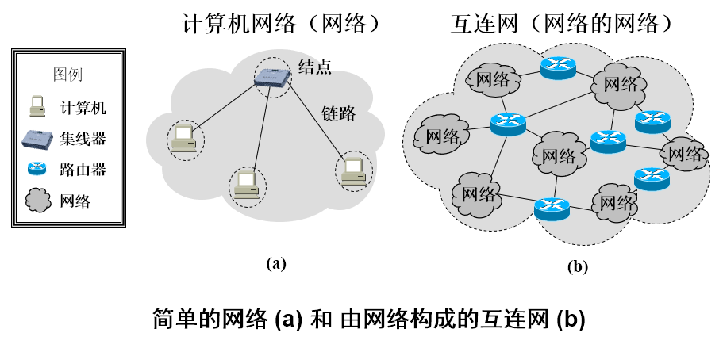

**关于“云”**
当使用一朵“云”来表示网络时，可能会有两种不同的情况：
云表示的网络已经包含了和网络相连的计算机。
云表示的网络里面就只剩下许多路由器和连接这些路由器的链路，把有关的计算机画在云的外面。习惯上，与网络相连的计算机常称为主机(host)。

**网络**把许多计算机连接在一起。
**互连网**则把许多网络通过路由器连接在一起。
与网络相连的计算机常称为**主机**。

**1.2.2互联网基础结构发展的三个阶段**
**第一阶段：**从单个网络ARPANET向互联网发展的过程。
1983年，TCP/IP协议成为ARPANET上的标准协议，使得所有使用TCP/IP协议的计算机都能利用互连网相互通信。人们把1983年作为互联网的诞生时间。1990年，ARPANET正式宣布关闭。
**第二阶段**：建成了三级结构的互联网。
它是一个三级计算机网络，分为主干网、地区网和校园网（或企业网）。
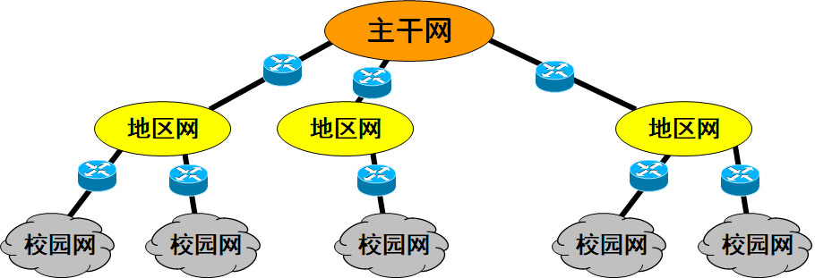

**第三阶段**：逐渐形成了多层次ISP结构的互联网。
出现了互联网服务提供者ISP(Internet Service Provider)。
任何机构和个人只要向某个ISP交纳规定的费用，就可从该ISP获取所需IP地址的使用权，并可通过该ISP接入到互联网。
根据提供服务的覆盖面积大小以及所拥有的IP地址数目的不同，ISP也分成为不同层次的ISP：主干ISP、地区ISP和本地ISP。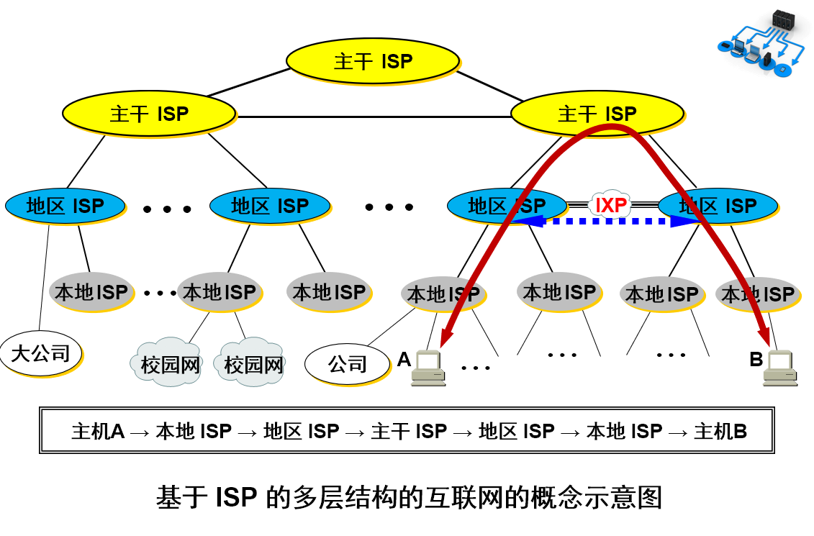

**互联网交换点IXP( Internet eXchange Point )**
互联网交换点IXP主要作用就是允许两个网络直接相连并交换分组
许多互联网交换点IXP在进行对等交换分组时互相不收取费用
但本地ISP或地区ISP通过IXP向高层的IXP转发分组需交纳一定费用
IXP采用工作在数据链路层的网络交换机都用局域网互连起来
到2016年3月，全球已经有226个IXP，分布在172个国家和地区。但互联网的发展在全世界还很不平衡。

**万维网WWW**
互联网已经成为世界上规模最大和增长速率最快的计算机网络，没有人能够准确说出互联网究竟有多大。
互联网的迅猛发展始于20世纪90年代。由欧洲原子核研究组织CERN开发的**万维网WWW  (World Wide Web)**被广泛使用在互联网上，大大方便了广大非网络专业人员对网络的使用，成为互联网的这种指数级增长的主要驱动力。

**1.2.3互联网的标准化工作**
互联网的标准化工作对互联网的发展起到了非常重要的作用。
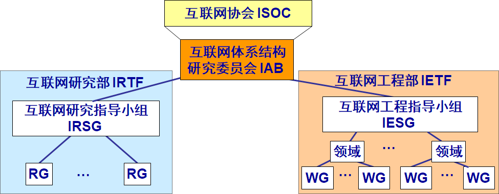所有互联网标准都以 RFC 的形式在互联网上发表。
**Request For Comments (RFC）---请求评议**
互联网草案 (Internet Draft) ——有效期只有六个月。在这个阶段还*不是* RFC 文档。
建议标准 (Proposed Standard) ——从这个阶段开始就成为 RFC 文档。
互联网标准 (Internet Standard) ——达到正式标准后，每个标准就分配到一个编号 STD xxxx。一个标准可以和多个 RFC 文档关联。
**各种 RFC 之间的关系** 
除了建议标准和互联网标准这两种 RFC 文档外，还有三种 RFC 文档，即历史的、实验的和提供信息的 RFC 文档。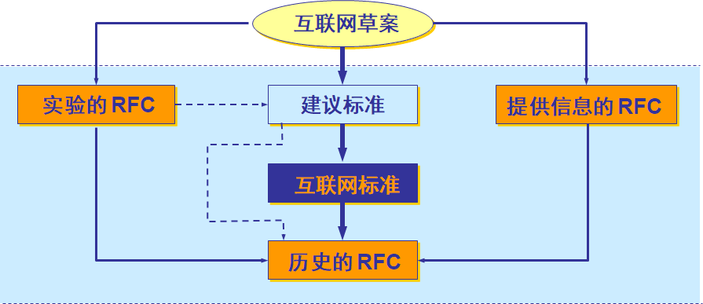

## **1.3  互联网的组成**

**1.3.1  互联网的边缘部分**
从互联网的工作方式上看，可以划分为两大块：
**边缘部分**：由所有连接在互联网上的主机组成。这部分是用户直接使用的，用来进行通信（传送数据、音频或视频）和资源共享。
**核心部分**：由大量网络和连接这些网络的路由器组成。这部分是为边缘部分提供服务的（提供连通性和交换）。
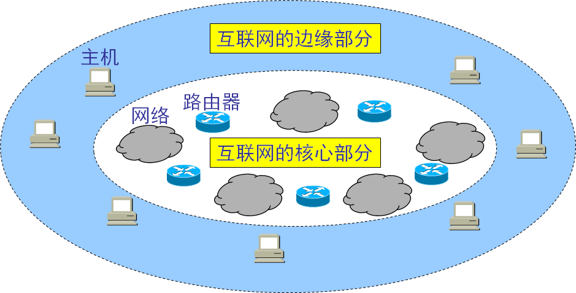
边缘部分
处在互联网边缘的部分就是连接在互联网上的所有的主机。这些主机又称为端系统(end system)。
端系统在功能上可能有很大的差别
小的端系统可以是一台普通个人电脑，具有上网功能的智能手机，甚至是一个很小的网络摄像头。
大的端系统则可以是一台非常昂贵的大型计算机。
端系统的拥有者可以是个人，也可以是单位（如学校、企业、政府机关等），当然也可以是某个 ISP。

端系统之间通信的含义
“主机 A 和主机 B 进行通信”实际上是指：“运行在主机 A 上的某个程序和运行在主机 B 上的另一个程序进行通信”。简称为“计算机之间通信”。 

端系统之间的通信方式通常可划分为两大类：
客户-服务器方式（C/S 方式）
即 Client/Server 方式，简称为 C/S 方式。
对等方式（P2P 方式）
即 PeerToPeer 方式 ，简称为 P2P 方式。

**客户-服务器方式**
客户 (client) 和服务器 (server) 都是指通信中所涉及的两个应用进程。
客户-服务器方式所描述的是进程之间服务和被服务的关系。
客户是服务的请求方，服务器是服务的提供方。
服务请求方和服务提供方都要使用网络核心部分所提供的服务。
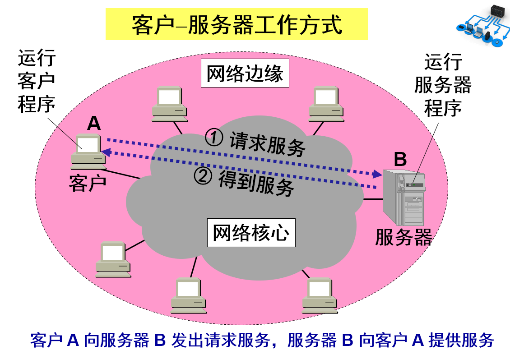
客户软件的特点:
被用户调用后运行，在打算通信时主动向远地服务器发起通信（请求服务）。因此，客户程序必须知道服务器程序的地址。
不需要特殊的硬件和很复杂的操作系统。
服务器软件的特点：
一种专门用来提供某种服务的程序，可同时处理多个远地或本地客户的请求。
系统启动后即自动调用并一直不断地运行着，被动地等待并接受来自各地的客户的通信请求。因此，服务器程序不需要知道客户程序的地址。
一般需要强大的硬件和高级的操作系统支持。
客户与服务器的通信关系建立后，通信可以是双向的，客户和服务器都可发送和接收数据。

**对等方式（P2P 方式）**
对等连接 (peer-to-peer，简写为 P2P) 是指两个主机在通信时并不区分哪一个是服务请求方还是服务提供方。
只要两个主机都运行了对等连接软件 (P2P 软件) ，它们就可以进行平等的、对等连接通信。
双方都可以下载对方已经存储在硬盘中的共享文档。
**特点**：
对等连接方式从本质上看仍然是使用客户服务器方式，只是对等连接中的每一个主机既是客户又是服务器。
例如主机 C 请求 D 的服务时，C 是客户，D 是服务器。但如果 C 又同时向 F提供服务，那么 C 又同时起着服务器的作用。
对等连接工作方式可支持大量对等用户（如上百万个）同时工作。
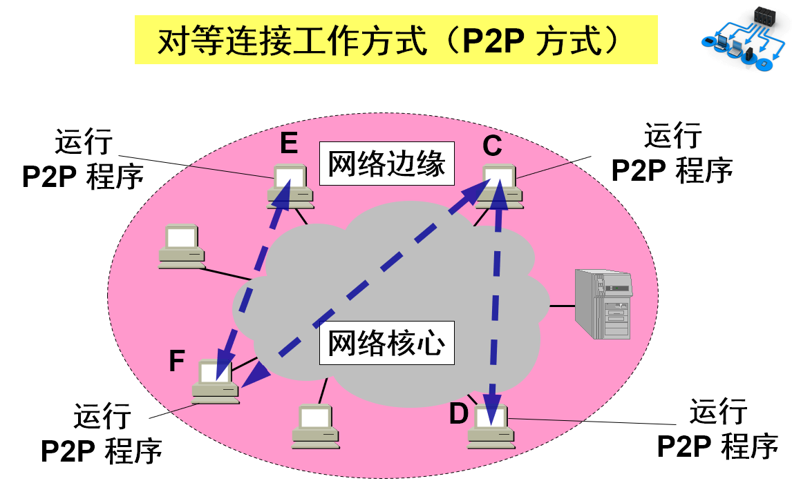

**1.3.2  互联网的核心部分**网络核心部分是互联网中最复杂的部分。
网络中的核心部分要向网络边缘中的大量主机提供连通性，使边缘部分中的任何一个主机都能够向其他主机通信（即传送或接收各种形式的数据）。
在网络核心部分起特殊作用的是**路由器 (router)**

**互联网的核心部分**
互联网的核心部分是由**许多网络**和把它们互连起来的路由器组成，而主机处在**互联网的边缘部分**。
互联网核心部分中的路由器之间一般都用高速链路相连接，而在网络边缘的主机接入到核心部分则通常以相对较低速率的链路相连接。
主机的用途是为用户进行信息处理的，并且可以和其他主机通过网络交换信息。路由器的用途则是用来转发分组的，即进行分组交换的。 

**路由器：**
在路由器中的输入和输出端口之间没有直接连线。
路由器处理分组的过程是：
把收到的分组先放入缓存（暂时存储）；
查找转发表，找出到某个目的地址应从哪个端口转发；
把分组送到适当的端口转发出去。

路由器是实现**分组交换 (packet switching)** 的关键构件，其任务是转发收到的分组，这是网络核心部分最重要的功能。
为了理解分组交换，首先了解计算机网络中常用的另外两种交换技术**电路交换、报文交换**的基本概念。

**1.** **电路交换**
2 部电话机只需要用 1 对电线直接连接就能够互相通话。
5 部电话机两两直接相连，需 10 对电线。
N 部电话机两两直接相连，需 N(N – 1)/2 对电线。这种直接连接方法所需要的电线对的数量与电话机数量的平方（ N2 ）成正比。
当电话机的数量增多时，就要使用**交换机**来完成全网的交换任务。
每一部电话都直接连接到交换机上，而交换机使用交换的方法，让电话用户彼此之间可以很方便地通信。
所采用的交换方式就是**电路交换 (circuit switching)**。
电路交换必定是**面向连接**的。
电路交换分为三个阶段：
**建立连接**：建立一条专用的物理通路，以保证双方通话时所需的通信资源在通信时不会被其他用户占用；
**通信**：主叫和被叫双方就能互相通电话；
**释放连接**：释放刚才使用的这条专用的物理通路（释放刚才占用的所有通信资源）。
优点：实时性好，能及时传达信息
缺点：
呼叫时间长
通信带宽不能充分利用，，这导致在传送计算机数据时，通信线路的利用率很低（用来传送数据的时间不到10%甚至1%）。
不同计算机和远程终端的传输速率不同

**2. 报文交换技术**
报文交换是采用存储转发的方式来传输数据，它不需要在两个站点之间建立一条专用的通信线路。
报文交换的特点是整块报文一起从一个站点传到另一个站点
优点：线路利用率较高，可共享信道；一个报文送到多个目的站点。
缺点：传输延迟长，不能满足实时或交互式通信要求。
报文交换的时延较长，从几分钟到几小时不等。现在报文交换已经很少有人使用了。

**3. 分组交换技术**

分组交换则采用存储转发技术。

1. 在发送端，先把较长的报文划分成较短的、固定长度的数据段。
2. 每一个数据段前面添加上首部构成分组(packet)。
   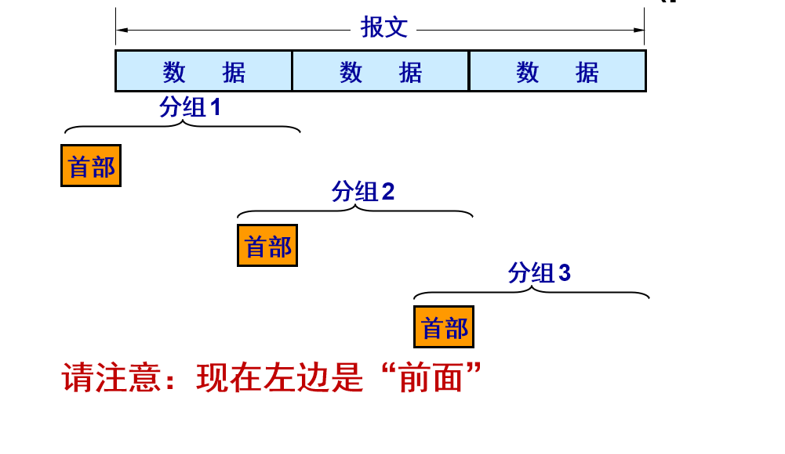
3. 分组交换网以“分组”作为数据传输单元。
4. 依次把各分组发送到接收端（假定接收端在左边）。
   分组首部的重要性：
   **每一个**分组的首部都含有**地址**（诸如目的地址和源地址）等控制信息。
   分组交换网中的结点交换机根据收到的分组首部中的**地址信息**，把分组**转发**到下一个结点交换机。
   每个分组在互联网中**独立地选择传输路径**。
   用这样的**存储转发**方式，最后分组就能到达最终目的地。
5. 接收端收到分组后剥去首部还原成报文。
6. 最后，在接收端把收到的数据恢复成为原来的报文。
   这里我们假定分组在传输过程中没有出现差错，在转发时也没有被丢弃。

分组交换的优点
高效：在分组传输的过程中动态分配传输带宽，对通信链路是逐段占用。
灵活：为每一个分组独立地选择最合适的转发路由。
迅速：以分组作为传送单位，可以不先建立连接就能向其他主机发送分组。
可靠：保证可靠性的网络协议；分布式多路由的分组交换网，使网络有很好的生存性。

分组交换的缺点
分组在各结点存储转发时需要排队，这就会造成一定的时延。
分组必须携带的首部（里面有必不可少的控制信息）也造成了一定的开销。

**三种交换的比较**
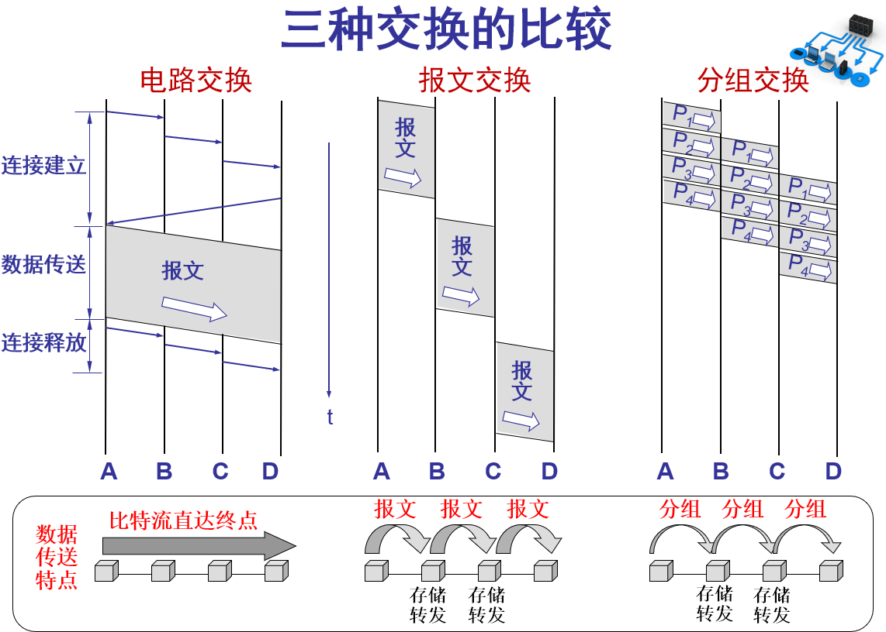
若要连续传送大量的数据，且其传送时间远大于连接建立时间，则电路交换的传输速率较快。
报文交换和分组交换不需要预先分配传输带宽，在传送突发数据时可提高整个网络的信道利用率。
由于一个分组的长度往往远小于整个报文的长度，因此分组交换比报文交换的时延小，同时也具有更好的灵活性。

## 1.4  计算机网络在我国的发展

1980 年，铁道部开始进行计算机联网实验。
1989 年11 月，我国第一个公用分组交换网 CNPAC 建成运行。
**1994 年 4 月 20 日**，我国用 64 kbit/s 专线正式连入互联网，我国被国际上正式承认为接入互联网的国家。
1994 年 5 月，中国科学院高能物理研究所设立了我国的第一个万维网服务器。
1994 年 9 月中国公用计算机互联网  CHINANET 正式启动。

到目前为止，我国陆续建造了基于互联网技术的并能够和互联网互连的多个全国范围的公用计算机网络，其中规模最大的就是下面这五个：
(1) 中国电信互联网 CHINANET（也就是原来的中国公用计算机互联网）
(2) 中国联通互联网 UNINET
(3) 中国移动互联网 CMNET
(4) 中国教育和科研计算机网 CERNET
(5) 中国科学技术网 CSTNET

中国十大国内骨干互联网络
1.中国公用计算机互联网-----CHINANET
由中国电信集团主管，1994年8月原邮电部与美国Sprint公司签定协议，开始组建CHINANET网络，1995年6月正式提供服务。
2.中国科学技术网络--------CSTNET
由中国科学院主管，1994年5月21日完成**我国最高域名CN**主服务器的设置，实现了与Internet的TCP/IP连接。
3.中国教育和科研计算机网-----CERNET
由国家教育部主管，1994年开始建设，并于1995年10月开通，包括全国主干网、地区网、校园网的三级层次结构。（网络控制中心设在清华大学）
4.中国金桥信息网------------CHINAGBN
它是发展以地面光纤通信宽带传输系统为主的全新型电信业务网络。
**5.中国联通互联网**-----UNINET 1998年开始运营
6.中国网通宽带高速互联网----CNCNET    2000.10.28年开始运营
**7.中国移动互联网**--------CMNET  2000.1开始运营
8.中国国际经济贸易互联网----CIETNET
我国唯一的经济类国际互联网络，2000年初开始组建
9.中国长城互联网-------CGWNET  正在建设中
公益性网络
10.中国卫星集团互联网----CSNET  正在建设中

## 1.5  计算机网络的类别

**1.5.1  计算机网络的定义**
1、最简单的定义：计算机网络是一些互相连接的、自治的计算机的集合。
2、因特网(Internet)是“网络的网络”
3、较好的定义：所谓的计算机网络就是把分布在不同区域的计算机与专门的设备用通信线路互相连成一个规模大、功能强的网络系统，从而使众多计算机可以方便地互相传递信息、共享硬件、软件、数据信息资源等的系统。

**1.5.2  几种不同类别的网络**
计算机网络有多种类别。典型包括：

1. 按照网络的作用范围进行分类
2. 按照网络的使用者进行分类
3. 用来把用户接入到互联网的网络

1.按照网络的作用范围进行分类
**广域网 WAN** (Wide Area Network)：作用范围通常为几十到几千公里。
**城域网 MAN** (Metropolitan Area Network)：作用距离约为  5 ~ 50 公里。
**局域网 LAN** (Local Area Network) ：局限在较小的范围（如 1 公里左右）。
**个人区域网 PAN** (Personal Area Network) ：范围很小，大约在 10 米左右。

2.按照网络的使用者进行分类
公用网 (public network) 
按规定交纳费用的人都可以使用的网络。因此也可称为公众网。
专用网 (private network) 
为特殊业务工作的需要而建造的网络。
公用网和专用网都可以提供多种服务。如传送的是计算机数据，则分别是公用计算机网络和专用计算机网络。

3.用来把用户接入到互联网的**网络接入网 AN** (Access Network)，它又称为本地接入网或居民接入网。
接入网是一类比较特殊的计算机网络，用于将用户接入互联网。
接入网本身既不属于互联网的核心部分，也不属于互联网的边缘部分。
接入网是从某个用户端系统到互联网中的第一个路由器（也称为边缘路由器）之间的一种网络。

## 1.6  计算机网络的性能

**1.6.1  计算机网络的性能指标**
计算机网络的性能一般是指它的几个重要的性能指标，主要包括：
**速率、带宽、吞吐量、时延**、时延带宽积、往返时间 RTT、利用率

1. 速率

   比特（bit）是计算机中数据量的单位，也是信息论中使用的信息量的单位。
   比特（bit）来源于 binary digit，意思是一个“二进制数字”，因此一个比特就是二进制数字中的一个 1 或 0。
   速率是计算机网络中最重要的一个性能指标，指的是**数据的传送速率**，它也称为**数据率** (data rate)或**比特率** (bit rate)。
   速率的单位是 bit/s，或 kbit/s、Mbit/s、 Gbit/s 等。例如 4 * 10^10 bit/s 的数据率就记为 40 Gbit/s。
   *速率往往是指额定速率或标称速率，非实际运行速率。*

2. 带宽 
   两种不同意义：
   “带宽”(bandwidth) 本来是指信号具有的**频带宽度**，其单位是赫（或千赫、兆赫、吉赫等）。
   在计算机网络中，带宽用来表示网络中某通道传送数据的能力。表示在单位时间内网络中的某信道所能通过的“**最高数据率**”。单位是 bit/s ，即 “比特每秒”。
   在时间轴上信号的宽度随带宽的增大而变窄。

   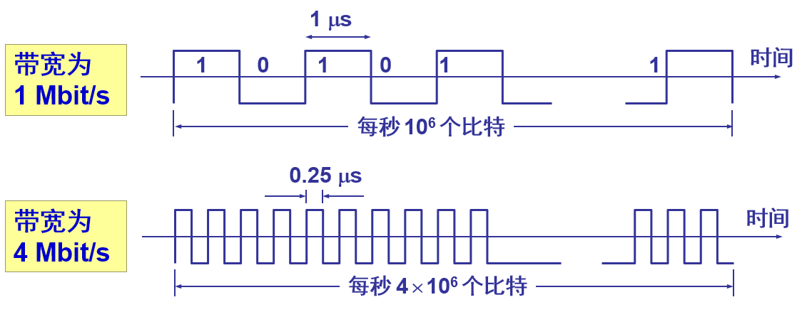

3. 吞吐量
   吞吐量 (throughput) 表示在单位时间内通过某个网络（或信道、接口）的数据量。
   吞吐量更经常地用于对现实世界中的网络的一种测量，以便知道实际上**到底有多少数据量能够通过网络**。
   吞吐量受网络的带宽或网络的额定速率的限制。

4. 时延
   时延 (delay 或 latency) 是指数据（一个报文或分组，甚至比特）从网络（或链路）的一端传送到另一端所需的时间。
   有时也称为**延迟或迟延**。
   数据在网络中经历的总时延就是发送时延、传播时延、处理时延和排队时延之和。
   网络中的时延由以下几个不同的部分组成：
   (1)发送时延
   也称为传输时延。
   发送数据时，数据帧从结点进入到传输媒体所需要的时间。
   也就是从发送数据帧的第一个比特算起，到该帧的最后一个比特发送完毕所需的时间。
   发送时延=数据帧长度（bit）/发送速率（bit/s）

   (2)传播时延
   电磁波在信道中需要传播一定的距离而花费的时间。
   **发送时延与传播时延有本质上的不同。**
   信号**发送速率**和信号在信道上的传播速率是**完全不同**的概念。
   传播时延=信道长度（米）/信号在信道上的传播速率（米/秒）

   (3)处理时延
   主机或路由器在收到分组时，为处理分组（例如分析首部、提取数据、差错检验或查找路由）所花费的时间。

   (4)排队时延
   分组在路由器输入输出队列中排队**等待处理**所经历的时延。
   *排队时延的长短往往取决于网络中当时的通信量。*

5. 时延带宽积
   链路的时延带宽积又称为**以比特为单位的链路长度**。
   时延带宽积=传播时延*带宽
   只有在代表链路的管道都充满比特时，
   链路才得到了充分利用。

6. 往返时间RTT
   互联网上的信息不仅仅单方向传输，而是双向交互的。因此，有时很需要知道双向交互一次所需的时间。
   **往返时间**表示从发送方发送数据开始，到发送方收到来自接收方的确认，总共经历的时间。
   在互联网中，往返时间还包括**各中间结点**的处理时延、排队时延以及转发数据时的发送时延。
   当使用卫星通信时，往返时间 RTT 相对较长，是很重要的一个性能指标。

7. 利用率
   分为信道利用率和网络利用率。
   **信道利用率**指出某信道有百分之几的时间是被利用的（有数据通过）。完全空闲的信道的利用率是零。
   **网络利用率则**是全网络的信道利用率的加权平均值。
   信道利用率并非越高越好。*当某信道的利用率增大时，该信道引起的时延也就迅速增加。*

**1.6.2  计算机网络的非性能特征**
一些非性能特征也很重要。它们与前面介绍的性能指标有很大的关系。主要包括：
费用、质量、标准化、可靠性、可扩展性和可升级性、易于管理和维护

## 1.7  计算机网络的体系结构

**1.7.1  计算机网络体系结构的形成**
相互通信的两个计算机系统必须**高度协调工作**才行，而这种“协调”是相当复杂的。
“**分层**”可将庞大而复杂的问题，转化为若干较小的局部问题，而这些较小的局部问题就比较易于研究和处理。

计算机网络的**体系结构**(architecture)是计算机网络的各层及其协议的集合。
体系结构就是这个计算机网络及其部件所应完成的功能的**精确定义**。
**实现**(implementation)是遵循这种体系结构的前提下用何种硬件或软件完成这些功能的问题。
体系结构是抽象的，而实现则是具体的，是真正在运行的计算机硬件和软件。
**世界上第一个网络体系结构**是IBM公司与1974年提出的“SNA”。

**计算机网络的根本目的**是为了实现数据通信和软件、硬件资源共享，要想让两台计算机进行通信，必须采用相同的信息交换规则，这就是**网络协议**。
相互通信的两个计算机系统必须高度协调工作才行，而这种“协调”是相当复杂的。
要真正理解网络体系结构，我们先必须知道下面几个概念：**协议、实体、系统、层、接口**等

网络层次体系结构主要包括五个要素
1.网络协议
网络协议 (network protocol)，简称为协议，是为网络中的数据交换而建立的**规则、标准或约定的集合**。
语法：数据与控制信息的结构或格式。
语义：需要发出何种控制信息，完成何种动作以及做出何种响应。
同步：事件实现顺序的详细说明。
2.实体
软件元素（如进程等）或硬件元素（智能I/O芯片等）的抽象。
3.系统
包含一个或多个实体，具有信息处理和通信功能的整体。通常一个系统总是硬件、软件两部分的有机结合。
4.层：层是处理复杂问题的一种结构化技术。上层只知道下层为其提供哪些服务，并不关心这些服务是如何实现的
5.接口：同一结点的不同功能层之间的通信规则。（服务访问点SAP）
注意:
协议是“水平的”，即协议是控制对等实体之间通信的规则。
服务是“垂直的”，即服务是由下层向上层通过层间接口提供。
同一系统相邻两层的实体进行交互的地方，称为服务访问点 SAP  (Service Access Point)。

1974 年，美国的 IBM 公司宣布了**系统网络体系结构SNA** (System Network Architecture)。这个著名的网络标准就是按照分层的方法制定的。
不久后，其他一些公司也相继推出自己公司的具有不同名称的体系结构。
由于**网络体系结构的不同**，不同公司的设备很难互相连通。

1、开放系统互连参考模型 OSI/RM
为了使不同体系结构的计算机网络都能互连，国际标准化组织 ISO 于 1977 年成立了专门机构研究该问题。
他们提出了一个试图使各种计算机在世界范围内互连成网的标准框架，即著名的**开放系统互连基本参考模型 OSI/RM** (Open Systems Interconnection Reference Model)，简称为 OSI。
只要遵循 OSI 标准，一个系统就可以和位于世界上任何地方的、也遵循这同一标准的其他任何系统进行通信。
开放系统互连基本参考模型 OSI/RM七层：
**物理层、数据链路层、网络层、传输层、会话层、表示层、应用层。**

2、TCP /IP参考模型TCP/IP 是四层的体系结构：
应用层、运输层、网际层、网络接口层

法律上的 (de jure) 国际标准 OSI 并没有得到市场的认可。
非国际标准 TCP/IP 却获得了最广泛的应用。TCP/IP 常被称为事实上的 (de facto) 国际标准。

**1.7.2  协议与划分层次**
计算机网络中的数据交换**必须遵守事先约定好的规则**。
这些规则明确规定了所交换的数据的格式以及有关的同步问题（同步含有时序的意思）。
**网络协议** (network protocol)，简称为**协议**，是为进行网络中的数据交换而建立的规则、标准或约定。
语法：数据与控制信息的结构或格式。
语义：需要发出何种控制信息，完成何种动作以及做出何种响应。
同步：事件实现顺序的详细说明。

分层的好处：
各层之间是独立的、灵活性好、结构上可分割开、易于实现和维护、能促进标准化工作。
缺点：降低效率、有些功能会在不同的层次中重复出现，因而产生了额外开销。

**1.7.3具有五层协议的体系结构**
OSI的七层协议体系结构的概念清楚，理论也较完整，但它既复杂又不实用。
TCP/IP是四层体系结构：应用层、运输层、网际层和网络接口层。
但最下面的网络接口层并没有具体内容。
因此往往采取折中的办法，即综合 OSI 和 TCP/IP 的优点，采用一种只有**五层协议的体系结构**。

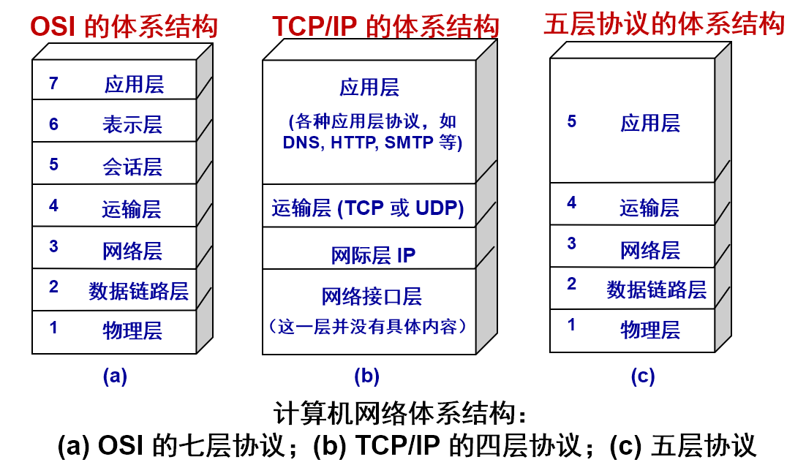
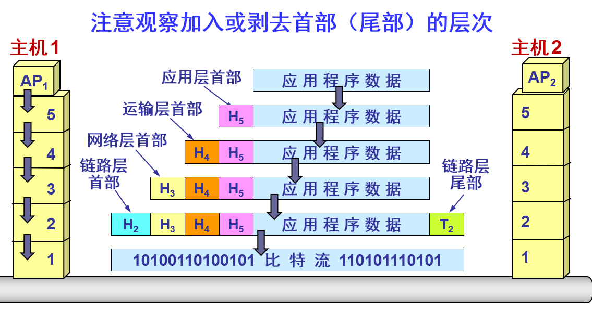**主机 1 向主机 2 发送数据**
1.应用进程数据先传送到应用层，加上应用层首部，成为应用层PDU
2.应用层 PDU 再传送到运输层，加上运输层首部，成为运输层报文
3.运输层报文再传送到网络层，加上网络层首部，成为 IP 数据报（或分组）
4.IP 数据报再传送到数据链路层，加上链路层首部和尾部，成为数据链路层帧
5.数据链路层帧再传送到物理层，最下面的物理层把比特流传送到物理媒体
电信号（或光信号）在物理媒体中传播，从发送端物理层传送到接收端物理层
1.物理层接收到比特流，上交给数据链路层
2.数据链路层剥去帧首部和帧尾部，取出数据部分，上交给网络层
3.网络层剥去首部，取出数据部分，上交给运输层
4.运输层剥去首部，取出数据部分，上交给应用层
5.应用层剥去首部，取出应用程序数据，上交给应用进程

PDU (Protocol Data Unit)：协议数据单元。OSI 参考模型把对等层次之间传送的数据单位称为该层的协议数据单元 PDU。
OSI 参考模型把对等层次之间传送的数据单位称为该层的**协议数据单元 PDU** (Protocol Data Unit)。这个名词现已被许多非 OSI 标准采用。
任何两个同样的层次把数据（即数据单元加上控制信息）通过水平虚线直接传递给对方。这就是所谓的“**对等层**”(peer layers)之间的通信。
**各层协议**实际上就是在各个对等层之间传递数据时的各项规定。

**1.7.4  实体、协议、服务和服务访问点**
**实体** (entity) 表示任何可发送或接收信息的硬件或软件进程。
**协议**是控制两个对等实体进行通信的规则的集合。
在协议的控制下，两个对等实体间的通信使得本层能够向上一层提供服务。
要实现本层协议，还需要使用下层所提供的服务。

协议和服务在概念上是不一样的
协议的实现保证了能够向上一层提供服务。
本层的服务用户**只能看见服务**而无法看见下面的协议。即下面的协议对上面的服务用户是**透明**的。
协议是“**水平的**”，即协议是控制对等实体之间通信的规则。
服务是“**垂直的**”，即服务是由下层向上层通过层间接口提供的。
上层使用**服务原语**获得下层所提供的服务。

同一系统相邻两层的实体进行交互的地方，称为**服务访问点SAP** (Service Access Point)。
服务访问点SAP是一个抽象的概念，它实际上就是一个逻辑接口。

协议必须把所有不利的条件事先都估计到，而不能假定一切都是正常的和非常理想的。
看一个计算机网络协议是否正确，不能光看在正常情况下是否正确，还必须非常仔细地检查这个协议能否应付各种异常情况。

**1.7.5  TCP/IP 的体系结构**
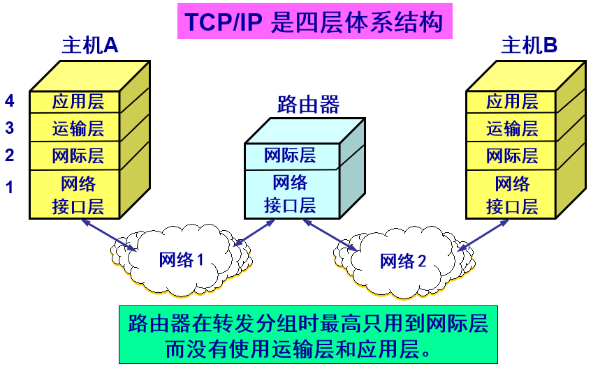
TCP/IP 是四层体系结构
TCP/IP 体系结构的另一种表示方法
实际上，现在的互联网使用的 TCP/IP 体系结构有时已经发生了演变，即某些应用程序可以直接使用 IP 层，或甚至直接使用最下面的网络接口层。
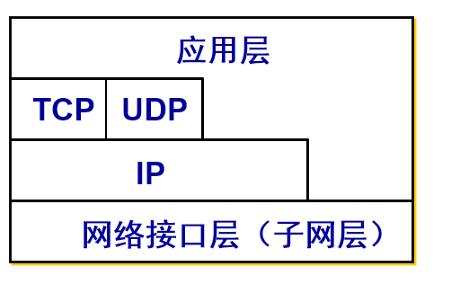
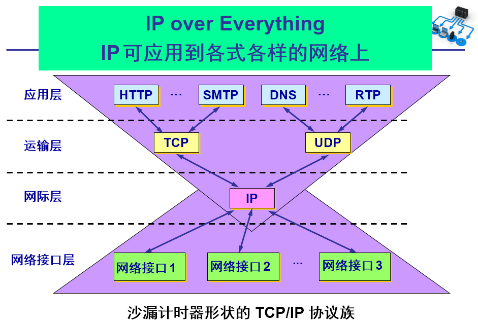

# 2.物理层

物理层的四个基本特性
物理层下面的传输媒体：**双绞线和光纤**
常见的几种信道复用技术
**宽带接入技术：ADSL和FTTx**

## 2.1  物理层的基本概念

物理层考虑的是怎样才能在连接各种计算机的传输媒体上**传输数据比特流**，而不是指具体的传输媒体。
物理层的作用是要尽可能地屏**蔽掉**不同传输媒体和通信手段的差异。
用于物理层的协议也常称为物理层**规程(procedure)**。

物理层的主要任务：确定与传输媒体的接口的一些特性。
**机械特性**：指明接口所用接线器的形状和尺寸、引线数目和排列、固定和锁定装置等。
**电气特性**：指明在接口电缆的各条线上出现的电压的范围。
**功能特性**：指明某条线上出现的某一电平的电压表示何种意义。
**过程特性**：指明对于不同功能的各种可能事件的出现顺序。

## 2.2  数据通信的基础知识

**2.2.1  数据通信系统的模型**
一个数据通信系统包括三大部分：源系统（或发送端、发送方）、传输系统（或传输网络）和目的系统（或接收端、接收方）。
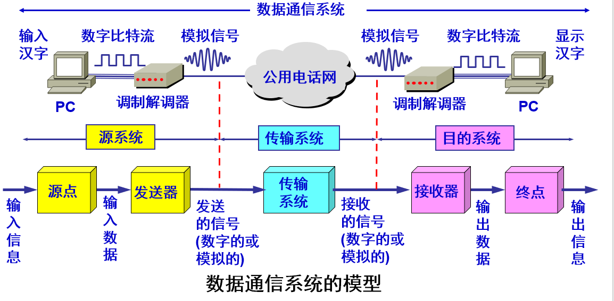

常用术语：
**数据**(data)——运送消息的实体。
**信号**(signal)——数据的电气的或电磁的表现。
**模拟信号**(analogous signal)——代表消息的参数的取值是连续的。
**数字信号**(digital signal)——代表消息的参数的取值是离散的。
**码元**(code)——在使用时间域（或简称为时域）的波形表示数字信号时，代表不同离散数值的基本波形。

**2.2.2  有关信道的几个基本概念**
**信道**——一般用来表示向某一个方向传送信息的媒体。
单向通信（单工通信）——只能有一个方向的通信而没有反方向的交互。
双向交替通信（半双工通信）——通信的双方都可以发送信息，但不能双方同时发送(当然也就不能同时接收)。
双向同时通信（全双工通信）——通信的双方可以同时发送和接收信息。
**基带信号**（即基本频带信号）——来自信源的信号。像计算机输出的代表各种文字或图像文件的数据信号都属于基带信号。基带信号往往包含有较多的低频成分，甚至有直流成分，而许多信道并不能传输这种低频分量或直流分量。因此必须对基带信号进行**调制(modulation)**。

调制分为两大类：
**基带调制**：仅对基带信号的波形进行变换，使它能够与信道特性相适应。变换后的信号**仍然是基带信号**。把这种过程称为**编码(coding)**。
**带通调制**：使用**载波(carrier)**进行调制，把基带信号的频率范围搬移到较高的频段，并**转换为模拟信号**，这样就能够更好地在模拟信道中传输（即仅在一段频率范围内能够通过信道）。

(1)常用编码方式
**不归零制：**正电平代表1，负电平代表0。
**归零制**：正脉冲代表1，负脉冲代表0。
**曼彻斯特编码**：位周期中心的向上跳变代表0，位周期中心的向下跳变代表1。但也可反过来定义。
**差分曼彻斯特编码**：在每一位的中心处始终都有跳变。位开始边界有跳变代表0，而位开始边界没有跳变代表1。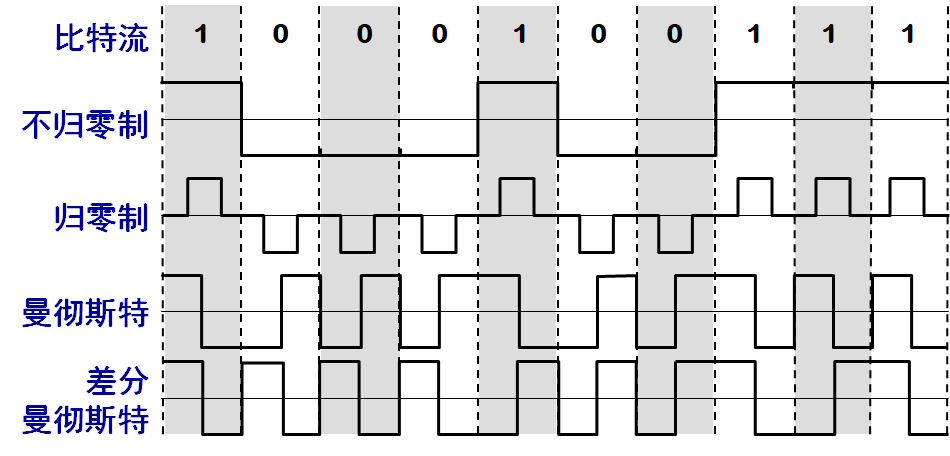
(2)基本的带通调制方法
基带信号往往包含有较多的低频成分，甚至有直流成分，而许多信道并不能传输这种低频分量或直流分量。为了解决这一问题，就必须对基带信号进行**调制(modulation)**。
最基本的二元制调制方法有以下几种：
**调幅(AM)**：载波的振幅随基带数字信号而变化。
**调频(FM)**：载波的频率随基带数字信号而变化。
**调相(PM)**：载波的初始相位随基带数字信号而变化。
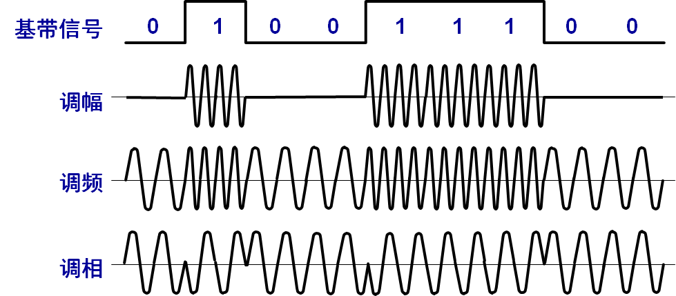

**2.2.3  信道的极限容量**
任何实际的信道都不是理想的，在传输信号时会产生各种失真以及带来多种干扰。
码元传输的速率越高，或信号传输的距离越远，或传输媒体质量越差，在信道的输出端的波形的失真就越严重。
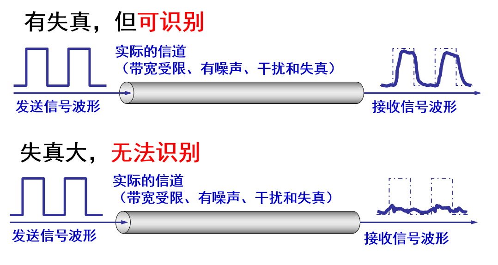

从概念上讲，限制码元在信道上的传输速率的因素有以下两个：
信道能够通过的频率范围、信噪比
**(1)信道能够通过的频率范围**
具体的信道所能通过的频率范围总是有限的。信号中的许多高频分量往往不能通过信道。
1924年，奈奎斯特(Nyquist)就推导出了著名的**奈氏准则**。他给出了在假定的理想条件下，为了避免**码间串扰**，码元的传输速率的上限值。
**公式：C=2Wlog2N**
（其中的W为带宽，N为周期内传输码元的个数。）
在任何信道中，码元传输的速率是有上限的，否则就会出现码间串扰的问题，使接收端对码元的判决（即识别）成为不可能。
如果信道的频带越宽，也就是能够通过的信号高频分量越多，那么就可以用更高的速率传送码元而不出现码间串扰。

**(2)信噪比**
噪声存在于所有的电子设备和通信信道中。
噪声是随机产生的，它的瞬时值有时会很大。因此噪声会使接收端对码元的判决产生错误。
但噪声的影响是相对的。如果信号相对较强，那么噪声的影响就相对较小。
信噪比就是**信号的平均功率和噪声的平均功率之比**。常记为S/N，并用分贝(dB)作为度量单位。即：
		**信噪比(dB)=10 log10(S/N)    (dB)**
例如，当S/N=10时，信噪比为10dB，而当S/N=1000时，信噪比为30dB。
1984年，香农(Shannon)用信息论的理论推导出了带宽受限且有高斯白噪声干扰的信道的极限、无差错的信息传输速率（香农公式）。
信道的极限信息传输速率C可表达为：
		**C = W log2(1+S/N)    (bit/s)**
其中：	
		W为信道的带宽（以Hz为单位）；
		S为信道内所传信号的平均功率；
		N为信道内部的高斯噪声功率。
香农公式表明
信道的带宽或信道中的信噪比越大，则信息的极限传输速率就越高。
*只要信息传输速率低于信道的极限信息传输速率，就一定可以找到某种办法来实现无差错的传输。*
*若信道带宽W或信噪比S/N没有上限（当然实际信道不可能是这样的），则信道的极限信息传输速率C也就没有上限。*
实际信道上能够达到的信息传输速率要比香农的极限传输速率低不少。

## 2.3  物理层下面的传输媒体

传输媒体也称为**传输介质**或**传输媒介**，它就是数据传输系统中在发送器和接收器之间的物理通路。
传输媒体可分为两大类，即导引型传输媒体和非导引型传输媒体。
在**导引型传输媒体**中，电磁波被导引沿着固体媒体（铜线或光纤）传播。
**非导引型传输媒体**就是指自由空间。在非导引型传输媒体中，电磁波的传输常称为无线传输。
电信领域使用的电磁波的频谱：
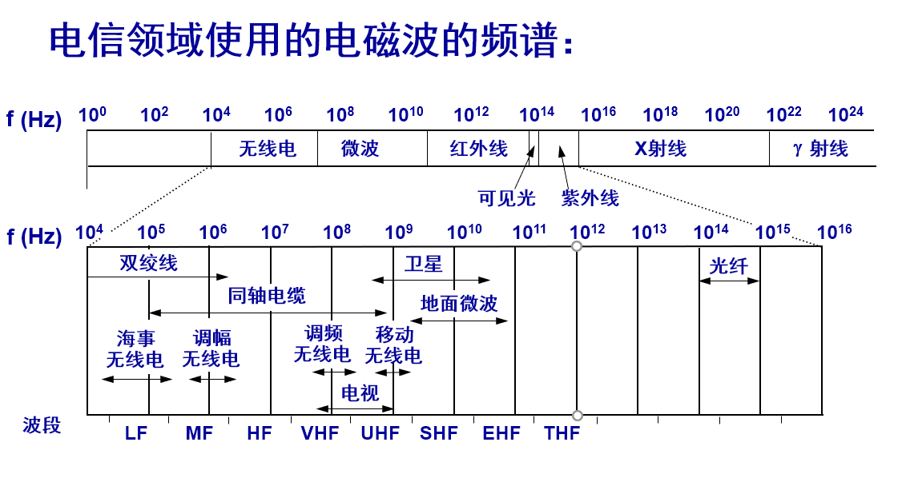

**2.3.1导引型传输媒体**
**双绞线**：
最常用的传输媒体。
模拟传输和数字传输都可以使用双绞线，其通信距离一般为几到十几公里。
**屏蔽双绞线STP(Shielded Twisted Pair)**
**无屏蔽双绞线UTP(Unshielded Twisted Pair)**
（1）非屏蔽双绞线（UTP）
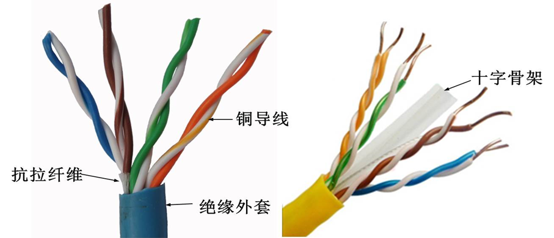
（2）屏蔽双绞线（STP）
屏蔽双绞线（Shielded Twisted Pair，STP）使用金属箔或金属网包裹网线内部的信号线，在屏蔽层外面再包裹绝缘外皮。
根据屏蔽方式的不同，屏蔽双绞线又分为：
STP（Shielded Twisted-Pair）：是指每条线对都有各自屏蔽层。
FTP（Foil Twisted-Pair）：是所有线对采用整体屏蔽。
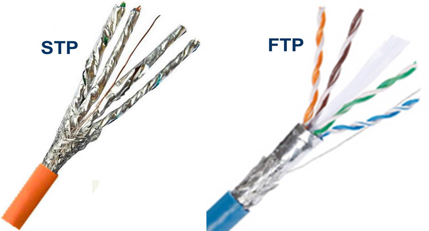
双绞线标准
1991年，美国电子工业协会EIA和电信行业协会联合发布了一个用于室内传送数据的无屏蔽双绞线和屏蔽双绞线的标准EIA/TIA-568。
1995年将布线标准更新为EIA/TIA-568-A。
2001年，EIA/TIA-568发布了第三个版本，即EIA/TIA-568-B
此标准规定了5个种类的UTP标准（从1类线到5类线）。
对传送数据来说，现在最常用的UTP是5类线（Category 5或CAT5）。
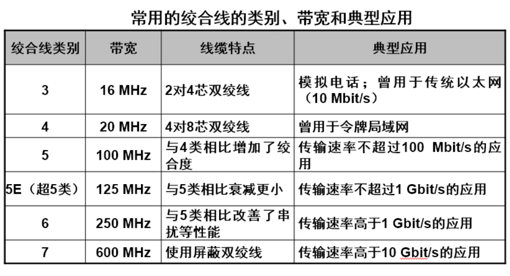
双绞线**EIA/TIA-568-B标准**
现阶段最新**EIA/TIA-568-B排线顺序**：
接线方式规定如下：
    1、2用于发送，3、6用于接收，4、5，7、8是双向线。
    1、2线必须是双绞，3、6双绞，4、5双绞，7、8双绞。
正确接线顺序：
        1        2       3       4       5       6       7       8
      白橙、橙、白绿、蓝、蓝白、绿、白棕、棕

**同轴电缆**
同轴电缆具有很好的抗干扰特性，被广泛用于传输较高速率的数据。
同轴电缆的带宽取决于电缆的质量。
50Ω同轴电缆——LAN/数字传输常用
75Ω同轴电缆——有线电视/模拟传输常用
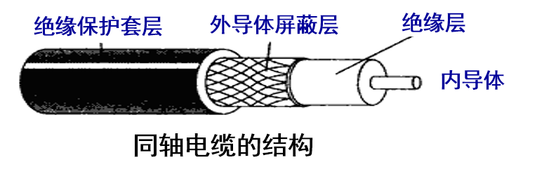

**光缆**
光纤是光纤通信的传输媒体。
由于可见光的频率非常高，约为108MHz的量级，因此一个光纤通信系统的传输带宽远远大于目前其他各种传输媒体的带宽。
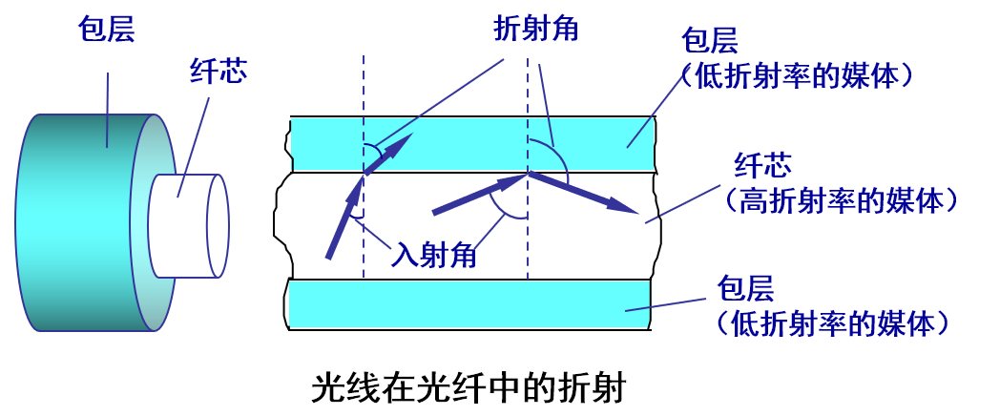
当光线从高折射率的媒体射向低折射率的媒体时，其折射角将大于入射角。因此，如果入射角足够大，就会出现全反射，光也就沿着光纤传输下去。

**多模光纤**：可以存在多条不同角度入射的光线在一条光纤中传输。这种光纤就称为多模光纤。
**单模光纤**：若光纤的直径减小到只有一个光的波长，则光纤就像一根波导那样，它可使光线一直向前传播，而不会产生多次反射。这样的光纤称为单模光纤。
光纤通信中使用的光波的波段
常用的三个波段的中心分别位于850nm,1300nm和1550nm。
所有这三个波段都具有25000~30000GHz的带宽，可见光纤的通信容量非常大。
**光纤优点**
(1)通信容量非常大。
(2)传输损耗小，中继距离长。
(2)抗雷电和电磁干扰性能好。
(3)无串音干扰，保密性好。
(4)体积小，重量轻。

**2.3.2  非导引型传输媒体**
将自由空间称为“非导引型传输媒体”。
无线传输所使用的频段很广。
**短波通信**（即高频通信）主要是靠电离层的反射，但短波信道的通信质量较差，传输速率低。
**微波**在空间主要是直线传播。
传统微波通信有两种方式：地面微波接力通信、卫星通信

## 2.4  信道复用技术

**2.4.1  频分复用**(Frequency Division Multiplexing)
**复用(multiplexing)**是通信技术中的基本概念。
它允许用户使用一个**共享**信道进行通信，降低成本，提高利用率。
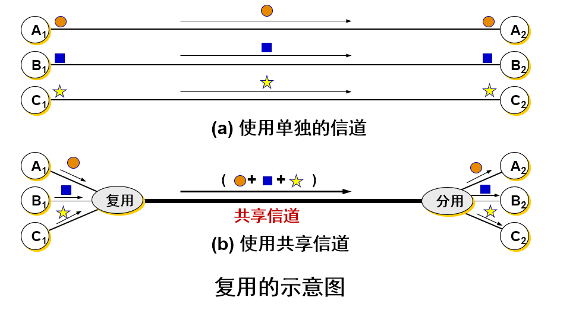
将整个带宽分为多份，用户在分配到一定的频带后，在通信过程中自始至终都占用这个频带。
**频分复用**的所有用户在同样的时间**占用不同的带宽资源**（请注意，这里的“带宽”是频率带宽而不是数据的发送速率）。
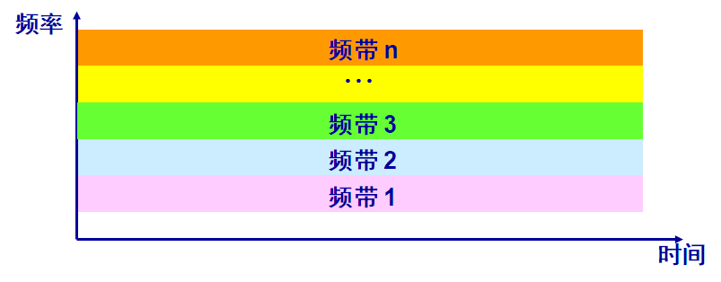

**2.4.2时分复用和统计时分复用**
**时分复用**则是将时间划分为一段段等长的**时分复用帧**（TDM帧）。每一个时分复用的用户在每一个TDM帧中占用固定序号的时隙。
每一个用户所占用的时隙是**周期性地出现**（其周期就是TDM帧的长度）。
TDM信号也称为**等时**(isochronous)信号。
时分复用的所有用户是在**不同的时间**占用**同样的频带宽度**。
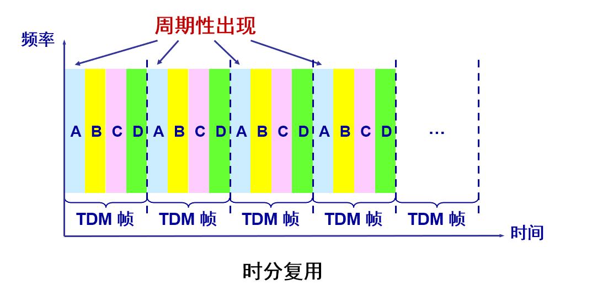
**时分复用可能会造成线路资源的浪费**：使用时分复用系统传送计算机数据时，由于计算机数据的突发性质，用户对分配到的子信道的利用率一般是不高的。
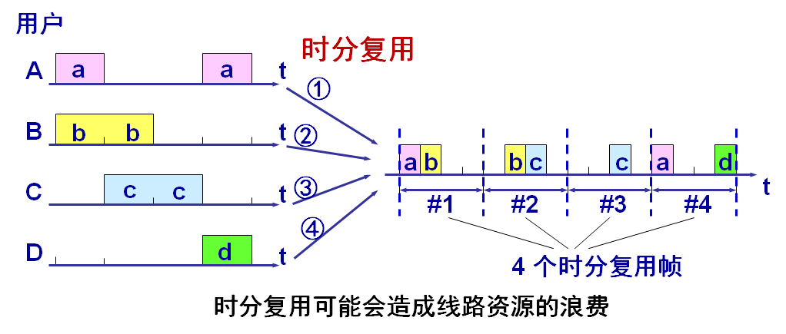
**统计时分复用STDM(Statistic TDM)**
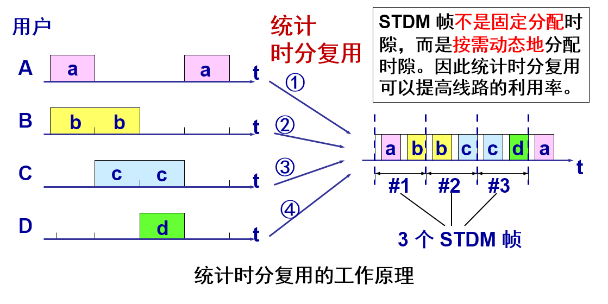

**2.4.3  波分复用**WDM(Wavelength Division Multiplexing)
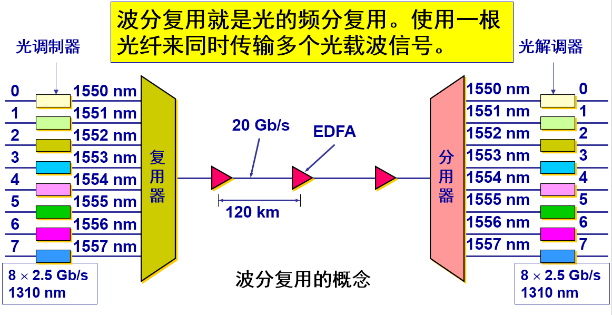

**2.4.4  码分复用**CDM(Code Division Multiplexing)
常用的名词是**码分多址**CDMA (Code Division Multiple Access)。
各用户使用经过特殊挑选的不同码型，因此彼此不会造成干扰。
这种系统发送的信号有很强的抗干扰能力，其频谱类似于白噪声，不易被敌人发现。

码片序列(chip sequence)
每一个比特时间划分为m个短的间隔，称为**码片(chip)**。
每个站被指派一个唯一的m bit码片序列。
如发送比特1，则发送自己的m bit码片序列。
如发送比特0，则发送该码片序列的二进制反码。
例如，S站的8 bit码片序列是00011011。
发送比特1时，就发送序列00011011，
发送比特0时，就发送序列11100100。
S站的码片序列：(–1–1–1+1+1–1+1+1)

## 2.5  数字传输系统

在早期电话网中，从市话局到用户电话机的用户线是采用最廉价的双绞线电缆，而长途干线采用的是频分复用FDM的模拟传输方式。
与模拟通信相比，数字通信无论是在传输质量上还是经济上都有明显的优势。
目前，长途干线大都采用时分复用PCM的数字传输方式。
脉码调制PCM体制最初是为了在电话局之间的中继线上传送多路的电话。

由于历史上的原因，PCM有两个互不兼容的国际标准：
北美的24路PCM（简称为T1）
欧洲的30路PCM（简称为E1）
我国采用的是欧洲的E1标准。
E1的速率是2.048Mbit/s，而T1的速率是1.544Mbit/s。
当需要有更高的数据率时，可采用复用的方法

旧的数字传输系统存在许多**缺点**，最主要的是以下两个方面：
**速率标准不统一**
如果不对高次群的数字传输速率进行标准化，国际范围的基于光纤高速数据传输就很难实现。
**不是同步传输**
在过去相当长的时间，为了节约经费，各国的数字网主要是采用准同步方式。
当数据传输的速率很高时，收发双方的时钟同步就成为很大的问题。

**同步光纤网** SONET (Synchronous Optical Network)
同步光纤网的各级时钟都来自一个非常精确的主时钟。
SONET为光纤传输系统定义了同步传输的线路速率等级结构
对电信信号称为第1级**同步传送信号**STS-1(Synchronous Transport Signal)，其传输速率是51.84 Mbit/s。
对光信号则称为第1级**光载波**OC-1(OC表示Optical Carrier)。
现已定义了从51.84 Mbit/s (即OC-1)一直到 9953.280 Mbit/s (即 OC-192/STS-192) 的标准。

**同步数字系列** SDH (Synchronous Digital Hierarchy)
ITU-T 以美国标准 SONET 为基础，制订出国际标准同步数字系列 。
一般可认为 SDH 与 SONET 是同义词。
其主要**不同点**是：SDH 的基本速率为 155.52 Mbit/s，称为第 1 级同步传递模块 (Synchronous Transfer Module)，即 STM-1，相当于 SONET 体系中的 OC-3 速率。   

SONET / SDH 标准的意义
使不同的数字传输体制在 STM-1 等级上获得了统一。
第一次真正实现了数字传输体制上的世界性标准。
已成为公认的新一代理想的传输网体制。
SDH 标准也适合于微波和卫星传输的技术体制。

## 2.6  宽带接入技术

用户要连接到互联网，必须先连接到某个ISP。
在互联网的发展初期，用户都是利用电话的用户线通过调制解调器连接到ISP的，电话用户线接入到互联网的速率最高只能达到56kbit/s。
美国联邦通信委员会FCC认为只要双向速率之和超过200kbit/s就是**宽带**。
从宽带接入的媒体来看，可以划分为两大类：有线宽带接入、无线宽带接入。
下面讨论有线的宽带接入。

**2.6.1  ADSL 技术**
**非对称数字用户线**ADSL(Asymmetric Digital Subscriber Line)技术就是用数字技术对现有的模拟电话用户线进行改造，使它能够承载宽带业务。
标准模拟电话信号的频带被限制在300~3400Hz的范围内，但用户线本身实际可通过的信号频率仍然超过1MHz。
ADSL技术就把0~4kHz低端频谱留给传统电话使用，而*把原来没有被利用的高端频谱留给用户上网使用。*
DSL就是**数字用户线**(Digital Subscriber Line)的缩写。
DSL的几种类型：
**ADSL**(Asymmetric Digital Subscriber Line)：非对称数字用户线
**HDSL**(High speed DSL)：高速数字用户线
**SDSL**(Single-line DSL)：1对线的数字用户线
**VDSL**(Very high speed DSL)：甚高速数字用户线
**DSL**(Digital Subscriber Line)：数字用户线。
**RADSL**(Rate-Adaptive DSL)：速率自适应DSL，是ADSL的一个子集，可自动调节线路速率）。
**ADSL的传输距离：**
ADSL的传输距离取决于**数据率和用户线的线径**（用户线越细，信号传输时的衰减就越大）。
ADSL所能得到的最高数据传输速率与实际的用户线上的信噪比密切相关。
例如：
0.5 毫米线径的用户线，传输速率为 1.5 ~ 2.0 Mbit/s 时可传送 5.5 公里，但当传输速率提高到 6.1 Mbit/s 时，传输距离就缩短为 3.7 公里。
如果把用户线的线径减小到 0.4 毫米，那么在 6.1 Mbit/s 的传输速率下就只能传送 2.7 公里。
**ADSL** **的特点**：
上行和下行带宽做成不对称的。上行指从用户到 ISP，而下行指从 ISP 到用户。
ADSL 在用户线（铜线）的两端各安装一个 **ADSL 调制解调器**。
我国目前采用的方案是**离散多音调 DMT** (Discrete Multi-Tone)调制技术。这里的“多音调”就是“多载波”或“多子信道”的意思。
**ADSL 的数据率：**
由于用户线的具体条件往往相差很大（距离、线径、受到相邻用户线的干扰程度等都不同），因此 ADSL 采用**自适应调制技术**使用户线能够传送尽可能高的数据率。
当 ADSL 启动时，用户线两端的 ADSL 调制解调器就测试可用的频率、各子信道受到的干扰情况，以及在每一个频率上测试信号的传输质量。
**ADSL 不能保证固定的数据率**。对于质量很差的用户线甚至无法开通 ADSL。
通常下行数据率在 32 kbit/s 到 6.4 Mbit/s 之间，而上行数据率在 32 kbit/s 到 640 kbit/s 之间。
**ADSL 的组成：**
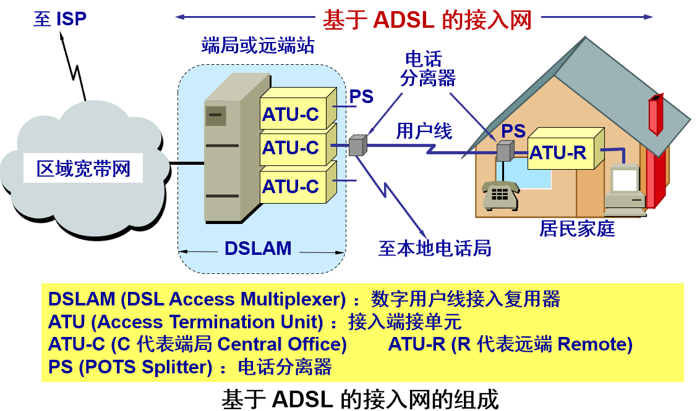
**第二代 ADSL**：
包括 ADSL2（G.992.3 和 G.992.4）和 ADSL2+（G.992.5）
通过提高调制效率得到了**更高的数据率**。
ADSL2 要求至少应支持下行 8 Mbit/s、上行 800 kbit/s的速率。
ADSL2+ 则将频谱范围从 1.1 MHz 扩展至 2.2 MHz，下行速率可达 16 Mbit/s（最大传输速率可达 25 Mbit/s），而上行速率可达 800 kbit/s。
采用了**无缝速率自适应技术** SRA (Seamless Rate Adaptation)，可在运营中不中断通信和不产生误码的情况下，自适应地调整数据率。
改善了线路质量评测和故障定位功能，这对提高网络的运行维护水平具有非常重要的意义。

**DMT 技术**(Discrete Multi-Tone)
**离散多音调 DMT** 调制技术采用**频分复用**的方法，把 40 kHz 以上一直到 1.1 MHz 的高端频谱划分为许多的子信道，其中 25 个子信道用于上行信道，而 249 个子信道用于下行信道。
每个子信道占据 4 kHz 带宽（严格讲是 4.3125 kHz），并使用不同的载波（即不同的音调）进行数字调制。这种做法相当于在一对用户线上使用许多小的调制解调器**并行**地传送数据。
DMT 技术的频谱分布
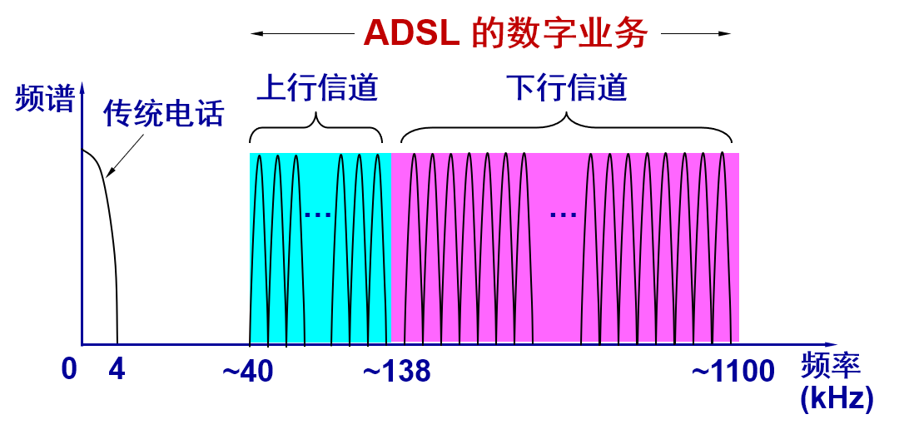

**2.6.2  光纤同轴混合网（HFC网）**
HFC (Hybrid Fiber Coax) 网是在目前覆盖面很广的有线电视网 CATV 的基础上开发的一种居民宽带接入网。
HFC 网除可传送 CATV 外，还提供电话、数据和其他宽带交互型业务。
现有的 CATV 网是树形拓扑结构的同轴电缆网络，它采用模拟技术的频分复用对电视节目进行单向传输。
**HFC 网对 CATV 网进行了改造。** 

HFC 网的主干线路采用光纤
HFC 网将原 CATV 网中的同轴电缆主干部分改换为**光纤**，并使用**模拟光纤技术**。
在模拟光纤中采用**光的振幅调制** AM，这比使用数字光纤更为经济。
模拟光纤从**头端**连接到**光纤结点** (fiber node)，即光**分配结点** ODN (Optical Distribution Node)。在光纤结点光信号被转换为电信号。在光纤结点以下就是同轴电缆。
HFC 网采用结点体系结构
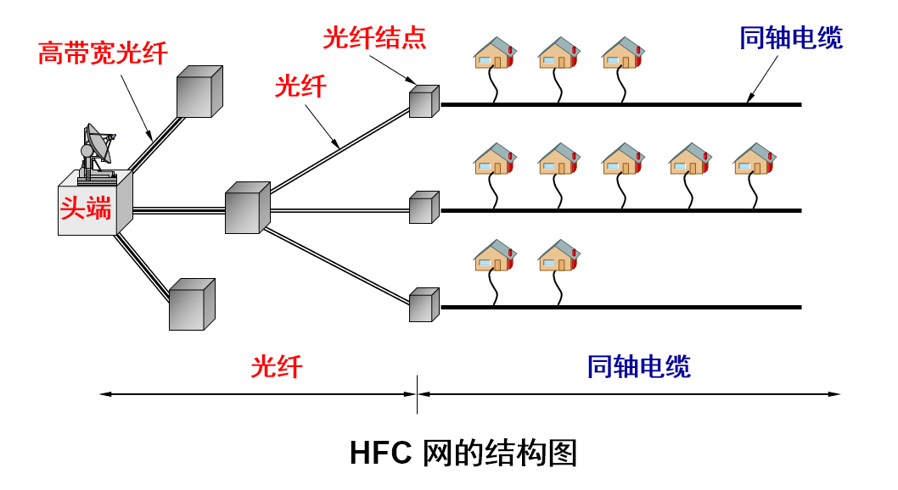
HFC 网具有双向传输功能，扩展了传输频带
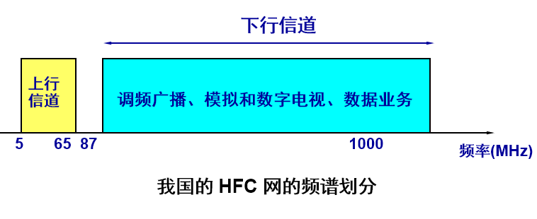
每个家庭要安装一个用户接口盒
**用户接口盒 UIB** (User Interface Box) 要提供三种连接，即：
使用同轴电缆连接到机顶盒 (set-top box)，然后再连接到用户的电视机。
使用双绞线连接到用户的电话机。
使用电缆调制解调器连接到用户的计算机。

**电缆调制解调器** (Cable Modem)
电缆调制解调器是为 HFC 网而使用的调制解调器。
电缆调制解调器最大的特点就是传输速率高。
下行速率一般在 3 ~ 10 Mbit/s之间，最高可达 30 Mbit/s。
上行速率一般为 0.2 ~ 2 Mbit/s，最高可达 10 Mbit/s。
电缆调制解调器比在普通电话线上使用的调制解调器要复杂得多，并且不是成对使用，而是只安装在用户端。 

**2.6.3  FTTx 技术**
FTTx 是一种实现宽带居民接入网的方案，代表多种宽带光纤接入方式。
FTTx 表示 Fiber To The…（光纤到…），例如：
**光纤到户 FTTH** (Fiber To The Home)：光纤一直铺设到用户家庭，可能是居民接入网最后的解决方法。
**光纤到大楼 FTTB** (Fiber To The Building)：光纤进入大楼后就转换为电信号，然后用电缆或双绞线分配到各用户。
**光纤到路边 FTTC** (Fiber To The Curb)：光纤铺到路边，从路边到各用户可使用星形结构双绞线作为传输媒体。
无源光网络 PON(Passive Optical Network) 的组成

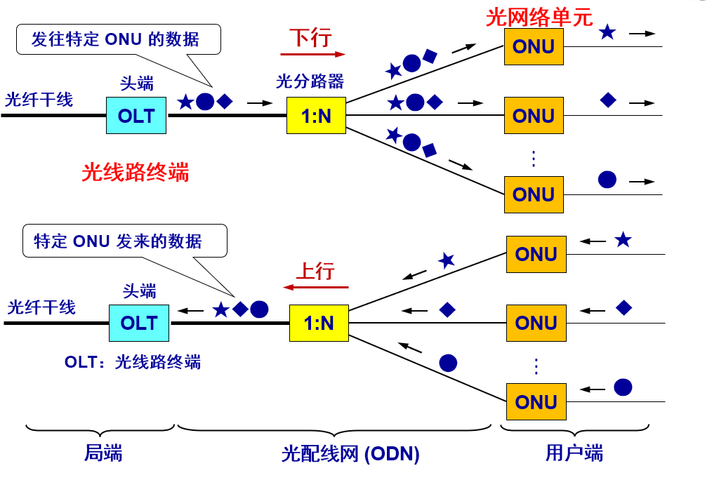